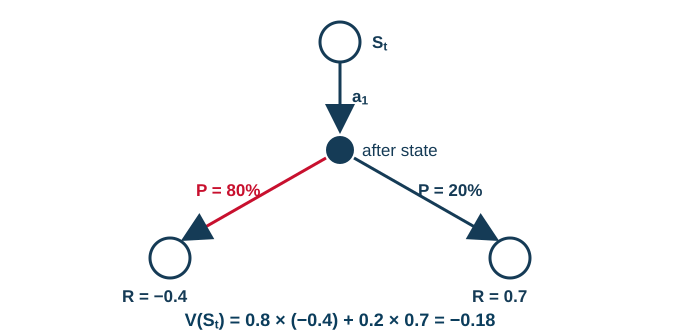
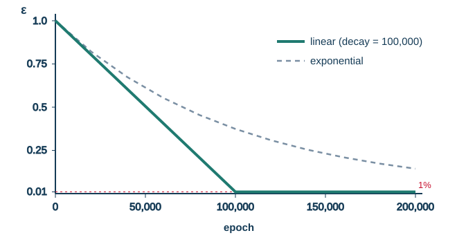

<!-- editorlm-hebrew-html-start -->
<style>
html, body, .vscode-body, .markdown-body, .markdown-preview, #write {
  direction: rtl !important; text-align: right !important;
}
ul, ol { padding-right: 2em !important; padding-left: 0 !important; }
blockquote { border-right: 3px solid #999; border-left: 0; padding-right: 1rem; padding-left: 0; }
@media print {
  html, body, .vscode-body, .markdown-body, .markdown-preview, #write {
    direction: rtl !important; text-align: right !important;
  }
}
</style>
<!-- editorlm-hebrew-html-end -->
<style>
.book { max-width: 900px; margin: auto; line-height: 1.8; font-family: Arial, sans-serif; }
.book .cover { min-height: 680px; box-sizing: border-box; padding: 64px 48px; margin: 24px 0 60px; background: #112b41; color: #f5f8fc; border-top: 9px solid #39c4b5; position: relative; }
.book .cover .eyebrow { color: #81e0d5; font-size: 15px; letter-spacing: 2px; }
.book .cover h1 { color: #fff; font-size: 48px; line-height: 1.3; border: 0; margin: 50px 0 18px; }
.book .cover .subtitle { font-size: 28px; color: #d8e6f0; }
.book .cover .author { font-size: 30px; color: #fff; margin-top: 52px; }
.book .cover .audience { color: #c1d3df; margin-top: 12px; }
.book .cover .motif { direction: ltr; text-align: left; font-family: Consolas, monospace; color: #81e0d5; font-size: 19px; margin-top: 54px; }
.book h1, .book h2, .book h3 { line-height: 1.4; font-weight: 700; }
.book > h1 { font-size: 32px !important; text-align: center !important; margin: 28px 0; }
.book h2 { font-size: 34px !important; text-align: center !important; color: #153b56 !important; background: #eef5fc; border: 0; border-bottom: 4px solid #299c91; border-radius: 10px 10px 0 0; padding: 28px 20px; margin: 24px 0 36px; }
.book h3 { font-size: 24px !important; text-align: right !important; color: #174e49 !important; background: #edf7f5; border: 0; border-right: 5px solid #299c91; border-radius: 6px; padding: 10px 16px; margin: 36px 0 18px; }
.book h4 { font-size: 20px !important; text-align: right !important; color: #174e49 !important; background: transparent; border: 0; border-right: 3px solid #7cc4bb; border-radius: 0; padding: 4px 14px; margin: 30px 0 12px; }
.book .chapter { height: 0; margin: 76px 0 0; border-top: 1px solid #ccd7df; break-before: page; page-break-before: always; break-after: avoid; page-break-after: avoid; }
.book .toc { padding: 24px; border-right: 5px solid #39a99d; background: rgba(70,150,155,.09); margin: 24px 0 48px; }
.book pre, .book pre code { direction: ltr !important; text-align: left !important; unicode-bidi: isolate; }
.book pre { box-sizing: border-box !important; width: 100% !important; max-width: 100% !important; margin: 0 !important; padding: 16px 20px; border: 1px solid #ccd7df; border-radius: 8px; line-height: 1.6; overflow-x: auto; }
.book code { direction: ltr; unicode-bidi: isolate; font-family: Consolas, "Courier New", monospace; }
.book pre { background: #f3f6fa !important; color: #1f2937 !important; }
.book pre code, .book pre code.hljs { background: transparent !important; color: #1f2937 !important; }
.book pre .hljs-keyword, .book pre .hljs-literal { color: #6f299c !important; }
.book pre .hljs-string { color: #216338 !important; }
.book pre .hljs-number { color: #075e68 !important; }
.book pre .hljs-comment { color: #526174 !important; }
.book pre .hljs-built_in, .book pre .hljs-title { color: #135b96 !important; }
.book table { width: 75%; max-width: 75%; margin: 18px auto; background: #f3f6fa; }
.book th, .book td { border: 1px solid #ccd7df; padding: 8px 12px; }
.book th, .book td { text-align: right; }
.book .small { font-size: .9em; opacity: .8; }
.book .python-intro { display: flex; align-items: center; gap: 28px; padding: 22px 28px; margin: 24px 0; background: #eef5fc; color: #183e63; border-right: 6px solid #3776ab; border-radius: 10px; }
.book .python-intro strong { font-size: 30px; }
.book .python-fact { background: #fff7d6; color: #423611; border-right: 6px solid #ffd343; border-radius: 8px; padding: 18px 24px; margin: 22px 0; }
.book .python-fact strong { font-size: 24px; }
.book .optional { background: #fff7d6; color: #423611; border-right: 6px solid #ffd343; border-radius: 8px; padding: 18px 24px; margin: 22px 0; font-size: .95em; }
.book .optional .formula { width: 90%; max-width: 90%; background: #fffdf3; }
.book .key-note { box-sizing:border-box; width:75%; max-width:75%; margin:26px auto; border:2px solid #1f7a70; border-radius:10px; background:#e6f7f4; overflow:hidden; }
.book .key-note .key-title { background:#1f7a70; color:#fff; font-weight:700; font-size:1.15em; padding:8px 18px; direction:rtl; text-align:right; }
.book .key-note .key-body { padding:14px 18px 16px; font-size:1.05em; direction:rtl; text-align:right; }
.book .grid-row { display:flex; flex-wrap:wrap; justify-content:center; align-items:flex-start; gap:14px 18px; }
.book .grid-row figure { width:auto; max-width:100%; margin:0; padding:0; background:transparent; border:0; }
.book .grid-row figcaption { margin-top:6px; font-size:.85em; }
.book .grid.small td { width:46px; height:36px; font-size:.9em; }
.book .grid .changed { color:#c8102e; font-weight:700; }
.book .grid.actions-table, .book .grid.actions-table th, .book .grid.actions-table td { direction:rtl!important; text-align:center!important; }
.book .grid.actions-table th { background:#eef5fc; border:1px solid #8199aa; font-weight:700; }
.book .bellman { box-sizing:border-box; width:75%; max-width:75%; margin:26px auto; border:2px solid #1f7a70; border-radius:10px; background:#e6f7f4; overflow:hidden; }
.book .bellman .bellman-title { background:#1f7a70; color:#fff; font-weight:700; font-size:1.15em; padding:8px 18px; direction:rtl; text-align:right; }
.book .bellman .bellman-cond { direction:ltr!important; text-align:center!important; unicode-bidi:isolate; padding:14px 20px 0; font-size:1.05em; color:#1f2937; }
.book .bellman .bellman-cond + .bellman-cond { padding-top:4px; }
.book .bellman .bellman-eq { direction:ltr!important; text-align:center!important; unicode-bidi:isolate; padding:12px 20px 18px; font-size:1.5em; font-weight:700; color:#0b3d5c; }
.book .bellman .bellman-eq span { background:#fff3b0; padding:4px 14px; border-radius:8px; border:1px solid #e6c94a; }
/* Display math renders left-to-right and centered, independent of the RTL page. */
.book .math-panel, .book .math-panel .katex-display, .book .math-panel .katex {
  direction: ltr !important;
  text-align: center !important;
  unicode-bidi: isolate;
}
.book .math-panel { box-sizing: border-box; width: 75%; max-width: 75%; margin: 20px auto; padding: 16px 20px; background: #f3f6fa; color: #1f2937; border: 1px solid #ccd7df; border-radius: 8px; overflow-x: auto; font-size: 1.1em; }
.book .math-panel .katex-display { margin: 0; }
.book .math-panel p { margin: 0; }
.book img { max-width: 100%; height: auto; }
.book figure { box-sizing: border-box; width: 75%; max-width: 75%; margin: 24px auto; padding: 16px 20px; background: #f3f6fa; border: 1px solid #ccd7df; border-radius: 8px; text-align: center; }
.book figure img { display: block; margin: auto; }
.book figcaption { direction: rtl; text-align: center; font-size: .9em; color: #445566; }
@media print { .book > h2 { break-before: page; page-break-before: always; } }
.book .screen-strip { width: 760px; max-width: 100%; height: 220px; overflow: hidden; border: 1px solid #bccad5; border-radius: 8px; margin: 20px auto 8px; direction: ltr; }
.book .screen-strip.output { height: 265px; }
.book .screen-strip img { display: block; width: 1745px; max-width: none; }
.book .screen-menu { width: 400px; max-width: 100%; height: 295px; overflow: hidden; direction: ltr; margin: 20px auto 8px; border: 1px solid #bccad5; border-radius: 8px; }
.book .screen-menu img { display: block; width: 1745px; max-width: none; }
.book .code-panel { box-sizing: border-box !important; display: block !important; width: 75% !important; max-width: 75% !important; margin: 18px auto !important; }
@media print {
  .book .cover { min-height: 85vh; break-after: page; print-color-adjust: exact; -webkit-print-color-adjust: exact; }
  .book pre { white-space: pre-wrap; break-inside: avoid; }
  .book .chapter { margin: 0; border: 0; }
  .book h1, .book h2, .book h3 { break-after: avoid; page-break-after: avoid; break-inside: avoid; }
  .book h2 { margin-top: 0; }
  .book h2, .book h3 { print-color-adjust: exact; -webkit-print-color-adjust: exact; }
}
</style>

<style>
.book .book-nav { display: flex; flex-wrap: wrap; gap: 10px; justify-content: center; align-items: center; padding: 16px 0; margin: 20px 0 32px; border-top: 1px solid #ccd7df; border-bottom: 1px solid #ccd7df; }
.book .book-nav a { display: inline-block; padding: 10px 18px; border-radius: 8px; background: #eef5fc; color: #153b56 !important; border: 1px solid #b5ccd9; text-decoration: none !important; font-size: 16px; font-weight: bold; }
.book .book-nav a.toc-link { background: #174e49; color: #fff !important; border-color: #174e49; }
.book .book-nav a:hover, .book .book-nav a:focus { background: #d4eee8; color: #153b56 !important; outline: 2px solid #299c91; outline-offset: 2px; }
.book .section-list { line-height: 2; }
@media print { .book .book-nav { display: none; } }

/* Explicit Hebrew direction, including prose beginning with English. */
.book p, .book ul, .book ol, .book li,
.book blockquote, .book h1, .book h2, .book h3,
.book h4, .book th, .book td {
  direction: rtl !important;
  text-align: right !important;
  unicode-bidi: isolate;
}
/* Chapter titles keep their agreed centered layout. */
.book h2 { text-align: center !important; }
.book pre, .book pre code, .book .code-panel {
  direction: ltr !important;
  text-align: left !important;
  unicode-bidi: isolate;
}
</style>

<style>
.book .formula { box-sizing:border-box; width:75%; max-width:75%; direction:ltr!important; text-align:center!important; overflow-x:auto;
  padding:16px 20px; background:#f3f6fa; color:#1f2937; border:1px solid #ccd7df; border-radius:8px; margin:20px auto; font-size:1.15em; }
.book .grid-panel { box-sizing:border-box; width:75%; max-width:75%; margin:20px auto; padding:16px 20px; background:#f3f6fa; border:1px solid #ccd7df; border-radius:8px; }
.book .grid { direction:ltr!important; width:auto!important; max-width:100%!important; margin:0 auto; border-collapse:collapse; background:#fff; }
.book .grid td { direction:ltr!important; text-align:center!important; width:64px; height:48px; border:1px solid #8199aa; }
.book .grid .goal { background:#d3efdc; } .book .grid .bad { background:#f4d7d7; }
</style>

<div class="book" dir="rtl" lang="he">

<nav class="book-nav" aria-label="ניווט בספר">
<a href="06-Value%20Iteration%20-%20puzzle%208.md">→ הקודם</a>
<a class="toc-link" href="../index.md">תוכן העניינים</a>
<a href="08-%D7%9E%D7%95%D7%A0%D7%98%D7%94%20%D7%A7%D7%A8%D7%9C%D7%95%20%D7%91%D7%90%D7%99%D7%A7%D7%A1%20%D7%A2%D7%99%D7%92%D7%95%D7%9C.md">הבא ←</a>
</nav>

## ד.7 — מונטה קרלו — למידה מהתנסות

**המצגת:** [מונטה קרלו](../../../sources/RL/4.%20מונטה%20קרלו.pptx) · **קוד:** [MC_Trainer.py](https://github.com/MarkmanGilad/Tic_Tac_Toe_2/blob/solved/MC_Trainer.py) · [AI_Agent.py](https://github.com/MarkmanGilad/Tic_Tac_Toe_2/blob/solved/AI_Agent.py) · [מאגר Tic_Tac_Toe_2 בגיטהב](https://github.com/MarkmanGilad/Tic_Tac_Toe_2)

בשלושת הפרקים הקודמים ענינו על השאלה ״מה המהלך הטוב ביותר?״ בהנחה שאנחנו יודעים את חוקי המשחק במלואם: לכל מצב ופעולה יכולנו לשאול את המודל מה יקרה, ומשוואת בלמן חישבה את ערך המצב מתוך המצב הבא. Value Iteration מחייב אותנו לדעת מהו המודל של הסביבה, כלומר מה יהיה המצב הבא בעקבות כל פעולה. הפרק הזה שואל שאלה חדשה: מה עושים כשאין לנו מודל כזה, וכל מה שאנחנו יכולים לעשות הוא לשחק ולראות מה קורה? זהו המצב הנפוץ בעולם האמיתי, מול יריב, בשוק או בשליטה ברובוט, ולכן זהו הרגע שבו הסוכן מתחיל באמת **ללמוד** ולא רק לחשב.

נדגים את הבעיה במשחק איקס עיגול. השחקן שלנו הוא X, והמצב הנוכחי s הוא הלוח הריק. נניח שהשחקן בוחר את הפעולה (0,1), המשבצת העליונה האמצעית. הלוח שנוצר אינו המצב הבא: הוא ממתין לסביבה, כלומר לשחקן השני, שיבצע את המהלך שלו. רק אחרי שהיריב שיחק אנחנו יודעים מהו s′, יכולים לחשב את התגמול, ויכולים לבחור את הפעולה הבאה. ואת מה שהיריב יעשה איננו יודעים מראש: במשחק אחד הוא יבחר במרכז, ובמשחק אחר בפינה.

<figure>

<figcaption>המצב s (משמאל) והלוח מיד אחרי הפעולה (0,1) של X (מימין). זה עדיין אינו המצב הבא: היריב טרם שיחק.</figcaption>
</figure>

<figure>

<figcaption>שלושה המשכים אפשריים לאותה פעולה: היריב יכול להניח O בפינה, במרכז או בפינה הנגדית. רק אחרי תגובתו X מקבל שוב את התור, ובכל פעם במצב אחר.</figcaption>
</figure>

בהעדר מודל איננו יכולים להשתמש ב־Value Iteration, כי אין לנו דרך לחשב את נוסחת בלמן: היא צריכה את s′. יתר על כן, גם אילו הייתה נתונה לנו טבלת ערכים מוכנה, לא היינו יכולים לגזור ממנה מדיניות כפי שעשינו בפרק הקודם: שם בחרנו את הפעולה שמובילה למצב בעל הערך הגבוה ביותר, וכאן איננו יודעים לאיזה מצב כל פעולה מובילה.

<!-- editorlm-source-ref: [sources/RL/4. מונטה קרלו.pptx#L8-L37] -->

### הפתרון — Monte Carlo Method

הפתרון הוא ללמוד **מהתנסות**: לשחק משחקים, לרשום מה קרה בהם, ולהשתמש בתוצאות כדי לשפר את ההערכות שלנו. זו הגישה של **Monte Carlo — מונטה קרלו**. השם לקוח מעיר הקזינו המפורסמת: במקום לחשב הסתברויות מדויקות, ״מטילים קובייה״ פעמים רבות ולומדים מהממוצע של התוצאות.

<figure>

<figcaption>גלגל רולטה. השיטה קרויה על שם מונטה קרלו, עיר הקזינו שבה מהמרים על תוצאות אקראיות.</figcaption>
</figure>

איננו יודעים את המודל, אז נדגום את הסביבה: נשחק מול היריב משחק אחד שלם, עד לסיומו, ונרשום את שרשרת המצבים, הפעולות והתגמולים שהתרחשו בפועל:

<div class="math-panel" dir="ltr">

$$
S_0, A_0, R_0, S_1, A_1, R_1, S_2, A_2, R_2, S_3, A_3, R_3, \ldots
$$

</div>

רצף כזה, מההתחלה ועד הסיום, הוא **אפיזודה**, כפי שהגדרנו בפרק המודל. כאן נמצא ההבדל הראשון מהתכנון הדינמי: שם סרקנו את כל המצבים בטבלה; כאן אנחנו רואים רק את המצבים שהמשחק עבר בהם בפועל, מסלול אחד מתוך כל הענפים האפשריים.

<figure>

<figcaption>עץ המשחק: עיגול לבן הוא מצב, נקודה שחורה היא פעולה, וריבוע T הוא מצב סופי. הקו האדום מסמן אפיזודה אחת שנדגמה: מסלול אחד מתוך כל הענפים האפשריים, מהמצב S<sub>t</sub> ועד הסיום.</figcaption>
</figure>

<a id="return"></a>

אחרי שהמשחק הסתיים יש בידינו את כל הנתונים כדי לחשב את הערך של המצב הראשון: זו התשואה G<sub>0</sub> של האפיזודה הזאת, [סכום התגמולים המהוון](03-מודל%20סביבה%20סוכן%20ו-MDP.md#discount) שהגדרנו בפרק המודל, כשכל תגמול רחוק יותר מוכפל ב־γ פעם נוספת:

<div class="math-panel" dir="ltr">

$$
V(s_0) = G_0 = R_0 + \gamma R_1 + \gamma^2 R_2 + \gamma^3 R_3 + \cdots
$$

</div>

כאן R<sub>0</sub> הוא התגמול שהתקבל אחרי הפעולה A<sub>0</sub>, כמו בשרשרת שלמעלה (בפרק המודל כתבנו את אותו תגמול R<sub>1</sub>; רק המספור שונה). ואת אותו חישוב אפשר לעשות לכל אחד מהמצבים בשרשרת, לא רק לראשון: מכל מצב S<sub>t</sub> מסתכלים קדימה עד סוף האפיזודה:

<div class="math-panel" dir="ltr">

$$
G_t = R_t + \gamma R_{t+1} + \gamma^2 R_{t+2} + \gamma^3 R_{t+3} + \cdots
$$

</div>

**חשוב להדגיש: G<sub>t</sub> היא התשואה של האפיזודה הזאת, מהצעד t ועד סופה.** זהו סכום התגמולים המהוון שהתקבלו **בפועל** במשחק הזה, מהמצב S<sub>t</sub> ועד המצב הסופי. זה מספר שמחשבים מתוך משחק אחד שכבר הסתיים, לא הערכה ולא תוחלת; לכן אפשר לחשב אותו רק אחרי שהאפיזודה נגמרה, ובאפיזודה אחרת שעוברת באותו מצב הוא עשוי לצאת שונה לגמרי.

באיקס עיגול התגמול מגיע רק בסוף, ניצחון, הפסד או תיקו, וכל המהלכים שלפניו קיבלו 0; כך התוצאה הסופית מיוחסת גם למהלכים שהובילו אליה.

**דוגמה.** משחק שבו X ניצח בשלושה מהלכים, עם γ=0.9. מבחינת X המשחק הוא שלושה צעדים: בכל צעד X מניח סימן ואחר כך היריב מגיב, והתגמולים הם 0, 0 ולבסוף 1 על הניצחון. התשואה של הצעד האחרון היא 1; של הצעד שלפניו <span dir="ltr">0 + 0.9·1 = 0.9</span>; ושל הראשון <span dir="ltr">0 + 0.9·0.9 = 0.81</span>. הדרך הנוחה לחשב זאת היא מהסוף להתחלה: מתחילים ב־G=0, ובכל צעד אחורה מחשבים G = r + γ·G:

<div class="grid-panel">
<table class="grid actions-table" dir="rtl" style="width:auto">
<tr><th style="padding:6px 14px">צעד</th><th style="padding:6px 14px">תגמול r</th><th style="padding:6px 14px">חישוב</th><th style="padding:6px 14px">תשואה G</th></tr>
<tr><td style="width:auto;padding:6px 14px">3 (האחרון)</td><td style="width:auto;padding:6px 14px">1</td><td style="width:auto;padding:6px 14px"><span dir="ltr">1 + 0.9·0</span></td><td style="width:auto;padding:6px 14px">1</td></tr>
<tr><td style="width:auto;padding:6px 14px">2</td><td style="width:auto;padding:6px 14px">0</td><td style="width:auto;padding:6px 14px"><span dir="ltr">0 + 0.9·1</span></td><td style="width:auto;padding:6px 14px">0.9</td></tr>
<tr><td style="width:auto;padding:6px 14px">1 (הראשון)</td><td style="width:auto;padding:6px 14px">0</td><td style="width:auto;padding:6px 14px"><span dir="ltr">0 + 0.9·0.9</span></td><td style="width:auto;padding:6px 14px">0.81</td></tr>
</table>
</div>

ואם המשחק הסתיים בהפסד, התגמול האחרון הוא ‎−1, והתשואות הן ‎−1, ‎−0.9 ו־‎−0.81: המהלך שאחריו הגיע ההפסד מקבל את ״האשמה״ הגדולה ביותר, ומהלכי הפתיחה חלק קטן ממנה. בתיקו כל התגמולים 0, וכל התשואות 0.

זו תוצאה של משחק אחד. משחק אחד שהסתיים בניצחון אינו מוכיח שכל משחק שמתחיל באותו מצב יסתיים כך; ייתכן שהניצחון נבע ממהלך גרוע של היריב. לכן חוזרים על הדגימה מספר רב של פעמים, כדי לעבור על מצבים רבים ככל האפשר ולראות כל אחד מהם בהמשכים שונים.

<!-- editorlm-source-ref: [sources/RL/4. מונטה קרלו.pptx#L41-L49] -->

### בעיות שיש לפתור באלגוריתם MC

לפני שנוכל לכתוב את האלגוריתם, הגישה הזאת מעמידה בפנינו שלוש בעיות שהתכנון הדינמי לא הכיר. שלושת הסעיפים הבאים פותרים אותן אחת אחרי השנייה, וזו דרך הלימוד של הפרק:

<div class="key-note">
<div class="key-title">שלוש השאלות שעלינו לפתור</div>
<div class="key-body">
<b>1. מודל אקראי.</b> דגימות של אותו מצב ואותה פעולה עשויות להחזיר תוצאות סותרות, כי היריב בחר בכל משחק תגובה אחרת. איך מחברים תוצאות שונות להערכה אחת?<br><br>
<b>2. מודל לא ידוע (Model Free).</b> גם אחרי שחישבנו ערכים, בזמן המשחק איננו יודעים לאיזה מצב תוביל כל פעולה. איך בוחרים את הפעולה הטובה ביותר?<br><br>
<b>3. דרך הדגימה.</b> איך הסוכן יבחר את הפעולות שהוא מבצע בזמן הדגימה של הסביבה? באקראי? לפי מדיניות מסוימת?
</div>
</div>

<!-- editorlm-source-ref: [sources/RL/4. מונטה קרלו.pptx#L53-L57] -->

### בעיה 1 — סביבה סטוכסטית (אקראית)

עד כה התעלמנו מהמקרים שבהם המודל של הסביבה הוא **אקראי (סטוכסטי)**: אחרי שהסוכן מבצע פעולה, המצב הבא אינו קבוע מראש, והסביבה עשויה להחזיר כמה מצבים שונים. דוגמאות: מכונית שנכנסת לעיקול כשמצב הכביש אינו ידוע, אם הכביש יבש היא תסיים את הסיבוב, ואם הוא רטוב היא תחליק, נניח ב־10% מהפעמים; באיקס עיגול, אחרי המהלך שלנו לא ידוע מה היריב יבצע, ויריב אקראי עשוי לבחור באותו מצב פעולות שונות; במשחק קלפים, כשמבקשים קלף נוסף איננו יודעים איזה קלף נקבל; וכך גם בהטלת קוביות.

<!-- editorlm-source-ref: [sources/RL/4. מונטה קרלו.pptx#L61-L67] -->

#### הסתברות ותוחלת — שני מושגים שנצטרך

לפני הנוסחה, שני מושגים מתורת ההסתברות, בקצרה ובדוגמאות.

**הסתברות** של תוצאה היא מספר בין 0 ל־1 שאומר באיזה חלק מהפעמים התוצאה מתקבלת, כשחוזרים על אותו ניסוי פעמים רבות. בהטלת קובייה הוגנת ההסתברות לקבל 6 היא 1/6: בערך אחת מכל שש הטלות. סכום ההסתברויות של כל התוצאות האפשריות הוא תמיד 1, כי משהו חייב לקרות. בדוגמת הכביש: הסתברות 0.1 (10%) להחלקה ו־0.9 לסיבוב מוצלח.

**תוחלת (Expected Value)** היא הממוצע שנקבל בטווח הארוך, אם נחזור על הניסוי פעמים רבות מאוד. מחשבים אותה כך: מכפילים כל תוצאה אפשרית בהסתברות שלה, ומחברים. זהו ממוצע **משוקלל**: תוצאה שמתקבלת לעיתים קרובות ״שוקלת״ יותר מתוצאה נדירה. שתי דוגמאות:

- **קובייה.** כל אחת מהתוצאות 1 עד 6 מתקבלת בהסתברות 1/6, ולכן התוחלת היא <span dir="ltr">(1 + 2 + 3 + 4 + 5 + 6)/6 = 21/6 = 3.5</span>. שימו לב: 3.5 אינה תוצאה אפשרית של הטלה אחת. התוחלת אינה ״מה שיקרה בהטלה הבאה״ אלא הממוצע של הטלות רבות: אם נטיל אלף פעמים ונמצע, נקבל מספר קרוב ל־3.5.
- **משחק מזל.** במשחק מרוויחים 10 שקלים בהסתברות 0.2 ומפסידים שקל אחד בהסתברות 0.8. התוחלת היא <span dir="ltr">10·0.2 + (−1)·0.8 = 2 − 0.8 = 1.2</span>: בממוצע, כל משחק מכניס 1.2 שקלים, אף שברוב המשחקים הבודדים מפסידים. מי שישחק מאה פעמים ירוויח בערך 120 שקלים.

בכתיב מתמטי מסמנים את התוחלת באות E (מהמילה Expected): <span dir="ltr">E[X]</span> פירושו ״התוחלת של X״, הממוצע המשוקלל של כל הערכים ש־X יכול לקבל.

#### נוסחת בלמן בסביבה אקראית

עכשיו אפשר לחזור למשוואת בלמן. בסביבה דטרמיניסטית כתבנו V(s) = r + γV(s′): אחרי הפעולה יש מצב הבא יחיד, שידוע מראש, ותגמול יחיד. בסביבה אקראית אחרי אותה פעולה יכולים להתקבל כמה מצבים הבאים שונים, כל אחד בהסתברות שלו, ולכן ערך המצב הוא **התוחלת** של ״התגמול ועוד γ כפול ערך המצב הבא״ על פני כל המצבים הבאים האפשריים:

<div class="math-panel" dir="ltr">

$$
V(s) = \mathbb{E}\left[\, R_{s'} + \gamma V(s') \,\right] \quad \text{for all } s'
$$

</div>

קוראים את זה כך: לכל מצב הבא אפשרי s′ מחשבים את התגמול שמתקבל במעבר אליו ועוד γ כפול ערכו, מכפילים בהסתברות להגיע אליו, ומחברים את כל המכפלות. אם יש רק מצב הבא אחד, בהסתברות 1, נשארת המשוואה הדטרמיניסטית שהכרנו. זו משוואת בלמן המלאה שהוזכרה כרשות בפרק ד.4, וכאן היא כבר אינה רשות: היריב הוא סביבה אקראית.

נדגים זאת בעץ. בעץ כזה **נקודה לבנה** היא מצב, שבו הסוכן בוחר; **הקשת** היוצאת ממנה היא הפעולה שנבחרה; **הנקודה השחורה** היא המצב מיד אחרי הפעולה שלנו, לפני שהסביבה הגיבה (after state); ומהנקודה השחורה יוצאים כמה ענפים, אחד לכל תגובה אפשרית של הסביבה, כל אחד עם ההסתברות שלו, אל **הנקודה הלבנה הבאה**: המצב שבו הסוכן שוב בוחר. באיקס עיגול הנקודה השחורה היא הלוח אחרי שהנחנו את ה־X שלנו, והענפים הם התגובות האפשריות של היריב.

<figure>

<figcaption>חישוב תוחלת בעץ: מהמצב S<sub>t</sub> הסוכן בוחר את הפעולה a<sub>1</sub> ומגיע לנקודה השחורה. משם הסביבה מובילה ב־80% מהמקרים להמשך שערכו ‎−0.4, וב־20% להמשך שערכו 0.7.</figcaption>
</figure>

נניח לצורך ההדגמה שמהמצב S<sub>t</sub> יש לסוכן רק פעולה חוקית אחת, a<sub>1</sub>, ולכן ערך המצב V(S<sub>t</sub>) הוא פשוט הערך שמתקבל אחרי הפעולה הזאת (על ערך של מצב ופעולה יחד נדבר בהמשך הפרק). הסוכן מבצע את a<sub>1</sub>, ואחרי הפעולה הסביבה יכולה להוביל לשני מצבים: ב־80% מהמקרים לענף השמאלי, שההמשך ממנו שווה ‎−0.4, וב־20% לענף הימני, שההמשך ממנו שווה 0.7 (המספרים על הענפים הם הערכים שמתקבלים מכל המשך, כולל התגמול והמשך המשחק). ערך המצב הוא התוחלת, בדיוק כמו במשחק המזל:

<div class="math-panel" dir="ltr">

$$
V(S_t) = 0.8 \times (-0.4) + 0.2 \times 0.7 = -0.32 + 0.14 = -0.18
$$

</div>

הערך שלילי אף שאחד ההמשכים טוב, כי ההמשך הרע קורה הרבה יותר. אילו ההסתברויות היו הפוכות, 20% ו־80%, היינו מקבלים <span dir="ltr">0.2·(−0.4) + 0.8·0.7 = 0.48</span>, והמצב היה מצוין. ההסתברויות משנות את הערך לא פחות מהתוצאות עצמן.

**עוד דוגמה, מאיקס עיגול.** נניח ש־X מחליט תמיד לפתוח בפינה (0,0), כך שמהלוח הריק יש לו למעשה פעולה אחת, ומולו יריב אקראי. אם היריב מגיב במרכז, ההמשך קשה ל־X, ונניח שהתשואה שתתקבל בסוף היא 0.1; אם הוא מגיב בכל משבצת אחרת, X בדרך כלל מנצח, ונניח תשואה 0.8. יריב אקראי בוחר את המרכז באחת משמונה המשבצות הפנויות, כלומר בהסתברות <span dir="ltr">1/8 = 12.5</span>%, ואת שאר המשבצות בהסתברות <span dir="ltr">7/8 = 87.5</span>%. ערך הלוח הריק הוא <span dir="ltr">0.1×0.125 + 0.8×0.875 = 0.0125 + 0.7 = 0.7125</span>. המספרים כאן להמחשה, אבל המבנה אמיתי: ערך של מצב מול יריב אקראי הוא ממוצע משוקלל על תגובותיו, כשלכל תגובה יש הסתברות.

<!-- editorlm-source-ref: [sources/RL/4. מונטה קרלו.pptx#L71-L79] -->

#### דגימה של סביבה אקראית

אבל את ההסתברויות 80% ו־20% איננו יודעים; הן חלק מהמודל שאין לנו. כאן נכנסת הדגימה: אם נבצע את אותה פעולה מאותו מצב פעמים רבות, ההתפלגות תתגלה מעצמה. ב־100 דגימות נקבל בערך 80 פעמים את ההמשך הראשון ו־20 פעמים את השני, וממוצע התוצאות שקיבלנו הוא בדיוק הערך המשוקלל שחיפשנו:

<div class="math-panel" dir="ltr">

$$
\frac{80 \times (-0.4) + 20 \times 0.7}{100} = -0.18
$$

</div>

אין צורך לדעת מראש באיזו הסתברות היריב בוחר כל תגובה; די לשחק, לרשום תוצאות ולמצע. מדגם אחר של 100 משחקים עשוי לתת 78 ו־22, ואז הממוצע יהיה ‎−0.158 ולא ‎−0.18; לכן אין להסתמך על משחק יחיד, וככל שנשחק יותר, הממוצע יתקרב לתוחלת האמיתית.

<!-- editorlm-source-ref: [sources/RL/4. מונטה קרלו.pptx#L83-L86] -->

#### חישוב ממוצע של הערכים

איך מחשבים ממוצע של דגימות שמגיעות אחת אחרי השנייה, בלי לשמור את כולן? מחזיקים לכל מצב מונה n של מספר הפעמים שהסוכן ביקר בו, ואת הממוצע הנוכחי V. כשמגיעה דגימה חדשה V<sub>new</sub>, אפשר לחשב את הממוצע החדש מתוך הממוצע הישן בלבד. הפיתוח הוא אלגברה פשוטה בשלושה צעדים.

**צעד 1 — כותבים את הממוצע החדש.** הממוצע הישן V הוא ממוצע של n−1 דגימות, ולכן סכומן הוא V·(n−1). מוסיפים את הדגימה החדשה, ומחלקים את הסכום במספר הדגימות הכולל, n:

<div class="math-panel" dir="ltr">

$$
V \leftarrow \frac{V \cdot (n-1) + V_{new}}{n}
$$

</div>

**צעד 2 — פותחים סוגריים ומסדרים.** במונה, V·(n−1) הוא V·n − V. נכתוב את המונה מחדש כך שיהיו בו V·n ולידו ההפרש בין הדגימה החדשה לממוצע הישן:

<div class="math-panel" dir="ltr">

$$
V \cdot (n-1) + V_{new} = V \cdot n - V + V_{new} = V \cdot n + \left(V_{new} - V\right)
$$

</div>

**צעד 3 — מפצלים את השבר.** מחלקים כל אחד משני האיברים במונה ב־n. האיבר הראשון, V·n/n, הוא פשוט V:

<div class="math-panel" dir="ltr">

$$
V = \frac{V \cdot (n-1) + V_{new}}{n} = \frac{V \cdot n + \left(V_{new} - V\right)}{n} = V + \frac{1}{n}\left(V_{new} - V\right)
$$

</div>

זו **נוסחת הממוצע**: הממוצע החדש הוא הממוצע הישן, ועוד חלק 1/n מן ההפרש בין הדגימה החדשה לממוצע הישן. אין צורך לשמור את הדגימות עצמן, רק את V ואת n.

**בדיקה במספרים.** הממוצע של שלוש דגימות הוא 0.2, והדגימה הרביעית נותנת 1. בדרך הרגילה: סכום שלוש הדגימות הוא 0.2·3 = 0.6, מוסיפים 1 ומקבלים 1.6, ומחלקים ב־4: 0.4. בנוסחה: <span dir="ltr">0.2 + (1 − 0.2)/4 = 0.2 + 0.2 = 0.4</span>. אותו מספר, אבל בלי לדעת מה היו שלוש הדגימות הראשונות. שימו לב גם לכיוון: הדגימה החדשה (1) גדולה מהממוצע (0.2), ולכן הממוצע עלה; וככל שיש יותר דגימות, n גדול יותר, וכל דגימה חדשה מזיזה את הממוצע פחות.

**דוגמה: אותו מצב, חמש דגימות.** נניח שביקרנו במצב מסוים חמש פעמים, ובכל פעם התשואה שהתקבלה בסוף המשחק הייתה אחרת: 1, ‎−1, 1, 1, 0. הממוצע מתעדכן כך:

<div class="grid-panel">
<table class="grid actions-table" dir="rtl" style="width:auto">
<tr><th style="padding:6px 14px">דגימה n</th><th style="padding:6px 14px">V<sub>new</sub></th><th style="padding:6px 14px">חישוב</th><th style="padding:6px 14px">V אחרי העדכון</th></tr>
<tr><td style="width:auto;padding:6px 14px">1</td><td style="width:auto;padding:6px 14px">1</td><td style="width:auto;padding:6px 14px"><span dir="ltr">0 + (1 − 0)/1</span></td><td style="width:auto;padding:6px 14px">1</td></tr>
<tr><td style="width:auto;padding:6px 14px">2</td><td style="width:auto;padding:6px 14px">‎−1</td><td style="width:auto;padding:6px 14px"><span dir="ltr">1 + (−1 − 1)/2</span></td><td style="width:auto;padding:6px 14px">0</td></tr>
<tr><td style="width:auto;padding:6px 14px">3</td><td style="width:auto;padding:6px 14px">1</td><td style="width:auto;padding:6px 14px"><span dir="ltr">0 + (1 − 0)/3</span></td><td style="width:auto;padding:6px 14px">0.333</td></tr>
<tr><td style="width:auto;padding:6px 14px">4</td><td style="width:auto;padding:6px 14px">1</td><td style="width:auto;padding:6px 14px"><span dir="ltr">0.333 + (1 − 0.333)/4</span></td><td style="width:auto;padding:6px 14px">0.5</td></tr>
<tr><td style="width:auto;padding:6px 14px">5</td><td style="width:auto;padding:6px 14px">0</td><td style="width:auto;padding:6px 14px"><span dir="ltr">0.5 + (0 − 0.5)/5</span></td><td style="width:auto;padding:6px 14px">0.4</td></tr>
</table>
</div>

ואכן, הממוצע של 1, ‎−1, 1, 1, 0 הוא <span dir="ltr">2/5 = 0.4</span>.

<!-- editorlm-source-ref: [sources/RL/4. מונטה קרלו.pptx#L90-L94] -->

<a id="incremental-update"></a>
#### חישוב ממוצע ללא החזקת מונה

דרך נוספת, שאינה דורשת מונה לכל מצב, היא שיטת **תיקון הטעות**: במקום ‎1/n משתמשים במספר קטן קבוע, **מקדם הלמידה α (אלפא)**:

<div class="math-panel" dir="ltr">

$$
V \leftarrow V + \alpha \left(V_{new} - V\right)
$$

</div>

ההפרש בסוגריים הוא הטעות שלנו: הפער בין התוצאה שדגמנו לבין האומדן הנוכחי. אם הערך החדש גדול מהממוצע, מוסיפים ל־V קצת; אם הוא קטן, מפחיתים קצת. אנחנו יוצאים מתוך הנחה שנבצע את החישוב מספר רב מאוד של פעמים, ולכן נגיע לממוצע האמיתי. השיטה מזכירה את Gradient Descent מחלק ג, רק בלי הנגזרת: צעד קטן בכיוון הטעות, שוב ושוב.

**אותה דוגמה עם α=0.1.** חמש הדגימות 1, ‎−1, 1, 1, 0, הפעם בלי מונה:

<div class="grid-panel">
<table class="grid actions-table" dir="rtl" style="width:auto">
<tr><th style="padding:6px 14px">דגימה</th><th style="padding:6px 14px">V<sub>new</sub></th><th style="padding:6px 14px">חישוב</th><th style="padding:6px 14px">V אחרי העדכון</th></tr>
<tr><td style="width:auto;padding:6px 14px">1</td><td style="width:auto;padding:6px 14px">1</td><td style="width:auto;padding:6px 14px"><span dir="ltr">0 + 0.1·(1 − 0)</span></td><td style="width:auto;padding:6px 14px">0.1</td></tr>
<tr><td style="width:auto;padding:6px 14px">2</td><td style="width:auto;padding:6px 14px">‎−1</td><td style="width:auto;padding:6px 14px"><span dir="ltr">0.1 + 0.1·(−1 − 0.1)</span></td><td style="width:auto;padding:6px 14px">‎−0.01</td></tr>
<tr><td style="width:auto;padding:6px 14px">3</td><td style="width:auto;padding:6px 14px">1</td><td style="width:auto;padding:6px 14px"><span dir="ltr">‎−0.01 + 0.1·(1 + 0.01)</span></td><td style="width:auto;padding:6px 14px">0.091</td></tr>
<tr><td style="width:auto;padding:6px 14px">4</td><td style="width:auto;padding:6px 14px">1</td><td style="width:auto;padding:6px 14px"><span dir="ltr">0.091 + 0.1·(1 − 0.091)</span></td><td style="width:auto;padding:6px 14px">0.182</td></tr>
<tr><td style="width:auto;padding:6px 14px">5</td><td style="width:auto;padding:6px 14px">0</td><td style="width:auto;padding:6px 14px"><span dir="ltr">0.182 + 0.1·(0 − 0.182)</span></td><td style="width:auto;padding:6px 14px">0.164</td></tr>
</table>
</div>

אחרי חמש דגימות בלבד הערך רחוק מהממוצע 0.4, כי כל צעד קטן. זה המחיר של α קבוע, והוא משתלם כשיש הרבה דגימות: אחרי אלפי משחקים הערך מתקרב לממוצע, ובלי לשמור מונה לכל אחד מאלפי המצבים. יש לשיטה גם יתרון: כאשר α קבוע, זהו ממוצע משוקלל שנותן משקל רב יותר לדגימות האחרונות, וזה דווקא רצוי כשהמדיניות משתנה במהלך האימון. משחקים ישנים, ששוחקו כשעדיין שיחקנו גרוע, מאבדים בהדרגה את השפעתם.

<!-- editorlm-source-ref: [sources/RL/4. מונטה קרלו.pptx#L98-L105] -->

לסיכום הבעיה הראשונה: במונטה קרלו נגיע למצב S<sub>t</sub> פעמים רבות. בכל פעם נחשב את התשואה G<sub>t</sub> לפי המסלול שהגענו אליו, ונעדכן את הממוצע. אחרי מספיק ביקורים הממוצע יהיה קרוב מאוד לערך האמיתי של המצב:

<div class="bellman">
<div class="bellman-title">כלל העדכון של מונטה קרלו</div>
<div class="bellman-cond" dir="ltr">&#x2066;G<sub>t</sub> = R<sub>t</sub> + γ·R<sub>t+1</sub> + γ²·R<sub>t+2</sub> + …&#x2069;</div>
<div class="bellman-eq" dir="ltr"><span>&#x2066;V(S<sub>t</sub>) ← V(S<sub>t</sub>) + α·(G<sub>t</sub> − V(S<sub>t</sub>))&#x2069;</span></div>
</div>

שימו לב מתי העדכון מתבצע: רק **בסוף האפיזודה**, כי רק אז G<sub>t</sub> ידוע. בספרות קוראים לזה Sample Backup, גיבוי מדגימה: הערך של מצב מתעדכן ממסלול אחד שנדגם, ולא מכל הענפים כמו בתכנון הדינמי.

<!-- editorlm-source-ref: [sources/RL/4. מונטה קרלו.pptx#L109-L116] -->

### בעיה 2 — מציאת המדיניות בהעדר מודל

מצאנו דרך לחשב את פונקציית הערך גם בהעדר מודל, בעזרת סדרה של ניסויים ושמירת התוצאות. נותרה הבעיה השנייה: איננו יכולים לקבל את המדיניות מפונקציית הערך. בפרק הקודם בחרנו את הפעולה שמביאה למצב עם הערך הגבוה ביותר. אבל אם איננו יודעים מהו המצב הבא, כיצד נבחר?

נניח שאנחנו בלוח הריק, ושכבר למדנו את הערכים של לוחות שיכולים להיווצר אחרי המהלך שלנו ותגובת היריב. הנה ארבעה מהם, עם ערכים לצורך ההמחשה:

<div class="grid-panel"><div class="grid-row">
<figure>
<table class="grid small" dir="ltr">
<tr><td></td><td>X</td><td></td></tr>
<tr><td></td><td></td><td>O</td></tr>
<tr><td></td><td></td><td></td></tr>
</table>
<figcaption>V = 0.125</figcaption>
</figure>
<figure>
<table class="grid small" dir="ltr">
<tr><td></td><td>X</td><td></td></tr>
<tr><td>O</td><td></td><td></td></tr>
<tr><td></td><td></td><td></td></tr>
</table>
<figcaption>V = 0.752</figcaption>
</figure>
<figure>
<table class="grid small" dir="ltr">
<tr><td>X</td><td></td><td></td></tr>
<tr><td></td><td></td><td></td></tr>
<tr><td></td><td>O</td><td></td></tr>
</table>
<figcaption>V = 0.225</figcaption>
</figure>
<figure>
<table class="grid small" dir="ltr">
<tr><td></td><td></td><td>X</td></tr>
<tr><td></td><td></td><td></td></tr>
<tr><td>O</td><td></td><td></td></tr>
</table>
<figcaption>V = 0.691</figcaption>
</figure>
</div></div>

שני הלוחות הראשונים נוצרים שניהם מהפעולה (0,1); ההבדל ביניהם הוא רק בתגובת היריב, ולאחד מהם ערך נמוך ולשני גבוה. איזה מהם נקבל אם נשחק (0,1)? איננו יודעים, ולכן ערכי הלוחות האלה אינם אומרים לנו אם (0,1) היא פעולה טובה. אותו דבר בשני הלוחות האחרונים, שנוצרים מפינות שונות: הערכים שייכים ללוחות שאחרי תגובת היריב, לא לפעולות שלנו.

<!-- editorlm-source-ref: [sources/RL/4. מונטה קרלו.pptx#L120-L144] -->

#### הפתרון — Q-Table

במקום לשמור ערך לכל מצב, נשמור ערך לכל **זוג של מצב ופעולה**, בטבלה שנקראת **Q-Table**. הנתונים לכך כבר בידינו: באותה אפיזודה שדגמנו, S<sub>0</sub>, A<sub>0</sub>, R<sub>0</sub>, S<sub>1</sub>, A<sub>1</sub>, R<sub>1</sub>, …, התשואה שחישבנו מהמצב S<sub>0</sub> היא בעצם התשואה של הזוג (S<sub>0</sub>, A<sub>0</sub>): מה יצא, בסופו של דבר, מביצוע הפעולה A<sub>0</sub> במצב S<sub>0</sub>. וכך לכל זוג בשרשרת, כל אחד מנקודתו והלאה:

<div class="math-panel" dir="ltr">

$$
\begin{gathered} Q(s_0, a_0) = R_0 + \gamma R_1 + \gamma^2 R_2 + \gamma^3 R_3 + \cdots \\ Q(s_1, a_1) = R_1 + \gamma R_2 + \gamma^2 R_3 + \cdots \end{gathered}
$$

</div>

ההגדרה של ערך מצב–פעולה נמצאת ב[פרק המודל](03-מודל%20סביבה%20סוכן%20ו-MDP.md#action-value); כעת אנחנו לומדים אותו מתוך דגימות, באותו כלל עדכון בדיוק:

<a id="mc-update"></a>
<div class="bellman">
<div class="bellman-title">כלל העדכון של מונטה קרלו עבור Q</div>
<div class="bellman-cond" dir="ltr">&#x2066;G<sub>t</sub> = R<sub>t</sub> + γ·R<sub>t+1</sub> + γ²·R<sub>t+2</sub> + …&#x2069;</div>
<div class="bellman-eq" dir="ltr"><span>&#x2066;Q(S<sub>t</sub>, A<sub>t</sub>) ← Q(S<sub>t</sub>, A<sub>t</sub>) + α·(G<sub>t</sub> − Q(S<sub>t</sub>, A<sub>t</sub>))&#x2069;</span></div>
</div>

טבלת Q פותרת את הבעיה השנייה. הקושי היה שכדי לבחור פעולה היינו צריכים לדעת לאיזה מצב היא מובילה, וזה תלוי במה שהיריב יעשה. בטבלת Q הציון ניתן **לפעולה שלנו** עצמה: בשורה של המצב הנוכחי שמור, לכל פעולה חוקית, הערך שהתקבל בממוצע מביצועה, כולל כל מה שקרה אחריה, תגובות היריב וכל ההמשך. לכן בזמן המשחק לא צריך לחכות ולראות מה יעשה היריב, ולא צריך מודל שינבא זאת: מסתכלים בשורה של המצב, ובוחרים את הפעולה עם הערך הגבוה ביותר. כך נראית טבלת Q של איקס עיגול: שורה לכל מצב (לוח), ועמודה לכל אחת מתשע המשבצות, כלומר לכל פעולה אפשרית. בכל תא רשום הערך של הפעולה באותו מצב; במשבצות תפוסות, שאינן פעולה חוקית באותו מצב, מסומן N/A:

<figure>

<figcaption>טבלת Q של כמה מצבים. הערכים הם ערכי המחשה, לא תוצאה של אימון.</figcaption>
</figure>

בשורה הראשונה, למשל, ל־X נותרו שלוש משבצות פנויות, ולפי הטבלה הטובה שבהן היא Top Middle עם 0.5; בשורה של הלוח הריק (השלישית) הערך הגבוה ביותר הוא 0.7 במשבצת האמצעית, ולכן X יפתח במרכז. בכל מקרה הבחירה נעשית מתוך השורה של המצב הנוכחי בלבד, בלי לשאול מה יעשה היריב אחר כך.

ואפשר גם בנוסחה: המדיניות בוחרת את הפעולה שנותנת את הערך הגדול ביותר בטבלה, מבין הפעולות החוקיות במצב:

<div class="math-panel" dir="ltr">

$$
\pi(s) = \operatorname*{argmax}_{a \in A(s)} Q(s,a)
$$

</div>

שימו לב שאין להוסיף כאן שוב את התגמול המיידי, כפי שעשינו ב־Value Iteration: הוא כבר נכלל בתשואה שעל פיה Q נלמד.

**איך הסוכן בוחר פעולה בעזרת Q, צעד אחר צעד.** נסכם את הבחירה כאלגוריתם במילים, כי זו הפעולה שהסוכן יבצע בכל מהלך ומהלך:

1. הסוכן נמצא במצב s ורושם את הפעולות החוקיות בו (באיקס עיגול: המשבצות הפנויות).
2. הוא פונה לטבלת Q ושולף את כל הערכים של השורה של המצב, <span dir="ltr">Q(s, *)</span>: ערך אחד לכל פעולה חוקית. פעולה שעדיין אינה בטבלה מקבלת 0.
3. הוא משווה בין הערכים ומוצא את הגדול ביותר.
4. הוא מבצע את הפעולה שנתנה את הערך הזה. אם כמה פעולות שקולות, בוחרים אחת מהן, למשל הראשונה.

זה כל מה שנדרש: אין כאן ״לאן הפעולה מובילה״, אין מודל ואין ניחוש של מהלך היריב. כל הידע על ההמשך כבר מקופל במספר שבטבלה. השוו ל־Value Iteration, שם בכל בחירה שאלנו את המודל מה המצב הבא של כל פעולה; כאן שואלים רק את הטבלה.

<!-- editorlm-source-ref: [sources/RL/4. מונטה קרלו.pptx#L148-L174] -->

### בעיה 3 — דרך ביצוע הדגימה

נותרה השאלה השלישית: אילו פעולות לבחור בזמן הדגימה של הסביבה. יש שתי אפשרויות קיצוניות:

- **בחירה אקראית.** הסוכן בוחר בכל פעם פעולה חוקית אקראית. השיטה תביא לתוצאה נכונה, כי כל הפעולות ייבדקו, אבל תחייב מספר עצום של דגימות, והלמידה תהיה איטית מאוד.
- **בחירה לפי טבלת Q.** הסוכן בוחר בכל פעם את הפעולה הטובה ביותר לפי הידע שיש לו כרגע. בהתחלה הטבלה אקראית, אבל תוך כדי הניסויים הערכים מתקרבים לערכים הנכונים. הבעיה: ברגע שמצאנו פעולה אחת טובה, נבחר בה שוב ושוב ולא ננסה פעולות אחרות, שאולי טובות יותר; וכיוון שלא בחרנו בהן, לעולם לא נדע.

**דוגמה.** בלוח הריק הסוכן ניסה פעם אחת את הפינה (0,0) וניצח, ולכן Q של הפינה חיובי, וכל שאר הפעולות עדיין 0. מעכשיו בחירה לפי הטבלה תפתח תמיד בפינה, ולעולם לא תנסה את המרכז, גם אם המרכז הוא הפתיחה הטובה ביותר. הטבלה ״ננעלת״ על הצלחה מקרית.

זוהי הדילמה המכונה **Exploration vs. Exploitation**, חקירה מול ניצול: מתי לנסות מצבים חדשים (Explore) ומתי לנצל את הידע הקיים וללכת לפיו (Exploit). היא מוכרת גם מחוץ למשחקים: מי שתמיד מזמין במסעדה את המנה שהוא כבר אוהב לא יגלה לעולם מנה טובה יותר, ומי שתמיד מנסה משהו חדש לא נהנה ממה שכבר יודע שטוב.

<!-- editorlm-source-ref: [sources/RL/4. מונטה קרלו.pptx#L193-L200] -->

#### Epsilon-Greedy Function

הפתרון: בדרך כלל בוחרים את הפעולה שלפי הידע העכשווי היא הטובה ביותר, לפי טבלת Q, אך מדי פעם בוחרים פעולה אקראית. הסיכוי לבחירה אקראית נקבע על ידי המספר ε (אפסילון, מספר קטן בין 0 ל־1):

<div class="code-panel" dir="ltr">

```text
epsilon = 0.001

def Epsilon_Greedy (state, Q_Value):
    r = Random()
    if r < epsilon:
        return random legal action
    else:
        return maxArg_a (Q(s, a))
```

</div>

`Random()` מגרילה מספר בין 0 ל־1, ולכן התנאי מתקיים בהסתברות ε. **דוגמה** עם ε=0.2: הוגרל 0.13, קטן מ־0.2, ולכן הסוכן בוחר משבצת פנויה אקראית, גם אם היא נראית גרועה לפי הטבלה; בפעם הבאה הוגרל 0.57, ולכן הוא בוחר את הפעולה עם Q הגבוה ביותר. בממוצע אחד מכל חמישה מהלכים יהיה מהלך חקירה. גם בהגרלה אפשר לבחור במקרה את הפעולה בעלת הערך המרבי.

<!-- editorlm-source-ref: [sources/RL/4. מונטה קרלו.pptx#L204-L215] -->

<a id="epsilon-decay"></a>
#### Epsilon-greedy decay

אפשר לשפר את האלגוריתם: בתחילת האימון הטבלה כמעט ריקה, ולכן נרצה לחקור הרבה; ככל שהמודל מאומן יותר, נסתמך יותר על הטבלה. לכן ε לא יהיה קבוע אלא ירד במהלך האימון, מערך גבוה בהתחלה לערך קטן בסופו. הדרך הפשוטה ביותר היא **דעיכה לינארית**: ε יורד בקו ישר מ־`start` ל־`final` לאורך `decay` אפיזודות, ומשם נשאר קבוע. הפונקציה מקבלת את מספר האפיזודה, `epoch`, ומחזירה את ε המתאים לה:

<div class="code-panel" dir="ltr">

```python
epsilon_start = 1.0
epsilon_final = 0.01
epsilon_decay = 100000

def epsilon_greedy(epoch, start=epsilon_start, final=epsilon_final, decay=epsilon_decay):
    if epoch > decay:
        return final
    return start - (start - final) * epoch / decay
```

</div>

באפיזודה 0 מקבלים 1.0, כלומר משחק אקראי לחלוטין; בכל אפיזודה ε יורד באותה כמות קטנה, עד שבאפיזודה 100,000 הוא מגיע ל־0.01, ומשם נשאר 0.01 עד סוף האימון:

<div class="grid-panel">
<table class="grid actions-table" dir="rtl" style="width:auto">
<tr><th style="padding:6px 14px">אפיזודה</th><th style="padding:6px 14px">ε</th><th style="padding:6px 14px">משמעות</th></tr>
<tr><td style="width:auto;padding:6px 14px">0</td><td style="width:auto;padding:6px 14px">1.0</td><td style="width:auto;padding:6px 14px">כל מהלך אקראי</td></tr>
<tr><td style="width:auto;padding:6px 14px">25,000</td><td style="width:auto;padding:6px 14px">0.75</td><td style="width:auto;padding:6px 14px">שלושה מכל ארבעה מהלכים אקראיים</td></tr>
<tr><td style="width:auto;padding:6px 14px">50,000</td><td style="width:auto;padding:6px 14px">0.505</td><td style="width:auto;padding:6px 14px">בערך חצי</td></tr>
<tr><td style="width:auto;padding:6px 14px">75,000</td><td style="width:auto;padding:6px 14px">0.26</td><td style="width:auto;padding:6px 14px">אחד מכל ארבעה</td></tr>
<tr><td style="width:auto;padding:6px 14px">100,000 ואילך</td><td style="width:auto;padding:6px 14px">0.01</td><td style="width:auto;padding:6px 14px">אחד מכל מאה, עד סוף האימון</td></tr>
</table>
</div>

<figure>

<figcaption>ε לאורך האימון. הקו המלא: דעיכה לינארית, ירידה בקו ישר עד 100,000 אפיזודות ואז 0.01 קבוע. הקו המקווקו: דעיכה מעריכית, יורדת מהר בהתחלה ולאט בהמשך. הקו האדום המקווקו הוא רצפת 1% שלא יורדים מתחתיה.</figcaption>
</figure>

<div class="key-note">
<div class="key-title">תמיד משאירים קצת חקירה</div>
<div class="key-body">שימו לב ש־ε אינו יורד לאפס. גם בסוף האימון, כשהטבלה כבר טובה, משאירים ε=0.01: אחד מכל מאה מהלכים נבחר באקראי. זה המקובל, ויש לכך סיבה: אם נפסיק לחקור לגמרי, הסוכן ינעל על מה שכבר מצא ולעולם לא יגלה פעולה טובה יותר שטרם ניסה, ומצבים שלא הופיעו באימון עד כה לא יופיעו בו לעולם. אחוז אחד של חקירה כמעט אינו פוגע במשחק, ושומר על הטבלה ״חיה״.</div>
</div>

אפשרות אחרת היא **דעיכה מעריכית**, <span dir="ltr">final + (start − final)·e<sup>−epoch/decay</sup></span>: ירידה מהירה בהתחלה ואיטית בהמשך, כמו הקו המקווקו בגרף, כשהערך מתקרב ל־`final` בהדרגה ואינו מגיע אליו בדיוק. שתי הדרכים מקובלות; בקוד של הפרק הבא נשתמש בלינארית.

<!-- editorlm-source-ref: [sources/RL/4. מונטה קרלו.pptx#L219-L228] -->

### סיכום — עקרונות אלגוריתם מונטה קרלו

<div class="key-note">
<div class="key-title">ארבעת העקרונות</div>
<div class="key-body">
<b>דגימות של הסביבה.</b> כיוון שאיננו יודעים את המודל, דוגמים את הסביבה עד למצב סופי (אפיזודה), וכך מקבלים את התגמולים לחישוב הערכים.<br><br>
<b>חישוב ממוצע.</b> כיוון שהסביבה אקראית, וכל פעולה יכולה להוביל למצבים שונים, מחשבים את ממוצע הערכים שהתקבלו בדגימות השונות, בעזרת α.<br><br>
<b>טבלת Q של מצב–פעולה.</b> כיוון שהמודל לא ידוע, שומרים את הערכים לפי מצב ופעולה, וכך בכל מצב בוחרים את הפעולה עם הערך הגבוה ביותר בלי לדעת לאן היא מובילה.<br><br>
<b>Exploration מול Exploitation.</b> בבחירת הפעולות בזמן הדגימה משתמשים ב־ε-greedy: ברוב המקרים הפעולה המיטבית לפי הטבלה, ולעיתים פעולה אקראית.
</div>
</div>

<!-- editorlm-source-ref: [sources/RL/4. מונטה קרלו.pptx#L233-L237] -->

### פסאודו־קוד מונטה קרלו

יש לנו עכשיו את כל החלקים. האלגוריתם מאתחל את הטבלה ואת הפרמטרים, ואז חוזר על שני שלבים בכל אפיזודה: משחק שלם עם בחירה ב־ε-greedy, ואחריו מעבר על האפיזודה מהסוף להתחלה, חישוב G ועדכון Q:

<div class="code-panel" dir="ltr">

```text
def Monte_Carlo ():

    #initialize
    alpha = small number
    epsilon = small number or epsilon_decay()
    for all s in S, a in A
        Q(s,a) = random()
    epochs = big number
    for epoch in epochs (for each episode):
        epsilon = epsilon_decay()
        Generate an episode using epsilon-greedy(): S0,A0,R0,S1,A1,R1 ...S_n
        G = 0
        for t=n-1 to 0:
            G = R_t + gamma * G
            Q(S_t, A_t) = Q(S_t, A_t) + alpha * (G - Q(S_t, A_t))    #Average

def epsilon_greedy ():
    r = Random()
    if r < epsilon:
        return random legal action
    else:
        return maxArg_a (Q(s, a))
```

</div>

בזמן איסוף האפיזודה בוחרים פעולות באמצעות הטבלה הנוכחית. בסיומה מעדכנים את הערכים של הזוגות שביקרנו בהם, מהצעד האחרון לראשון, כי כך G מצטבר בקלות, בדיוק כמו בדוגמת האפיזודה שראינו. במשחק הבא כבר משתמשים בטבלה המעודכנת, ולכן המדיניות משתפרת מאפיזודה לאפיזודה, כמו ב־Policy Iteration, רק שכאן ״ההערכה״ היא משחק אחד ו״השיפור״ הוא הבחירה החמדנית מהטבלה. בפועל אין צורך לאתחל את הטבלה לכל המצבים מראש: בקוד, זוג שטרם נראה מקבל 0 בפעם הראשונה שפונים אליו.

השורה ״Generate an episode״ מסתירה בתוכה משחק שלם. הנה גם היא בפסאודו־קוד, באותו סגנון: מתחילים ממצב ההתחלה, וכל עוד המשחק לא הסתיים בוחרים פעולה ב־ε-greedy, מבצעים אותה בסביבה, ושומרים ברשימה את המצב, הפעולה והתגמול. הרשימה שמתקבלת היא האפיזודה שהלולאה שלמעלה עוברת עליה מהסוף להתחלה:

<div class="code-panel" dir="ltr">

```text
def Generate_episode():
    episode = []
    state = initial state
    while not end_of_game(state):
        action = epsilon_greedy(state)
        next_state, reward = environment(state, action)
        episode.append((state, action, reward))
        state = next_state
    return episode
```

</div>

שימו לב לשורה `environment(state, action)`: במשחק מול יריב ״הסביבה״ כוללת גם את תגובת היריב. הצעד מתחיל במהלך שלנו ומסתיים כשמגיע שוב תורנו, או כשהמשחק נגמר, והתגמול שנשמר הוא של הצעד כולו: 1 אם ניצחנו במהלך שלנו, ‎−1 אם היריב ניצח בתגובתו, ו־0 אחרת. `next_state` הוא הלוח שאחרי תגובת היריב, וממנו נבחר את הפעולה הבאה. עבור המשחק בן שלושת הצעדים שראינו קודם הרשימה תהיה <span dir="ltr">[(S<sub>0</sub>, A<sub>0</sub>, 0), (S<sub>1</sub>, A<sub>1</sub>, 0), (S<sub>2</sub>, A<sub>2</sub>, 1)]</span>, ולולאת העדכון תעבור עליה מהצעד האחרון לראשון: G יהיה 1, אחר כך 0.95, אחר כך 0.9025, וכל זוג יתעדכן בהתאם.

<!-- editorlm-source-ref: [sources/RL/4. מונטה קרלו.pptx#L241-L263] -->

בפרק הבא נממש את האלגוריתם על איקס עיגול. במשחק הזה יש לכל היותר 3<sup>9</sup> = 19,683 סידורי לוח, ובפועל פחות, ולכן טבלה מספיקה. נאמן סוכן שמשחק X, השחקן הראשון, מול סוכן אקראי, בממשק משחק שכבר נתון.

<!-- editorlm-source-ref: [sources/RL/4. מונטה קרלו.pptx#L271-L274] -->

<nav class="book-nav" aria-label="ניווט בספר">
<a href="06-Value%20Iteration%20-%20puzzle%208.md">→ הקודם</a>
<a class="toc-link" href="../index.md">תוכן העניינים</a>
<a href="08-%D7%9E%D7%95%D7%A0%D7%98%D7%94%20%D7%A7%D7%A8%D7%9C%D7%95%20%D7%91%D7%90%D7%99%D7%A7%D7%A1%20%D7%A2%D7%99%D7%92%D7%95%D7%9C.md">הבא ←</a>
</nav>

</div>

<!-- editorlm-source-versions: {"schemaVersion": 1, "sources": {"sources/RL/4. מונטה קרלו.pptx": {"sourceSha256": "ee320746d35546683d37dec9724a60a82a1059b128cde5dbb3ca0c54a7cdd9e8", "canonicalTextSha256": "09ba5a091f7fb828952fc7d0946ee6c1a6b047a98ce58c52ad4238a2d289142e"}}} -->
