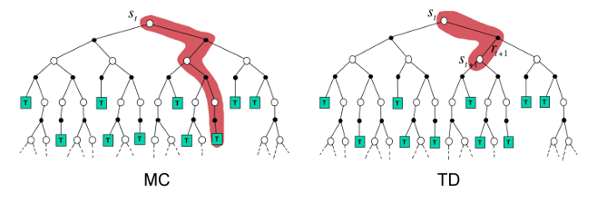
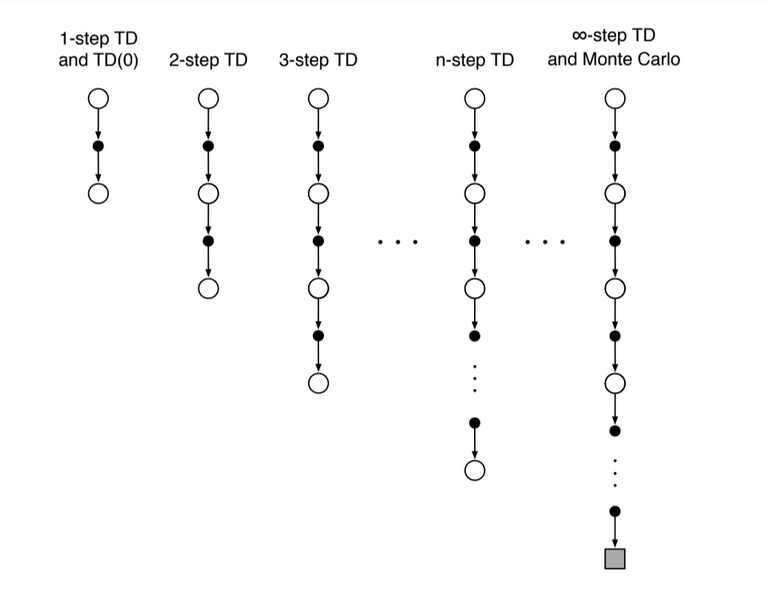

<!-- editorlm-hebrew-html-start -->
<style>
html, body, .vscode-body, .markdown-body, .markdown-preview, #write {
  direction: rtl !important; text-align: right !important;
}
ul, ol { padding-right: 2em !important; padding-left: 0 !important; }
blockquote { border-right: 3px solid #999; border-left: 0; padding-right: 1rem; padding-left: 0; }
@media print {
  html, body, .vscode-body, .markdown-body, .markdown-preview, #write {
    direction: rtl !important; text-align: right !important;
  }
}
</style>
<!-- editorlm-hebrew-html-end -->
<style>
.book { max-width: 900px; margin: auto; line-height: 1.8; font-family: Arial, sans-serif; }
.book .cover { min-height: 680px; box-sizing: border-box; padding: 64px 48px; margin: 24px 0 60px; background: #112b41; color: #f5f8fc; border-top: 9px solid #39c4b5; position: relative; }
.book .cover .eyebrow { color: #81e0d5; font-size: 15px; letter-spacing: 2px; }
.book .cover h1 { color: #fff; font-size: 48px; line-height: 1.3; border: 0; margin: 50px 0 18px; }
.book .cover .subtitle { font-size: 28px; color: #d8e6f0; }
.book .cover .author { font-size: 30px; color: #fff; margin-top: 52px; }
.book .cover .audience { color: #c1d3df; margin-top: 12px; }
.book .cover .motif { direction: ltr; text-align: left; font-family: Consolas, monospace; color: #81e0d5; font-size: 19px; margin-top: 54px; }
.book h1, .book h2, .book h3 { line-height: 1.4; font-weight: 700; }
.book > h1 { font-size: 32px !important; text-align: center !important; margin: 28px 0; }
.book h2 { font-size: 34px !important; text-align: center !important; color: #153b56 !important; background: #eef5fc; border: 0; border-bottom: 4px solid #299c91; border-radius: 10px 10px 0 0; padding: 28px 20px; margin: 24px 0 36px; }
.book h3 { font-size: 24px !important; text-align: right !important; color: #174e49 !important; background: #edf7f5; border: 0; border-right: 5px solid #299c91; border-radius: 6px; padding: 10px 16px; margin: 36px 0 18px; }
.book .chapter { height: 0; margin: 76px 0 0; border-top: 1px solid #ccd7df; break-before: page; page-break-before: always; break-after: avoid; page-break-after: avoid; }
.book .toc { padding: 24px; border-right: 5px solid #39a99d; background: rgba(70,150,155,.09); margin: 24px 0 48px; }
.book pre, .book pre code { direction: ltr !important; text-align: left !important; unicode-bidi: isolate; }
.book pre { box-sizing: border-box !important; width: 100% !important; max-width: 100% !important; margin: 0 !important; padding: 16px 20px; border: 1px solid #ccd7df; border-radius: 8px; line-height: 1.6; overflow-x: auto; }
.book code { direction: ltr; unicode-bidi: isolate; font-family: Consolas, "Courier New", monospace; }
.book pre { background: #f3f6fa !important; color: #1f2937 !important; }
.book pre code, .book pre code.hljs { background: transparent !important; color: #1f2937 !important; }
.book pre .hljs-keyword, .book pre .hljs-literal { color: #6f299c !important; }
.book pre .hljs-string { color: #216338 !important; }
.book pre .hljs-number { color: #075e68 !important; }
.book pre .hljs-comment { color: #526174 !important; }
.book pre .hljs-built_in, .book pre .hljs-title { color: #135b96 !important; }
.book table { width: 75%; max-width: 75%; margin: 18px auto; background: #f3f6fa; }
.book th, .book td { border: 1px solid #ccd7df; padding: 8px 12px; }
.book th, .book td { text-align: right; }
.book .small { font-size: .9em; opacity: .8; }
.book .python-intro { display: flex; align-items: center; gap: 28px; padding: 22px 28px; margin: 24px 0; background: #eef5fc; color: #183e63; border-right: 6px solid #3776ab; border-radius: 10px; }
.book .python-intro strong { font-size: 30px; }
.book .python-fact { background: #fff7d6; color: #423611; border-right: 6px solid #ffd343; border-radius: 8px; padding: 18px 24px; margin: 22px 0; }
.book .python-fact strong { font-size: 24px; }
.book img { max-width: 100%; height: auto; }
.book figure { box-sizing: border-box; width: 75%; max-width: 75%; margin: 24px auto; padding: 16px 20px; background: #f3f6fa; border: 1px solid #ccd7df; border-radius: 8px; text-align: center; }
.book figure img { display: block; margin: auto; }
.book figcaption { direction: rtl; text-align: center; font-size: .9em; color: #445566; }
@media print { .book > h2 { break-before: page; page-break-before: always; } }
.book .screen-strip { width: 760px; max-width: 100%; height: 220px; overflow: hidden; border: 1px solid #bccad5; border-radius: 8px; margin: 20px auto 8px; direction: ltr; }
.book .screen-strip.output { height: 265px; }
.book .screen-strip img { display: block; width: 1745px; max-width: none; }
.book .screen-menu { width: 400px; max-width: 100%; height: 295px; overflow: hidden; direction: ltr; margin: 20px auto 8px; border: 1px solid #bccad5; border-radius: 8px; }
.book .screen-menu img { display: block; width: 1745px; max-width: none; }
.book .code-panel { box-sizing: border-box !important; display: block !important; width: 75% !important; max-width: 75% !important; margin: 18px auto !important; }
@media print {
  .book .cover { min-height: 85vh; break-after: page; print-color-adjust: exact; -webkit-print-color-adjust: exact; }
  .book pre { white-space: pre-wrap; break-inside: avoid; }
  .book .chapter { margin: 0; border: 0; }
  .book h1, .book h2, .book h3 { break-after: avoid; page-break-after: avoid; break-inside: avoid; }
  .book h2 { margin-top: 0; }
  .book h2, .book h3 { print-color-adjust: exact; -webkit-print-color-adjust: exact; }
}
</style>

<style>
.book .book-nav { display: flex; flex-wrap: wrap; gap: 10px; justify-content: center; align-items: center; padding: 16px 0; margin: 20px 0 32px; border-top: 1px solid #ccd7df; border-bottom: 1px solid #ccd7df; }
.book .book-nav a { display: inline-block; padding: 10px 18px; border-radius: 8px; background: #eef5fc; color: #153b56 !important; border: 1px solid #b5ccd9; text-decoration: none !important; font-size: 16px; font-weight: bold; }
.book .book-nav a.toc-link { background: #174e49; color: #fff !important; border-color: #174e49; }
.book .book-nav a:hover, .book .book-nav a:focus { background: #d4eee8; color: #153b56 !important; outline: 2px solid #299c91; outline-offset: 2px; }
.book .section-list { line-height: 2; }
@media print { .book .book-nav { display: none; } }

/* Explicit Hebrew direction, including prose beginning with English. */
.book p, .book ul, .book ol, .book li,
.book blockquote, .book h1, .book h2, .book h3,
.book h4, .book th, .book td {
  direction: rtl !important;
  text-align: right !important;
  unicode-bidi: isolate;
}
/* Chapter titles keep their agreed centered layout. */
.book h2 { text-align: center !important; }
.book pre, .book pre code, .book .code-panel {
  direction: ltr !important;
  text-align: left !important;
  unicode-bidi: isolate;
}
</style>

<style>
.book .formula { box-sizing:border-box; width:75%; max-width:75%; direction:ltr!important; text-align:center!important; overflow-x:auto;
  padding:16px 20px; background:#f3f6fa; color:#1f2937; border:1px solid #ccd7df; border-radius:8px; margin:20px auto; font-size:1.15em; }
.book .grid-panel { box-sizing:border-box; width:75%; max-width:75%; margin:20px auto; padding:16px 20px; background:#f3f6fa; border:1px solid #ccd7df; border-radius:8px; }
.book .grid { direction:ltr!important; width:auto!important; max-width:100%!important; margin:0 auto; border-collapse:collapse; background:#fff; }
.book .grid td { direction:ltr!important; text-align:center!important; width:64px; height:48px; border:1px solid #8199aa; }
.book .grid .goal { background:#d3efdc; } .book .grid .bad { background:#f4d7d7; }
</style>

<div class="book" dir="rtl" lang="he">

<nav class="book-nav" aria-label="ניווט בספר">
<a href="07-%D7%9E%D7%95%D7%A0%D7%98%D7%94%20%D7%A7%D7%A8%D7%9C%D7%95%20%D7%91%D7%90%D7%99%D7%A7%D7%A1%20%D7%A2%D7%99%D7%92%D7%95%D7%9C.md">→ הקודם</a>
<a class="toc-link" href="../index.md">תוכן העניינים</a>
<a href="09-TD%20%D7%91%D7%90%D7%99%D7%A7%D7%A1%20%D7%A2%D7%99%D7%92%D7%95%D7%9C.md">הבא ←</a>
</nav>

## ד.8 — <span dir="ltr" style="unicode-bidi:isolate">Temporal Difference</span>

<p style="text-align:center!important">שיטות במשפחת TD: <span dir="ltr" style="unicode-bidi:isolate">SARSA</span> ו־<span dir="ltr" style="unicode-bidi:isolate">Q-learning</span></p>

**המצגת:** [Temporal Difference](../../../sources/RL/5.%20Temporal%20Difference.pptx)

השאלה שהפרק הזה עונה עליה פשוטה: האם חייבים לחכות לסוף המשחק כדי ללמוד ממנו? בשני הפרקים הקודמים למדנו את שיטת מונטה קרלו: הסוכן משחק אפיזודה שלמה, מחכה לתוצאה הסופית, ורק אז חוזר אחורה ומעדכן את הערכים של כל המצבים והפעולות שעבר בדרך. השיטה עובדת יפה באיקס עיגול, כי המשחק מסתיים אחרי כמה מהלכים. אבל חשבו על נהג שלומד לנהוג: הוא אינו ממתין לסוף הנסיעה כדי להסיק שפנייה חדה מדי הייתה טעות. הוא מרגיש את התוצאה מיד ומתקן את הצעד הבא.

במשחק קצר אפשר להמתין לסיום כדי ללמוד מהתוצאה. במשחק ארוך ההמתנה מעכבת את הלמידה, ובתהליך שאין לו סיום טבעי היא אינה מתאימה. זו המגבלה של גרסת מונטה קרלו האפיזודית שלמדנו. **Temporal Difference — TD** מאפשרת לעדכן ערכים כבר אחרי צעד אחד: משתמשים בתגמול שהתקבל ובאומדן של מה שצפוי בהמשך.

הרעיון הכללי מחבר שני דברים שכבר ראינו. ממונטה קרלו לוקחים את הלמידה מדגימות: אין לנו מודל של הסביבה, ולכן לומדים מניסיון בפועל. מ־Value Iteration לוקחים את ה־Bootstrapping: במקום לחכות לתגמולים העתידיים, משתמשים בהערכה הקיימת של המצב הבא. השילוב נותן אלגוריתם שלומד מכל צעד בודד, בלי מודל ובלי המתנה.

בפרק נציג תחילה את עדכון TD הבסיסי לערכי מצבים, ואחר כך נעבור לערכי Q ולשני האלגוריתמים המרכזיים במשפחה: SARSA ו־Q-learning. ההבדל ביניהם דק אך חשוב, ונקדיש לו סעיף השוואה. בפרק הבא ניישם את הרעיון על איקס עיגול.

### עדכון בלי להמתין לסוף האפיזודה

נתחיל מהמקרה הפשוט ביותר: טבלה של ערכי מצבים V, כמו זו שהכרנו ב־Value Iteration. נזכיר שערך המצב V(S) הוא אומדן לסכום התגמולים המהוון שהסוכן צפוי לצבור מהמצב S והלאה. במונטה קרלו האומדן הזה התעדכן לכיוון התשואה שנמדדה עד סוף האפיזודה. כאן נבנה יעד אחר.

אחרי מעבר מ־S למצב S′ קיבלנו תגמול R. התגמולים הרחוקים עדיין אינם ידועים, אבל כבר יש לנו הערכה V(S′). לכן נבנה יעד המשלב מידע שנמדד עכשיו עם הערכה לעתיד:

<div class="formula" dir="ltr">target = R + γV(S′)<br>V(S) ← V(S) + α[target − V(S)]</div>

השורה הראשונה מגדירה את **היעד — target**: מה שאנחנו חושבים כעת שערך המצב S צריך להיות. השורה השנייה מזיזה את הערך הישן חלק מהדרך לכיוון היעד. הפרמטר α הוא קצב הלמידה שהכרנו במונטה קרלו: α קטן מזיז את הערך מעט בכל עדכון, ו־α גדול נותן משקל רב לדגימה האחרונה. הפרמטר γ הוא מקדם ההיוון, שמקטין את משקלם של תגמולים רחוקים.

בניגוד ל־[תשואה מאפיזודה מלאה](06-מונטה%20קרלו.md#return), היעד הזה אינו סכום של כל התגמולים שכבר נצפו עד הסיום. החלק הראשון שלו הגיע מהסביבה, והחלק השני מגיע מטבלת הערכים הנוכחית.

<figure>

<figcaption>אותו עץ משחק מפרק מונטה קרלו. משמאל (MC): כדי לעדכן את S<sub>t</sub> מחכים למסלול שלם עד מצב סופי T. מימין (TD): מעדכנים כבר אחרי צעד אחד, לפי התגמול של הצעד R<sub>t+1</sub> והאומדן הקיים של המצב הבא S<sub>t+1</sub>.</figcaption>
</figure>

לדוגמה, אם R=0, ‏γ=0.9 ו־V(S′)=0.8, היעד הוא 0.72. אם הערך הישן של S הוא 0.5 ו־α=0.1, נקבל ערך חדש 0.522. אפשר לבצע את העדכון מיד, גם אם המשחק נמשך עוד צעדים רבים. נשים לב שהערך זז רק מ־0.5 ל־0.522, אף שהיעד היה 0.72: זהו עדכון הדרגתי, ורק אחרי דגימות רבות הערך מתקרב ליעד.

<!-- editorlm-source-ref: [sources/RL/5. Temporal Difference.pptx#L9-L23] -->

### TD Error ו־Bootstrapping

כדאי לתת שם לגודל שמניע את העדכון. הפער בין היעד לבין הערך הנוכחי נקרא **שגיאת TD — TD Error**, ומסמנים אותו באות היוונית δ (דלתא):

<div class="formula" dir="ltr">δ = R + γV(S′) − V(S)</div>

בכל עדכון משנים את הערך ב־αδ. שגיאה חיובית אומרת שהמצב היה טוב יותר ממה שחשבנו, והערך עולה; שגיאה שלילית אומרת שהוא היה גרוע יותר, והערך יורד. כשהאומדן מדויק, השגיאה בממוצע קרובה לאפס והערכים מתייצבים. זהו שימוש ב־[Bootstrapping](05-Value%20Iteration.md#bootstrapping): ההערכה של המצב הבא משתתפת בשיפור ההערכה של המצב הנוכחי. במצב סופי אין המשך, ולכן החלק העתידי מתאפס והיעד הוא R בלבד. את המונח שגיאת TD נפגוש שוב בפרק על DQN, שם הוא יהפוך לפונקציית ההפסד של רשת נוירונים.

### מטבלת V לטבלת Q ולדגימת הסביבה

עד כאן דיברנו על ערכי מצבים. אבל כדי שהסוכן יבחר פעולה לפי V(S′) הוא צריך לדעת לאיזה מצב תוביל כל פעולה, כלומר מודל של הסביבה, ואת המודל הזה אין לנו. לכן, כדי לבחור פעולות ללא מודל נשתמש ב־Q, מהסיבה שהוסברה ב־[מונטה קרלו](06-מונטה%20קרלו.md#mc-update): Q(S,A) אומר ישירות כמה שווה לבצע את הפעולה A במצב S, והסוכן בוחר את הפעולה בעלת הערך הגבוה. ביעד של TD מופיע כעת ערך Q של המצב הבא, אבל למצב הבא יש כמה פעולות אפשריות, ולכל אחת ערך Q משלה. צריך להחליט איזה מהם ייכנס ליעד. השאלה הזאת מובילה לשני האלגוריתמים הבאים.

בשניהם נמשיך לדגום מהסביבה מצב הבא ותגמול, ונשמור על חקירה באמצעות ε-greedy. נזכיר: בהסתברות ε בוחרים פעולה חוקית אקראית, וביתר המקרים בוחרים את הפעולה בעלת Q מרבי. ההבדל אינו בשאלה אם מותר לחקור, אלא **באיזו פעולה של המצב הבא משתמשים לצורך העדכון**.

<!-- editorlm-source-ref: [sources/RL/5. Temporal Difference.pptx#L25-L39] -->

<a id="sarsa"></a>
### SARSA — לומדים לפי הפעולה שנבחרה להמשך

האפשרות הראשונה היא הישירה ביותר: להשתמש בערך של הפעולה שהסוכן באמת עומד לבצע במצב הבא. השם SARSA מציין את חמשת הרכיבים של הדגימה: **S, A, R, S′, A′**. מתחילים במצב S, מבצעים A ומקבלים R ו־S′. אם המשחק נמשך, בוחרים גם את A′ לפי אותה מדיניות ε-greedy שבה הסוכן משתמש במשחק. ערך הפעולה הזאת יהיה חלק מהיעד:

<div class="formula" dir="ltr">Q(S,A) ← Q(S,A) + α[R + γQ(S′,A′) − Q(S,A)]</div>

אחרי העדכון ממשיכים מ־S′ ומבצעים את **אותה A′ שכבר נבחרה**. אין להגריל מחדש פעולה מיד לאחר שהשתמשנו בה ביעד. בכך נשמר הקשר בין הפעולה שעל פיה עודכן הערך לבין המדיניות שמבוצעת בפועל.

הפסאודו־קוד מדגיש את הסדר:

<div class="code-panel" dir="ltr">

```text
Initialize Q
For each episode:
    Initialize S
    Choose A using epsilon-greedy
    Repeat:
        Perform A and observe R, S'
        If S' is terminal:
            target = R
        Else:
            Choose A' using epsilon-greedy
            target = R + gamma * Q(S', A')
        Q(S, A) += alpha * (target - Q(S, A))
        If S' is terminal: stop this episode
        S = S'
        A = A'
```

</div>

SARSA נקרא **on-policy**: הוא לומד את ערכי המדיניות שמייצרת את הפעולות, כולל בחירות החקירה שלה. במילים אחרות, ערכי Q שהוא מאמד עונים על השאלה "כמה שווה המצב הזה לסוכן שממשיך לחקור לפעמים באקראי", ולא לסוכן מושלם. בסיום לא בוחרים A′, כי אין פעולה נוספת; מעדכנים לפי התגמול האחרון בלבד.

<!-- editorlm-source-ref: [sources/RL/5. Temporal Difference.pptx#L41-L47] -->

<a id="q-learning"></a>
### Q-learning — לומדים לפי הערך המרבי להמשך

האפשרות השנייה שואלת שאלה אחרת: לא "מה הסוכן יעשה במצב הבא", אלא "מה הכי טוב שאפשר לעשות שם". ב־Q-learning בוחרים את הפעולה שמבצעים בעזרת ε-greedy, אבל יעד העדכון משתמש בערך הגבוה ביותר מבין הפעולות החוקיות במצב הבא. הוא אינו תלוי בשאלה איזו פעולה חוקרת תתבצע שם בפועל:

<div class="formula" dir="ltr">Q(S,A) ← Q(S,A) + α[R + γ max<sub>a′∈A(S′)</sub> Q(S′,a′) − Q(S,A)]</div>

זהו אלגוריתם **off-policy**: הדגימות יכולות להגיע ממדיניות חוקרת, בעוד היעד משתמש בבחירה חמדנית. כלומר, הסוכן משחק במדיניות אחת (עם חקירה) ולומד את ערכיה של מדיניות אחרת (החמדנית, ללא חקירה). התכונה הזאת היא שתאפשר בהמשך ללמוד גם מדגימות ישנות שנשמרו בזיכרון, ונחזור אליה בפרק על DQN. גם כאן, במצב סופי היעד הוא R בלבד.

<div class="code-panel" dir="ltr">

```text
Initialize Q
For each episode:
    Initialize S
    Repeat:
        Choose A using epsilon-greedy
        Perform A and observe R, S'
        If S' is terminal:
            target = R
        Else:
            target = R + gamma * max Q(S', legal action)
        Q(S, A) += alpha * (target - Q(S, A))
        S = S'
    Until S is terminal
```

</div>

שימו לב למיקום הבחירה של A: היא נמצאת בתוך לולאת הצעדים. אין העברה של A′ שנבחרה לצורך היעד, כפי שעשינו ב־SARSA.

<!-- editorlm-source-ref: [sources/RL/5. Temporal Difference.pptx#L49-L57] -->

### ההבדל בין שני מסלולי העדכון

נשווה את השלבים כדי לראות היכן בחירת פעולת ההמשך משנה את יעד הלמידה.

| שלב | SARSA | Q-learning |
| --- | --- | --- |
| בחירת הפעולה שמתבצעת | ε-greedy | ε-greedy |
| מידע שמתקבל מהסביבה | R ו־S′ | R ו־S′ |
| ההמשך שביעד | Q של A′ שנבחרה ב־ε-greedy | Q המרבי בין הפעולות החוקיות |
| הצעד הבא | מבצעים את A′ שכבר נבחרה | בוחרים פעולה מחדש באמצעות ε-greedy |

נניח שבמצב הבא יש שתי פעולות בעלות ערכים 0.8 ו־0.2, והחקירה בחרה בפעולה השנייה. עבור R=0 ו־γ=0.9, יעד SARSA יהיה 0.18 (כי 0.9·0.2) ואילו יעד Q-learning יהיה 0.72 (כי 0.9·0.8). ההפרש נובע מבחירת ההמשך ביעד, אף שהמעבר שנדגם זהה. SARSA "מעניש" את המצב הנוכחי על כך שהחקירה עלולה לבחור בו פעולה גרועה; Q-learning מתעלם מהחקירה ומניח שבהמשך ייבחר הטוב ביותר.

אין מכאן מסקנה שאחד האלגוריתמים תמיד טוב יותר. ההבחנה הדרושה לנו היא מה בדיוק נאמד בזמן שיש חקירה, וכיצד מממשים את העדכון בלי לערבב בין השיטות. טעות נפוצה במימוש היא לשלב את השניים: לבחור A′ ב־ε-greedy לצורך היעד, ואז להגריל פעולה חדשה לצעד הבא. זה אינו SARSA ואינו Q-learning.

<!-- editorlm-source-ref: [sources/RL/5. Temporal Difference.pptx#L59-L67] -->

### n-step TD — כמה צעדים לפני האומדן

עד עכשיו עמדו לפנינו שני קצוות: מונטה קרלו, שמחכה עד סוף האפיזודה ומשתמש רק בתגמולים אמיתיים, ו־TD של צעד אחד, שמשתמש בתגמול יחיד ומיד עובר לאומדן. בין שני הקצוות יש רצף שלם של אפשרויות ביניים. אפשר להמתין לשניים או לשלושה צעדים לפני שמשתמשים באומדן ההמשך. כך משלבים יותר תגמולים שנמדדו בפועל עם ערך משוער בקצה המסלול. עבור n מעברים, כאשר R<sub>t+1</sub> הוא התגמול שאחרי הפעולה בזמן t, היעד הוא:

<div class="formula" dir="ltr">G<sub>t</sub><sup>(n)</sup> = R<sub>t+1</sub> + γR<sub>t+2</sub> + … + γ<sup>n−1</sup>R<sub>t+n</sub> + γ<sup>n</sup>V(S<sub>t+n</sub>)</div>

למשל, ב־2-step נשתמש בשני תגמולים ואז בערך המצב שאליו הגענו: R<sub>t+1</sub>+γR<sub>t+2</sub>+γ²V(S<sub>t+2</sub>). את V(S<sub>t</sub>) נעדכן לכיוון היעד הזה בעזרת α, באותו מבנה של עדכון הדרגתי.

<figure>

<figcaption>הרצף בין השיטות. בכל עמודה עיגול הוא מצב ונקודה היא פעולה. TD של צעד אחד משתמש בתגמול אחד ואז באומדן של המצב האחרון בעמודה; 2-step ו־3-step משתמשים ביותר תגמולים שנמדדו בפועל לפני האומדן; בקצה הימני, מונטה קרלו ממתין עד המצב הסופי (הריבוע) ואינו משתמש באומדן כלל.</figcaption>
</figure>

אם האפיזודה מסתיימת לפני שנאספו n צעדים, עוצרים בסיום ואינם מוסיפים ערך עתידי. כשנאסף צעד יחיד מתקבל TD של צעד אחד; כשמחכים עד סוף האפיזודה ומשתמשים רק בתגמולים, חוזרים לרעיון של מונטה קרלו. n גדול יותר מכניס ליעד יותר מידע שנמדד בפועל ופחות תלות באומדן, אך מחייב להמתין יותר לפני העדכון. בספר זה נסתפק ב־TD של צעד אחד.

בפרק הבא ניישם SARSA על איקס עיגול. שם נתמקד במשמעות של צעד אחד מול יריב ובטיפול המדויק בסיום המשחק.

<!-- editorlm-source-ref: [sources/RL/5. Temporal Difference.pptx#L69-L77] -->

<nav class="book-nav" aria-label="ניווט בספר">
<a href="07-%D7%9E%D7%95%D7%A0%D7%98%D7%94%20%D7%A7%D7%A8%D7%9C%D7%95%20%D7%91%D7%90%D7%99%D7%A7%D7%A1%20%D7%A2%D7%99%D7%92%D7%95%D7%9C.md">→ הקודם</a>
<a class="toc-link" href="../index.md">תוכן העניינים</a>
<a href="09-TD%20%D7%91%D7%90%D7%99%D7%A7%D7%A1%20%D7%A2%D7%99%D7%92%D7%95%D7%9C.md">הבא ←</a>
</nav>

</div>

<!-- editorlm-source-versions: {"schemaVersion": 1, "sources": {"sources/RL/5. Temporal Difference.pptx": {"sourceSha256": "e60d96da1e7a790024fd038cd0a4b569cbfd4d2e39fc26920472cc6ced05d99f", "canonicalTextSha256": "d847ef1583229bd8731218070d9870debc7edfd809f55780d7af70628fd35148"}}} -->
