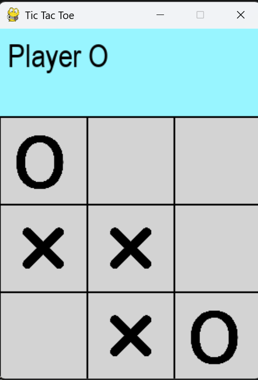

<!-- editorlm-hebrew-html-start -->
<style>
html, body, .vscode-body, .markdown-body, .markdown-preview, #write {
  direction: rtl !important; text-align: right !important;
}
ul, ol { padding-right: 2em !important; padding-left: 0 !important; }
blockquote { border-right: 3px solid #999; border-left: 0; padding-right: 1rem; padding-left: 0; }
@media print {
  html, body, .vscode-body, .markdown-body, .markdown-preview, #write {
    direction: rtl !important; text-align: right !important;
  }
}
</style>
<!-- editorlm-hebrew-html-end -->
<style>
.book { max-width: 900px; margin: auto; line-height: 1.8; font-family: Arial, sans-serif; }
.book .cover { min-height: 680px; box-sizing: border-box; padding: 64px 48px; margin: 24px 0 60px; background: #112b41; color: #f5f8fc; border-top: 9px solid #39c4b5; position: relative; }
.book .cover .eyebrow { color: #81e0d5; font-size: 15px; letter-spacing: 2px; }
.book .cover h1 { color: #fff; font-size: 48px; line-height: 1.3; border: 0; margin: 50px 0 18px; }
.book .cover .subtitle { font-size: 28px; color: #d8e6f0; }
.book .cover .author { font-size: 30px; color: #fff; margin-top: 52px; }
.book .cover .audience { color: #c1d3df; margin-top: 12px; }
.book .cover .motif { direction: ltr; text-align: left; font-family: Consolas, monospace; color: #81e0d5; font-size: 19px; margin-top: 54px; }
.book h1, .book h2, .book h3 { line-height: 1.4; font-weight: 700; }
.book > h1 { font-size: 32px !important; text-align: center !important; margin: 28px 0; }
.book h2 { font-size: 34px !important; text-align: center !important; color: #153b56 !important; background: #eef5fc; border: 0; border-bottom: 4px solid #299c91; border-radius: 10px 10px 0 0; padding: 28px 20px; margin: 24px 0 36px; }
.book h3 { font-size: 24px !important; text-align: right !important; color: #174e49 !important; background: #edf7f5; border: 0; border-right: 5px solid #299c91; border-radius: 6px; padding: 10px 16px; margin: 36px 0 18px; }
.book h4 { font-size: 20px !important; text-align: right !important; color: #174e49 !important; background: transparent; border: 0; border-right: 3px solid #7cc4bb; border-radius: 0; padding: 4px 14px; margin: 30px 0 12px; }
.book .chapter { height: 0; margin: 76px 0 0; border-top: 1px solid #ccd7df; break-before: page; page-break-before: always; break-after: avoid; page-break-after: avoid; }
.book .toc { padding: 24px; border-right: 5px solid #39a99d; background: rgba(70,150,155,.09); margin: 24px 0 48px; }
.book pre, .book pre code { direction: ltr !important; text-align: left !important; unicode-bidi: isolate; }
.book pre { box-sizing: border-box !important; width: 100% !important; max-width: 100% !important; margin: 0 !important; padding: 16px 20px; border: 1px solid #ccd7df; border-radius: 8px; line-height: 1.6; overflow-x: auto; }
.book code { direction: ltr; unicode-bidi: isolate; font-family: Consolas, "Courier New", monospace; }
.book pre { background: #f3f6fa !important; color: #1f2937 !important; }
.book pre code, .book pre code.hljs { background: transparent !important; color: #1f2937 !important; }
.book pre .hljs-keyword, .book pre .hljs-literal { color: #6f299c !important; }
.book pre .hljs-string { color: #216338 !important; }
.book pre .hljs-number { color: #075e68 !important; }
.book pre .hljs-comment { color: #526174 !important; }
.book pre .hljs-built_in, .book pre .hljs-title { color: #135b96 !important; }
.book table { width: 75%; max-width: 75%; margin: 18px auto; background: #f3f6fa; }
.book th, .book td { border: 1px solid #ccd7df; padding: 8px 12px; }
.book th, .book td { text-align: right; }
.book .small { font-size: .9em; opacity: .8; }
.book .python-intro { display: flex; align-items: center; gap: 28px; padding: 22px 28px; margin: 24px 0; background: #eef5fc; color: #183e63; border-right: 6px solid #3776ab; border-radius: 10px; }
.book .python-intro strong { font-size: 30px; }
.book .python-fact { background: #fff7d6; color: #423611; border-right: 6px solid #ffd343; border-radius: 8px; padding: 18px 24px; margin: 22px 0; }
.book .python-fact strong { font-size: 24px; }
.book .optional { background: #fff7d6; color: #423611; border-right: 6px solid #ffd343; border-radius: 8px; padding: 18px 24px; margin: 22px 0; font-size: .95em; }
.book .optional .formula { width: 90%; max-width: 90%; background: #fffdf3; }
.book .key-note { box-sizing:border-box; width:75%; max-width:75%; margin:26px auto; border:2px solid #1f7a70; border-radius:10px; background:#e6f7f4; overflow:hidden; }
.book .key-note .key-title { background:#1f7a70; color:#fff; font-weight:700; font-size:1.15em; padding:8px 18px; direction:rtl; text-align:right; }
.book .key-note .key-body { padding:14px 18px 16px; font-size:1.05em; direction:rtl; text-align:right; }
.book .grid-row { display:flex; flex-wrap:wrap; justify-content:center; align-items:flex-start; gap:14px 18px; }
.book .grid-row figure { width:auto; max-width:100%; margin:0; padding:0; background:transparent; border:0; }
.book .grid-row figcaption { margin-top:6px; font-size:.85em; }
.book .grid.small td { width:46px; height:36px; font-size:.9em; }
.book .grid .changed { color:#c8102e; font-weight:700; }
.book .grid.actions-table, .book .grid.actions-table th, .book .grid.actions-table td { direction:rtl!important; text-align:center!important; }
.book .grid.actions-table th { background:#eef5fc; border:1px solid #8199aa; font-weight:700; }
.book .bellman { box-sizing:border-box; width:75%; max-width:75%; margin:26px auto; border:2px solid #1f7a70; border-radius:10px; background:#e6f7f4; overflow:hidden; }
.book .bellman .bellman-title { background:#1f7a70; color:#fff; font-weight:700; font-size:1.15em; padding:8px 18px; direction:rtl; text-align:right; }
.book .bellman .bellman-cond { direction:ltr!important; text-align:center!important; unicode-bidi:isolate; padding:14px 20px 0; font-size:1.05em; color:#1f2937; }
.book .bellman .bellman-cond + .bellman-cond { padding-top:4px; }
.book .bellman .bellman-eq { direction:ltr!important; text-align:center!important; unicode-bidi:isolate; padding:12px 20px 18px; font-size:1.5em; font-weight:700; color:#0b3d5c; }
.book .bellman .bellman-eq span { background:#fff3b0; padding:4px 14px; border-radius:8px; border:1px solid #e6c94a; }
/* Display math renders left-to-right and centered, independent of the RTL page. */
.book .math-panel, .book .math-panel .katex-display, .book .math-panel .katex {
  direction: ltr !important;
  text-align: center !important;
  unicode-bidi: isolate;
}
.book .math-panel { box-sizing: border-box; width: 75%; max-width: 75%; margin: 20px auto; padding: 16px 20px; background: #f3f6fa; color: #1f2937; border: 1px solid #ccd7df; border-radius: 8px; overflow-x: auto; font-size: 1.1em; }
.book .math-panel .katex-display { margin: 0; }
.book .math-panel p { margin: 0; }
.book img { max-width: 100%; height: auto; }
.book figure { box-sizing: border-box; width: 75%; max-width: 75%; margin: 24px auto; padding: 16px 20px; background: #f3f6fa; border: 1px solid #ccd7df; border-radius: 8px; text-align: center; }
.book figure img { display: block; margin: auto; }
.book figcaption { direction: rtl; text-align: center; font-size: .9em; color: #445566; }
@media print { .book > h2 { break-before: page; page-break-before: always; } }
.book .screen-strip { width: 760px; max-width: 100%; height: 220px; overflow: hidden; border: 1px solid #bccad5; border-radius: 8px; margin: 20px auto 8px; direction: ltr; }
.book .screen-strip.output { height: 265px; }
.book .screen-strip img { display: block; width: 1745px; max-width: none; }
.book .screen-menu { width: 400px; max-width: 100%; height: 295px; overflow: hidden; direction: ltr; margin: 20px auto 8px; border: 1px solid #bccad5; border-radius: 8px; }
.book .screen-menu img { display: block; width: 1745px; max-width: none; }
.book .code-panel { box-sizing: border-box !important; display: block !important; width: 75% !important; max-width: 75% !important; margin: 18px auto !important; }
@media print {
  .book .cover { min-height: 85vh; break-after: page; print-color-adjust: exact; -webkit-print-color-adjust: exact; }
  .book pre { white-space: pre-wrap; break-inside: avoid; }
  .book .chapter { margin: 0; border: 0; }
  .book h1, .book h2, .book h3 { break-after: avoid; page-break-after: avoid; break-inside: avoid; }
  .book h2 { margin-top: 0; }
  .book h2, .book h3 { print-color-adjust: exact; -webkit-print-color-adjust: exact; }
}
</style>

<style>
.book .book-nav { display: flex; flex-wrap: wrap; gap: 10px; justify-content: center; align-items: center; padding: 16px 0; margin: 20px 0 32px; border-top: 1px solid #ccd7df; border-bottom: 1px solid #ccd7df; }
.book .book-nav a { display: inline-block; padding: 10px 18px; border-radius: 8px; background: #eef5fc; color: #153b56 !important; border: 1px solid #b5ccd9; text-decoration: none !important; font-size: 16px; font-weight: bold; }
.book .book-nav a.toc-link { background: #174e49; color: #fff !important; border-color: #174e49; }
.book .book-nav a:hover, .book .book-nav a:focus { background: #d4eee8; color: #153b56 !important; outline: 2px solid #299c91; outline-offset: 2px; }
.book .section-list { line-height: 2; }
@media print { .book .book-nav { display: none; } }

/* Explicit Hebrew direction, including prose beginning with English. */
.book p, .book ul, .book ol, .book li,
.book blockquote, .book h1, .book h2, .book h3,
.book h4, .book th, .book td {
  direction: rtl !important;
  text-align: right !important;
  unicode-bidi: isolate;
}
/* Chapter titles keep their agreed centered layout. */
.book h2 { text-align: center !important; }
.book pre, .book pre code, .book .code-panel {
  direction: ltr !important;
  text-align: left !important;
  unicode-bidi: isolate;
}
</style>

<style>
.book .formula { box-sizing:border-box; width:75%; max-width:75%; direction:ltr!important; text-align:center!important; overflow-x:auto;
  padding:16px 20px; background:#f3f6fa; color:#1f2937; border:1px solid #ccd7df; border-radius:8px; margin:20px auto; font-size:1.15em; }
.book .grid-panel { box-sizing:border-box; width:75%; max-width:75%; margin:20px auto; padding:16px 20px; background:#f3f6fa; border:1px solid #ccd7df; border-radius:8px; }
.book .grid { direction:ltr!important; width:auto!important; max-width:100%!important; margin:0 auto; border-collapse:collapse; background:#fff; }
.book .grid td { direction:ltr!important; text-align:center!important; width:64px; height:48px; border:1px solid #8199aa; }
.book .grid .goal { background:#d3efdc; } .book .grid .bad { background:#f4d7d7; }
</style>

<div class="book" dir="rtl" lang="he">

<nav class="book-nav" aria-label="ניווט בספר">
<a href="07-%D7%9E%D7%95%D7%A0%D7%98%D7%94%20%D7%A7%D7%A8%D7%9C%D7%95.md">→ הקודם</a>
<a class="toc-link" href="../index.md">תוכן העניינים</a>
<a href="09-Temporal%20Difference.md">הבא ←</a>
</nav>

## ד.8 — מונטה קרלו באיקס עיגול — טבלת Q וקוד האימון

**המצגת:** [מונטה קרלו באיקס עיגול](../../../sources/RL/4.1.%20איקס%20עיגול.pptx) · **קוד:** [ענף התרגיל main](https://github.com/MarkmanGilad/Tic_Tac_Toe_2) · [ענף הפתרון solved](https://github.com/MarkmanGilad/Tic_Tac_Toe_2/tree/solved) · [MC_Trainer.py](https://github.com/MarkmanGilad/Tic_Tac_Toe_2/blob/solved/MC_Trainer.py) · [AI_Agent.py](https://github.com/MarkmanGilad/Tic_Tac_Toe_2/blob/solved/AI_Agent.py) · [TicTacToe.py](https://github.com/MarkmanGilad/Tic_Tac_Toe_2/blob/solved/TicTacToe.py) · [State.py](https://github.com/MarkmanGilad/Tic_Tac_Toe_2/blob/solved/State.py)

בפרק הקודם בנינו את אלגוריתם מונטה קרלו בפסאודו־קוד: משחקים אפיזודה שלמה, מחשבים תשואות מהסוף להתחלה ומעדכנים טבלת Q. עכשיו נממש אותו על איקס עיגול. במשחק הזה יש לכל היותר 3<sup>9</sup> = 19,683 סידורי לוח, ובפועל פחות, כי לא כל סידור חוקי; מרחב קטן כזה אפשר היה לפתור גם בתכנון דינמי, אבל אנחנו נאמן את הסוכן מהתנסות בלבד, בלי מודל של היריב. הסוכן שלנו ישחק את השחקן הראשון, X, ויתאמן מול סוכן אקראי. זו הפעם הראשונה בחלק ד שסוכן לומד ממשחקים אמיתיים, ובסוף הפרק נמדוד כמה טוב הוא משחק.

<figure>

<figcaption>חלון המשחק של המאגר. הפס העליון מציג את השחקן שתורו כעת, ומתחתיו הלוח 3×3: X הוא הסוכן הלומד, O הוא היריב. כאן תור O, אחרי ש־X הניח את הסימן השלישי שלו.</figcaption>
</figure>

הפרק הזה הוא תרגיל, כמו פרק הפאזל: תחילה נכיר את המשחק הנתון ואת הממשק שלו, ואחר כך נראה איך שומרים את טבלת Q במילון ומה נדרש כדי שלוח שלם ישמש בו מפתח (על מילונים וגיבוב עצמם למדנו בחלק א, ורק נפנה לשם). אז יבואו השלד להשלמה, המשימה, הפתרון וההרצה.

<!-- editorlm-source-ref: [sources/RL/4.1. איקס עיגול.pptx#L12-L17] -->

### המשחק הנתון — מאגר Tic_Tac_Toe_2

במאגר [Tic_Tac_Toe_2](https://github.com/MarkmanGilad/Tic_Tac_Toe_2) בגיטהב נתון משחק איקס עיגול שלם לפי מודל סוכן–סביבה, עם גרפיקה ב־pygame. הענף `main` הוא גרסת התרגיל, ובו קטעי הקוד להשלמה מסומנים בהערות בעברית; הענף `solved` הוא הפתרון. אלה הקבצים:

| קובץ | תפקיד |
| --- | --- |
| `Graphics.py` | קבועים (מידות, צבעים, `FPS`) וציור הלוח בחלון |
| `State.py` | המצב: הלוח כטבלת numpy בגודל 3×3, תור השחקן ותוצאת המשחק |
| `TicTacToe.py` | הסביבה: ביצוע מהלך, בדיקת חוקיות, חישוב המצב הבא והתגמול, בדיקת סיום |
| `Human_Agent.py` | סוכן אנושי: לחיצת עכבר על משבצת |
| `Random_Agent.py` | סוכן אקראי: משבצת פנויה אקראית; זה היריב באימון |
| `Random_Agent_Advanced.py` | יריב אקראי משופר: מנצח אם אפשר, חוסם אם צריך, ואחרת משחק באקראי; היריב בענף הפתרון |
| `AI_Agent.py` | הסוכן הלומד, ובו טבלת Q; משלימים בו את ε-greedy |
| `MC_Trainer.py` | האימון במונטה קרלו; משלימים בו את איסוף האפיזודה ואת לולאת האימון |
| `Tester.py` | 1,000 משחקי בדיקה של סוכן מאומן, ללא גרפיקה |
| `Game.py` | משחק בחלון: הסוכן המאומן נגד שחקן אנושי |
| `Data/` | טבלאות Q שמורות |
| `SARSA_Trainer.py` | אימון בשיטה שנלמד בפרקים הבאים |

**המצב — State.** הלוח הוא טבלת numpy בגודל 3×3: 1 עבור X, ‎−1 עבור O ו־0 למשבצת ריקה. `player` הוא השחקן שתורו כעת (1 או ‎−1), ו־`end_of_game` מחזיק את תוצאת המשחק: 0 כל עוד המשחק נמשך, 1 לניצחון X, ‎−1 לניצחון O ו־2 לתיקו.

<div class="code-panel" dir="ltr">

```python
import numpy as np

class State:
    def __init__(self, board = None, player = 1):
        if board is not None:
            self.board = board
        else:
            self.board = self.init_board()
        self.player = player
        self.end_of_game = 0

    def init_board(self):
        board = np.zeros((3,3))
        # board[1,1] = 1
        # board[0,0] = -1
        return board
    
    def reset (self):
        self.board = self.init_board()
        self.player = 1
        self.end_of_game = 0

    def switch_players (self):
        if self.player == 1:
            self.player = -1
        else:
            self.player = 1

    def __eq__(self, other) ->bool:
        # b1 = np.equal(self.board, other.board).all()
        return np.equal(self.board, other.board).all()

    def __hash__(self) -> int:
        return hash(tuple(self.board.astype(np.int8).ravel()))
    
    def copy (self):
        newBoard = np.copy(self.board)
        return State(board=newBoard, player=self.player)
    
    def __str__(self) -> str:
        return str(self.board)
```

</div>

`__eq__` קובעת ששני מצבים שווים כאשר הלוחות שלהם זהים תא בתא, ו־`copy` מחזירה מצב חדש עם העתק של הלוח. את `__hash__` נסביר בהמשך הפרק: היא מה שמאפשר למצב לשמש מפתח במילון.

**הסביבה — TicTacToe.** שלוש שיטות משרתות את האימון. `next_state(state, action)` היא המודל של צעד אחד: היא מעתיקה את המצב, מניחה את הסימן של השחקן שתורו במשבצת שנבחרה, מעבירה את התור, בודקת אם המשחק הסתיים ומחזירה את המצב החדש ואת התגמול. `end_of_game(state)` בודקת סיום ומעדכנת את `state.end_of_game`, ו־`move(action)` מבצעת מהלך על המצב האמיתי של המשחק, בשביל `Game.py`:

<div class="code-panel" dir="ltr">

```python
    def next_state (self, state: State, action):
        next_state = state.copy()
        next_state.board[action] = state.player
        next_state.switch_players()
        self.end_of_game(next_state)
        if next_state.end_of_game == 2:
            reward = 0
        else:
            reward = next_state.end_of_game
        return next_state, reward

    def end_of_game (self, state: State):
        board = state.board
        row_sum = np.sum(board, axis=1)
        col_sum = np.sum(board, axis=0)
        diagonals = [np.trace(board), np.trace(np.fliplr(board))]
        piece_num =  np.count_nonzero(board)
        
        # print (f'row_sum: {row_sum} col_sum: {col_sum} diagonals: {diagonals} piece_num: {piece_num}')
        if 3 in row_sum or 3 in col_sum or 3 in diagonals:
            state.end_of_game = 1
            return True
        if -3 in row_sum or -3 in col_sum or -3 in diagonals:
            state.end_of_game = -1
            return True
        if piece_num == 9:
            state.end_of_game = 2
            return True
        return False
```

</div>

בדיקת הסיום נשענת על הייצוג המספרי: שורה, עמודה או אלכסון שסכומם 3 הם שלושה X, וסכום ‎−3 הוא שלושה O; תשעה סימנים בלי מנצח הם תיקו. התגמול הוא מנקודת המבט של X: 1 לניצחון, ‎−1 להפסד, 0 לתיקו ולכל מהלך שבו המשחק נמשך. לכן תגמול 0 לבדו אינו אומר אם המשחק נגמר, ובודקים סיום בנפרד. פעולה היא זוג <span dir="ltr">(row, col)</span>, כשמספור השורות והעמודות מתחיל באפס, ורשימת הפעולות החוקיות היא המשבצות שבהן 0; את הרשימה הזאת מחשב הסוכן בעצמו ב־`legal_actions`.

<a id="game-interface"></a>

| קריאה או שדה | המשמעות באימון |
| --- | --- |
| `State()` | לוח ריק, תור X |
| `env.next_state(state, action)` | מצב חדש ותגמול לאחר מהלך אחד; המצב הישן נשמר |
| `env.end_of_game(state)` | האם המשחק הסתיים |
| `state.end_of_game` | 0 למשחק ממשיך, 1 לניצחון X, ‎−1 לניצחון O, 2 לתיקו |
| `agent.legal_actions(state)` | רשימת המשבצות הפנויות כזוגות <span dir="ltr">(row, col)</span> |

**היריב — Random_Agent.** `np.where(board == 0)` מחזירה את מיקומי המשבצות הריקות, `zip` מחבר אותם לזוגות, ו־`random.choice` בוחר אחד מהם:

<div class="code-panel" dir="ltr">

```python
    def get_action(self, events=None, state = None, epoch=None):
        if state is None:
            state = self.env.state
        board = state.board
        indices = np.where(board == 0)
        actions = list(zip(indices[0], indices[1]))
        action = random.choice(actions)
        return action
```

</div>

**היריב המשופר — Random_Agent_Advanced.** בענף הפתרון יש יריב נוסף, שחושב צעד אחד קדימה. בכל תור הוא בודק שני דברים בעזרת `find_winning_action`: האם יש לו משבצת שמשלימה לו שלשה, ואם כן הוא מנצח; ואם לא, האם ל־X יש משבצת כזאת, ואם כן הוא חוסם אותה. רק אם אין לא ניצחון ולא חסימה הוא בוחר משבצת פנויה באקראי. כדי שלא יהיה צפוי לגמרי, באחד מכל חמישה מהלכים (`random_step = 5`) הוא מדלג על הבדיקה ומשחק באקראי בכל מקרה:

<div class="code-panel" dir="ltr">

```python
    def get_action(self, events=None, state = None, epoch=100, train=False, random_step = 5):
        if state is None:
            state = self.env.state
        board = state.board
        win_action = self.find_winning_action(board=board, player=self.player)
        block_action = self.find_winning_action(board=board, player=-self.player)
        if random.random() > 1/random_step:
            if win_action:
                return win_action
            if block_action :
                return block_action
        indices = np.where(board == 0)
        actions = list(zip(indices[0], indices[1]))
        action = random.choice(actions)
        return action
```

</div>

`find_winning_action` סורקת את השורות, העמודות והאלכסונים ומחפשת קו שבו לשחקן הנתון שני סימנים ומשבצת ריקה אחת; היא מחזירה את המשבצת הזאת, או `None` אם אין כזאת. יריב כזה מפגיש את הסוכן עם מצבים קשים יותר מיריב אקראי לגמרי: הוא לא נותן לנצח בקלות ומעניש טעויות.

נקודה חשובה: מנקודת מבטו של הסוכן הלומד, תגובת היריב היא חלק מ״הסביבה״, בדיוק כמו החלקה על כביש חלק בדוגמה מהפרק הקודם. לכן צעד למידה אחד יכלול את הפעולה של X ואת תגובת O, אם המשחק לא הסתיים קודם; המצב הבא של צעד למידה הוא מצב שבו X שוב צריך לבחור, או מצב סופי.

### מימוש Q-Table — מילון של מצב–פעולה וערך

בפרק הקודם דיברנו על ״טבלת Q״ באופן כללי. עכשיו צריך להחליט איך לשמור אותה בזיכרון. מערך דו־ממדי אינו מתאים: המצבים אינם מספרים רצים אלא לוחות, ואיננו יודעים מראש באילו מהם נבקר. מבנה הנתונים המתאים הוא **מילון (dict)**, שהכרנו ב[פרק א.11](../01-פייתון/11-dict.md) והשתמשנו בו בפרק הפאזל: המפתח יהיה זוג <span dir="ltr">(state, action)</span>, והערך המספר של אותו מצב–פעולה:

<div class="code-panel" dir="ltr">

```python
Q = dict()
state = State()
action = (1, 1)
Q[(state, action)] = 0.7
value = Q.get((state, action), 0)
```

</div>

המפתח בדוגמה מתאר בחירה במרכז מתוך לוח ריק. תזכורת: אם המפתח כבר קיים במילון, ההשמה מעדכנת את ערכו, ואין כפילויות; אם אינו קיים, הוא מתווסף עם הערך הנתון. `Q.get(key, 0)` מחזירה 0 אם המפתח עדיין אינו במילון, ולכן אין צורך למלא את הטבלה מראש: זוג מקבל שורה בפעם הראשונה שפונים אליו. במשחקי לוח אפשר גם לחשוב על המצב–פעולה כעל הלוח שאחרי הפעולה, לוח ריק ובמרכזו X; המצב הבא s′ כבר תלוי במהלך של השחקן השני.

<!-- editorlm-source-ref: [sources/RL/4.1. איקס עיגול.pptx#L21-L29] [sources/RL/4. מונטה קרלו.pptx#L280-L288] -->

### State כמפתח — פונקציית גיבוב לאובייקטים

כדי שערך כלשהו יוכל לשמש **מפתח** במילון, חייבת להיות לו **פונקציית גיבוב (hash)**. זה הכלל היחיד שחשוב לנו כאן, ונזכיר בקצרה מה עומד מאחוריו (ההסבר המלא ב[פרק א.17](../01-פייתון/17-גיבוב.md)).

**מהי פונקציית גיבוב.** מילון בפייתון הוא טבלת גיבוב: מערך של תאים. פונקציית הגיבוב מקבלת ערך ומחזירה מספר שלם, והמספר הזה קובע באיזה תא בטבלה יישמר הזוג. כשמכניסים מפתח למילון, פייתון מחשב ממנו את המספר ומניח את הזוג בתא המתאים; כשמחפשים מפתח, הוא מחשב שוב את אותו מספר וניגש ישירות לאותו תא, בלי לעבור על שאר המפתחות. לכן חיפוש והכנסה מהירים גם במילון של מיליוני זוגות, וזה מה שמאפשר לנו לפנות ל־Q מיליוני פעמים באימון. הדרישה הבסיסית מפונקציית גיבוב היא ששני ערכים שווים יקבלו תמיד אותו מספר; אחרת אותו מפתח ״ילך לאיבוד״ בתא אחר.

למספרים, למחרוזות ול־tuple יש בפייתון פונקציית גיבוב מוכנה, ולכן הם משמשים מפתחות בלי מאמץ; זו הסיבה שבפאזל המרנו את הלוח ל־tuple. אבל `State` היא מחלקה שלנו, ולאובייקט של מחלקה משלנו פייתון אינו יודע לחשב מספר מתוך התוכן. לכן עלינו להגדיר בעצמנו את פונקציית הגיבוב שלו, ואיתה גם את ההשוואה בין שני מצבים. לשם כך משמשות שתי המתודות המיוחדות שראינו ב־`State.py`:

<div class="code-panel" dir="ltr">

```python
    def __eq__(self, other) ->bool:
        # b1 = np.equal(self.board, other.board).all()
        return np.equal(self.board, other.board).all()

    def __hash__(self) -> int:
        return hash(tuple(self.board.astype(np.int8).ravel()))
```

</div>

`ravel` פורסת את הלוח לשורה של תשעה מספרים, `tuple` הופכת אותה ל־tuple, ו־`hash` של פייתון מחשבת ממנו את המספר. המילון קורא לשתי המתודות בעצמו בכל פנייה למפתח: `__hash__` אומרת לו באיזה תא לחפש, ו־`__eq__` בודקת אם המפתח שנמצא שם הוא אכן אותו מצב. מצבים שווים חייבים לקבל אותו hash, ולכן שתיהן מסתמכות על אותו לוח. כך אותו לוח, שיופיע באימון פעמים רבות כאובייקטים שונים שנוצרו ב־`next_state`, מגיע תמיד לאותה שורה ב־Q.

כלל אחד חשוב: אין לשנות את תוכנו של מצב לאחר ששימש מפתח, אחרת הגיבוב ישתנה והמילון לא ימצא אותו. הלוח הוא טבלת numpy, שאפשר לשנות, ולכן קוד האימון שומר באפיזודה `state.copy()` ולא את המצב עצמו.

<!-- editorlm-source-ref: [sources/RL/4.1. איקס עיגול.pptx#L81-L89] -->

### השלד להשלמה

בענף `main` שני קבצים ממתינים להשלמה. הראשון הוא הסוכן, `AI_Agent.py`:

<div class="code-panel" dir="ltr">

```python
from TicTacToe import TicTacToe
import numpy as np
from Graphics import *
import torch
import math
import random

class AI_Agent:
    def __init__(self, player, env: TicTacToe, graphics: Graphics = None, Q_table_PATH = None, train = True):
        self.env = env
        self.player = player
        if Q_table_PATH is None:
            self.Q = dict ()
        else:
            self.load_Q(Q_table_PATH)
        self.train = train

    def get_Q (self, state, action):
        if (state, action) in self.Q:
            return self.Q[(state, action)]
        else:
            return 0

    # greedy action
    def get_Q_action(self, state = None):
        if state is None:
            state = self.env.state
        actions = self.legal_actions(state)
        best_value = -10
        best_action = None
        for action in actions:
            key = (state, action)
            Q_value = self.Q.get((state, action),0)
            if Q_value > best_value:
                best_value = Q_value
                best_action = action
                
        return best_action
    
    # epsilon-greedy
    def get_action (self, state, epoch = None):
        if self.train:
            r = random.random()
            epsilon = self.epsilon_greedy(epoch)
        else:
            r = 1
            epsilon = 0
        if r < epsilon:
            action = random.choice(self.legal_actions(state))
        else:
            action = self.get_Q_action(state = state)
        return action

    def legal_actions (self, state):
        board = state.board
        indices = np.where(board == 0)
        actions = list(zip(indices[0], indices[1]))
        return actions

    def load_Q (self, PATH):
        self.Q = torch.load(PATH, weights_only=False)

    def save_Q (self, PATH):
        torch.save(self.Q, PATH)

    def epsilon_greedy (self, epoch)-> float:
        start = 1.0
        final = 0.01
        decay = 100
        
        '''
        עליכם לממש את הפונקציה אפסילון גרידי.
        ניתן לממש כפונקציה לינארית או מעריכית, לבחירתכם.
        
        '''

    def __call__(self, events= None, state=None):
        return self.get_action(state)
```

</div>

כמעט הכול כתוב. `get_Q` מחזירה את הערך של זוג, או 0 אם עדיין אינו בטבלה. `get_Q_action` היא הבחירה החמדנית: עוברת על הפעולות החוקיות ומחזירה את זו עם Q הגבוה ביותר, בדיוק ה־argmax מהפרק הקודם. `get_action` היא ε-greedy: בזמן אימון מגרילה r ומשווה ל־ε שמחזירה `epsilon_greedy`, ובזמן משחק (`train=False`) ε הוא 0 ובוחרים תמיד לפי הטבלה. `save_Q` ו־`load_Q` שומרות וטוענות את המילון לקובץ. חסרה רק `epsilon_greedy`, פונקציית הדעיכה של ε לפי מספר האפיזודה.

השני הוא המאמן, `MC_Trainer.py`:

<div class="code-panel" dir="ltr">

```python
from TicTacToe import TicTacToe
from State import State
from Human_Agent import Human_Agent
from Random_Agent import Random_Agent
from AI_Agent import AI_Agent

PATH = 'Data/Q_MC_4.pth'

env = TicTacToe(State())
player1 = AI_Agent(1, env, graphics=None, Q_table_PATH=None)
player2 = Random_Agent(-1, env,graphics=None)

gamma = 0.9

def main ():
    player = player1    
    
    '''
    השלימו את הקוד המאמן את הסוכן לפי אלגוריתם מנטו קרלו

    חובה להשתמש בפונקציה 
    Generate_episode
    '''


    player.save_Q(PATH)
    print(test(100))

def Generate_episode (player, epoch):
    episods = []
    
    '''
    השלימו את הקוד היוצר רשימה של צעדים מתחילת משחק ועד לסיומו.

    מבנה הרשימה:
    episods = [(state, action, reward), (state, action, reward), ...]

    ניתן להשתמש בפונקציה אפסילון-גרידי מתוך הסוכן החכם, אותו עליכם לבנות.
    '''

    return episods

def test (num):
    x_win = 0
    o_win = 0
    tie = 0
    player = player1
    player.train=False
    player.load_Q(PATH)
    for n in range(num):
        player = player1
        state = State()
        while not env.end_of_game(state):
            action = player.get_action(state=state)
            state, _ = env.next_state(state,action)
            player = switch_players(player)
        if state.end_of_game == 1:
            x_win +=1
        elif state.end_of_game == -1:
            o_win += 1
        else:
            tie +=1
        state.reset()
        print(n, end = "\r")    
    return x_win, o_win, tie

def print_episodes (episode):
    for i, e in enumerate(episode):
        print(f'\n i= {i} player = {e[0].player} ')
        for i in e:
            print (i, end=" ")

def switch_players(player):
    if player == player1:
        return player2
    else:
        return player1

if __name__ == '__main__':
    main()
    # print(test(100))
```

</div>

הקובץ יוצר סביבה, סוכן לומד שמשחק X (`player1`) ויריב אקראי שמשחק O (`player2`), וקובע γ. `test(num)` כבר כתובה: היא טוענת את הטבלה השמורה, מכבה את החקירה (`train=False`), משחקת `num` משחקים מול היריב האקראי לפי הטבלה בלבד, וסופרת ניצחונות של X, ניצחונות של O ותיקו. שתי הפונקציות להשלמה הן `Generate_episode`, שמשחקת משחק אחד ומחזירה את רשימת הצעדים, ו־`main`, לולאת האימון.

**לפני ההשלמה** אפשר לראות את היעד: `Game.py` בענף התרגיל טוען טבלת Q מאומנת מן הקובץ `Data/Q_MC_3.pth` ומעמיד את הסוכן, כ־X, מול שחקן אנושי. הריצו אותו ונסו לנצח.

<!-- editorlm-source-ref: [sources/RL/4. מונטה קרלו.pptx#L271-L276] -->

**המשימה.** עצרו כאן ונסו לפתור לבד לפי הפסאודו־קוד מהפרק הקודם, לפני שתמשיכו לפתרון:

1. ממשו את `epsilon_greedy(epoch)` ב־`AI_Agent.py`: ε יורד מ־`start` ל־`final` לאורך `decay` אפיזודות, בקו ישר או בדעיכה מעריכית, לבחירתכם. שימו לב ש־`decay` בשלד הוא 100; לאימון של מאות אלפי משחקים כדאי ערך גדול בהרבה.
2. ממשו את `Generate_episode(player, epoch)`: מתחילים מלוח ריק, וכל עוד המשחק לא הסתיים X בוחר פעולה ב־`player.get_action(state=state, epoch=epoch)`, הסביבה מבצעת אותה, ואם המשחק נמשך היריב מגיב ב־`player2.get_action(state=...)`. לכל צעד שומרים ברשימה את המצב שלפני הפעולה של X (עותק!), את הפעולה ואת התגמול שהתקבל אחרי תגובת היריב.
3. ממשו את `main`: לולאה של `epochs` אפיזודות; בכל אחת `Generate_episode`, ואז מעבר על הצעדים מהסוף להתחלה עם `G = gamma*G + reward` ועדכון `player.Q[(state, action)]` לפי כלל מונטה קרלו עם α קטן.
4. הריצו את `MC_Trainer.py`. בסיום מודפסת תוצאת `test(100)`: כמה משחקים ניצח הסוכן מתוך 100? אחר כך הריצו את `Game.py` עם הקובץ החדש ושחקו נגדו.
5. **תרגיל נוסף:** שנו את הקוד ובנו סוכן שמשחק את השחקן השני, O. שימו לב שהתגמול שמחזירה הסביבה הוא מנקודת המבט של X, ושהמצב שבו O בוחר הוא הלוח אחרי המהלך של X.

<div class="key-note">
<div class="key-title">לפני הפתרון: ביישום שלנו היריב אינו חלק מהסביבה</div>
<div class="key-body">בפסאודו־קוד של הפרק הקודם כתבנו <span dir="ltr">next_state, reward = environment(state, action)</span>, וההנחה הייתה שהסביבה כבר כוללת את תגובת היריב: מוסרים לה את המהלך שלנו ומקבלים בחזרה את הלוח שבו שוב תורנו. בקוד של המאגר זה לא כך. המחלקה <code>TicTacToe</code> מבצעת ב־<code>next_state</code> מהלך אחד בלבד, של השחקן שתורו, ואינה יודעת דבר על יריבים; היריב הוא אובייקט נפרד, <code>player2</code>, עם <code>get_action</code> משלו. לכן את היריב צריך להפעיל בעצמנו בתוך <code>Generate_episode</code>: אחרי המהלך של X בודקים אם המשחק נגמר, ואם לא, קוראים ליריב, מבצעים את המהלך שלו, ורק אז יש לנו את המצב הבא ואת התגמול של צעד הלמידה. כלומר צעד אחד ברשימת האפיזודה הוא זוג מהלכים, שלנו ושל היריב, בדיוק כפי שהגדרנו את ״צעד הלמידה״ בתחילת הפרק. זה ההבדל היחיד בין הפסאודו־קוד לפתרון, וזה מה שמסביר את שני המקרים שבקוד של <code>Generate_episode</code>.</div>
</div>

### פתרון — get_Q ו־ε-greedy בסוכן

הפתרון נמצא בענף `solved`. בסוכן השתנו שתי שיטות. `get_Q` נכתבה בקצרה בעזרת `get`, ו־`epsilon_greedy` מומשה כדעיכה לינארית:

<div class="code-panel" dir="ltr">

```python
    def get_Q (self, state, action):
        # if (state, action) in self.Q:
        #     return self.Q[(state, action)]
        # else:
        #     return 0
        return self.Q.get((state, action), 0)
```

</div>

<div class="code-panel" dir="ltr">

```python
    def epsilon_greedy (self, epoch):
        start = 1.0
        final = 0.01
        decay = 100000
        # return final + (start - final)* math.exp(-1*epoch/decay)
        if epoch > decay:
            return final
        return  start - (start - final) * epoch/decay
```

</div>

ε יורד בקו ישר מ־1 באפיזודה 0 ל־0.01 באפיזודה 100,000, ומשם נשאר 0.01: ב־100,000 המשחקים הראשונים הסוכן חוקר הרבה, ובמאה האלף הבאים הוא משחק כמעט רק לפי הטבלה. זו הדעיכה הלינארית מהפרק הקודם; השורה בהערה היא האפשרות המעריכית שהוזכרה שם.

<a id="sample-step"></a>
### פתרון — Generate_episode

<div class="code-panel" dir="ltr">

```python
def Generate_episode (player, epoch):
    episods = []
    state = State()
    while not env.end_of_game(state):
        action = player1.get_action(state=state, epoch=epoch)
        after_state, reward = env.next_state(state,action)
        if env.end_of_game(after_state):
            step = state.copy(), action, reward
            state = after_state
        else:
            action_env = player2.get_action(state=after_state)
            next_state, reward = env.next_state(after_state, action_env)
            step = state.copy(), action, reward
            state = next_state
        episods.append(step)

    episods.append((state,))
    return episods
```

</div>

בכל סיבוב של הלולאה X בוחר פעולה ב־ε-greedy, והסביבה מחשבת את הלוח שאחריה, `after_state`. יש שני מקרים. אם המשחק הסתיים במהלך של X, בניצחון או בתיקו, הצעד נשמר עם התגמול הזה ואין ליריב תור. אחרת היריב מגיב, `next_state` הוא הלוח שאחרי תגובתו, והתגמול הוא של המהלך שלו: ‎−1 אם ניצח, 0 אחרת. בשני המקרים הצעד שנשמר הוא <span dir="ltr">(state.copy(), action, reward)</span>: המצב **שלפני** הפעולה של X, הפעולה, והתגמול של צעד הלמידה כולו. הלוח שאחרי תגובת היריב הופך למצב של הצעד הבא. בסוף הרשימה נוסף המצב הסופי לבדו, `(state,)`, בשביל `print_episodes`; לולאת האימון תסיר אותו לפני החישוב.

**דוגמה.** במשחק מהפרק הקודם, שבו X פתח במרכז, היריב הגיב בפינה, X הניח למעלה באמצע, היריב חסם, ו־X סגר את הטור וניצח, הרשימה תכיל שלושה צעדים ואת המצב הסופי: <span dir="ltr">[(לוח ריק, (1,1), 0), (לוח עם X במרכז ו־O בפינה, (0,1), 0), (הלוח שלפני המהלך המנצח, (2,1), 1), (הלוח הסופי,)]</span>.

### פתרון — לולאת האימון

<div class="code-panel" dir="ltr">

```python
PATH = 'Data/Q_MC_2026_2.pth'

env = TicTacToe(State())
player1 = AI_Agent(1, env, graphics=None, Q_table_PATH=None)
# player2 = Random_Agent(-1, env,graphics=None)
player2 = Random_Agent_Advanced(-1, env=env, graphics=None)

gamma = 0.95

def main ():
    player = player1    
    start = 0
    epochs = 200000
    alpha = 0.01
    
    for epoch in range(start, epochs):
        episode = Generate_episode(player, epoch)
        G = 0
        episode.pop()
        for t in range(len(episode)):
            state, action, reward = episode.pop() # LIFO - Stack
            G = gamma* G + reward
            Q_value = player.Q.get((state, action),0) # if no key return 0
            player.Q[(state, action)] = Q_value + alpha * (G - Q_value)
        print(epoch, end="\r")
    
    player.save_Q(PATH)
    print(test(100))
```

</div>

זהו הפסאודו־קוד של הפרק הקודם, שורה בשורה. 200,000 אפיזודות, γ=0.95 ו־α=0.01: α קטן פירושו שכל משחק מזיז את הערכים רק מעט, ולכן צריך משחקים רבים; זה מתאים לסביבה שבה תוצאות של משחקים בודדים רועשות. בכל אפיזודה `episode.pop()` הראשון מסיר את המצב הסופי, ואז הלולאה מוציאה את הצעדים מהסוף להתחלה, כמו ממחסנית (LIFO): בכל צעד G מצטבר, `G = gamma*G + reward`, קוראים את הערך הנוכחי של הזוג (0 אם עדיין אינו בטבלה) ומזיזים אותו לכיוון G. בסיום הטבלה נשמרת לקובץ ומופעלת `test(100)`.

שני פרטים שונים מגרסת התרגיל, ושניהם בחירה של הפתרון ולא חובה: γ הוא 0.95 במקום 0.9, והיריב הוא `Random_Agent_Advanced`, סוכן אקראי משופר שברוב המקרים סוגר שלשה כשהוא יכול וחוסם את X כשצריך, ורק לעיתים משחק באקראי. אימון מול יריב כזה מפגיש את הסוכן עם מצבים קשים יותר. הקוד עובד באותה מידה עם `Random_Agent` הבסיסי; די להחליף את שורת `player2`.

<!-- editorlm-source-ref: [sources/RL/4. מונטה קרלו.pptx#L241-L256] -->

### הרצה ובדיקה

הפעילו את `MC_Trainer.py`. בטרמינל רץ מונה האפיזודות, ובסיום מודפסת תוצאת `test(100)`: ניצחונות X, ניצחונות O ותיקו. האימון של 200,000 המשחקים נמשך כדקה עד שתיים, לפי מהירות המחשב:

**פלט**

<div class="code-panel" dir="ltr">

```text
(98, 0, 2)
```

</div>

הסוכן ניצח 98 משחקים מתוך 100, סיים 2 בתיקו ולא הפסיד. `Tester.py` עושה את אותה בדיקה על 1,000 משחקים; הנה תוצאות שתי ההרצות, מול היריב המשופר של הפתרון ומול היריב האקראי הבסיסי של התרגיל (בשני המקרים הבדיקה נעשתה מול אותו יריב שמולו התאמן הסוכן):

| היריב באימון ובבדיקה | test(100) | Tester.py, 1,000 משחקים | זוגות בטבלת Q |
| --- | --- | --- | --- |
| `Random_Agent_Advanced` | 98 ניצחונות, 0 הפסדים, 2 תיקו | 929 ניצחונות, 0 הפסדים, 71 תיקו | 7,989 |
| `Random_Agent` | 99 ניצחונות, 0 הפסדים, 1 תיקו | 967 ניצחונות, 0 הפסדים, 33 תיקו | 8,622 |

הסוכן הגיע לכך בלי שאיש הסביר לו את חוקי איקס עיגול או אסטרטגיה כלשהי, רק מתוך תוצאות המשחקים. בטבלה יש כשמונת אלפים זוגות של מצב ופעולה, הרבה פחות מ־19,683 סידורי הלוח האפשריים: הסוכן ביקר רק במצבים שנוצרו במשחקים שלו. הרצה חוזרת תיתן מספרים מעט שונים, כי המשחקים אקראיים: בהרצה שנייה מול היריב המשופר התקבלו (92, 0, 8) ב־`test(100)` ו־939 ניצחונות, 0 הפסדים ו־61 תיקו ב־`Tester.py`. מה שחוזר בכל ההרצות הוא אפס הפסדים. שימו לב גם שהתוצאה אינה הוכחה שהסוכן אינו יכול להפסיד מול יריב אחר: הוא למד לשחק מול היריב שהתאמן מולו, ומצבים שיריב חכם יוצר אולי לא הופיעו באימון כלל.

אחרי האימון הריצו את `Game.py`: הוא טוען את הטבלה השמורה, הסוכן משחק X ואתם O בלחיצת עכבר. נסו להפסיד אותו.

<nav class="book-nav" aria-label="ניווט בספר">
<a href="07-%D7%9E%D7%95%D7%A0%D7%98%D7%94%20%D7%A7%D7%A8%D7%9C%D7%95.md">→ הקודם</a>
<a class="toc-link" href="../index.md">תוכן העניינים</a>
<a href="09-Temporal%20Difference.md">הבא ←</a>
</nav>

</div>

<!-- editorlm-source-versions: {"schemaVersion": 1, "sources": {"sources/RL/4.1. איקס עיגול.pptx": {"sourceSha256": "c643d0fd17400a16490ebc2c57d57a6de179948d9ad02479f2031b0271c73026", "canonicalTextSha256": "c3e1678b3628cd89a5cb4e0dba2b7d05cb6b4aeeda65dd547bd3ccc40b4ac905"}, "sources/RL/4. מונטה קרלו.pptx": {"sourceSha256": "ee320746d35546683d37dec9724a60a82a1059b128cde5dbb3ca0c54a7cdd9e8", "canonicalTextSha256": "09ba5a091f7fb828952fc7d0946ee6c1a6b047a98ce58c52ad4238a2d289142e"}}} -->
