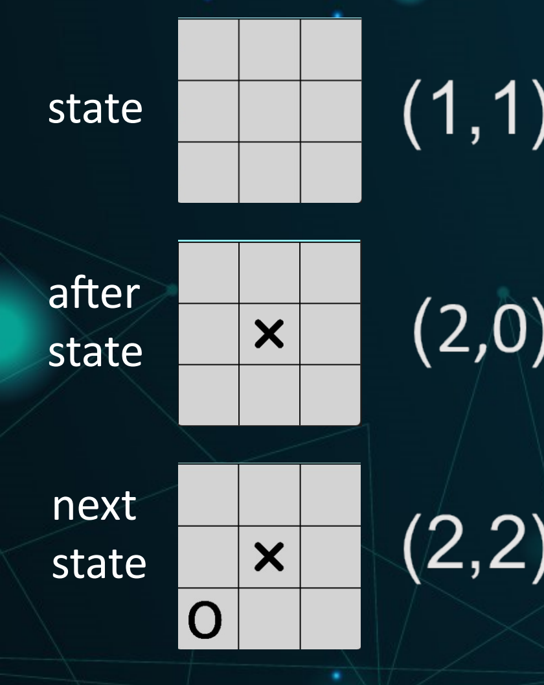
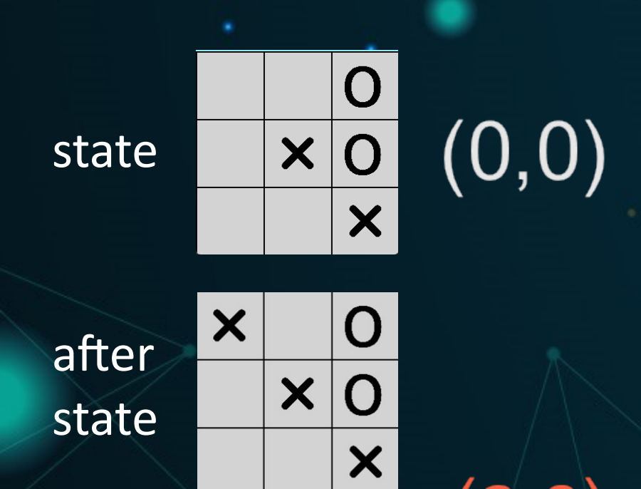
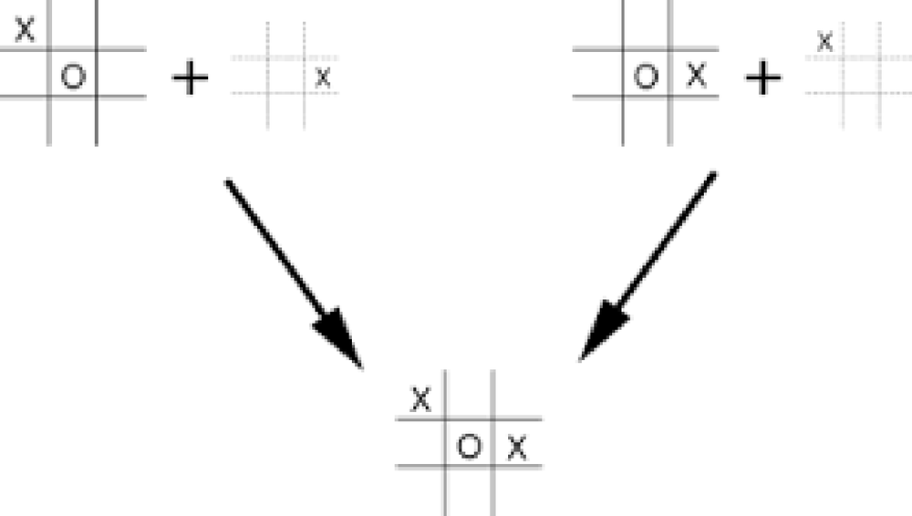

<!-- editorlm-hebrew-html-start -->
<style>
html, body, .vscode-body, .markdown-body, .markdown-preview, #write {
  direction: rtl !important; text-align: right !important;
}
ul, ol { padding-right: 2em !important; padding-left: 0 !important; }
blockquote { border-right: 3px solid #999; border-left: 0; padding-right: 1rem; padding-left: 0; }
@media print {
  html, body, .vscode-body, .markdown-body, .markdown-preview, #write {
    direction: rtl !important; text-align: right !important;
  }
}
</style>
<!-- editorlm-hebrew-html-end -->
<style>
.book { max-width: 900px; margin: auto; line-height: 1.8; font-family: Arial, sans-serif; }
.book .cover { min-height: 680px; box-sizing: border-box; padding: 64px 48px; margin: 24px 0 60px; background: #112b41; color: #f5f8fc; border-top: 9px solid #39c4b5; position: relative; }
.book .cover .eyebrow { color: #81e0d5; font-size: 15px; letter-spacing: 2px; }
.book .cover h1 { color: #fff; font-size: 48px; line-height: 1.3; border: 0; margin: 50px 0 18px; }
.book .cover .subtitle { font-size: 28px; color: #d8e6f0; }
.book .cover .author { font-size: 30px; color: #fff; margin-top: 52px; }
.book .cover .audience { color: #c1d3df; margin-top: 12px; }
.book .cover .motif { direction: ltr; text-align: left; font-family: Consolas, monospace; color: #81e0d5; font-size: 19px; margin-top: 54px; }
.book h1, .book h2, .book h3 { line-height: 1.4; font-weight: 700; }
.book > h1 { font-size: 32px !important; text-align: center !important; margin: 28px 0; }
.book h2 { font-size: 34px !important; text-align: center !important; color: #153b56 !important; background: #eef5fc; border: 0; border-bottom: 4px solid #299c91; border-radius: 10px 10px 0 0; padding: 28px 20px; margin: 24px 0 36px; }
.book h3 { font-size: 24px !important; text-align: right !important; color: #174e49 !important; background: #edf7f5; border: 0; border-right: 5px solid #299c91; border-radius: 6px; padding: 10px 16px; margin: 36px 0 18px; }
.book .chapter { height: 0; margin: 76px 0 0; border-top: 1px solid #ccd7df; break-before: page; page-break-before: always; break-after: avoid; page-break-after: avoid; }
.book .toc { padding: 24px; border-right: 5px solid #39a99d; background: rgba(70,150,155,.09); margin: 24px 0 48px; }
.book pre, .book pre code { direction: ltr !important; text-align: left !important; unicode-bidi: isolate; }
.book pre { box-sizing: border-box !important; width: 100% !important; max-width: 100% !important; margin: 0 !important; padding: 16px 20px; border: 1px solid #ccd7df; border-radius: 8px; line-height: 1.6; overflow-x: auto; }
.book code { direction: ltr; unicode-bidi: isolate; font-family: Consolas, "Courier New", monospace; }
.book pre { background: #f3f6fa !important; color: #1f2937 !important; }
.book pre code, .book pre code.hljs { background: transparent !important; color: #1f2937 !important; }
.book pre .hljs-keyword, .book pre .hljs-literal { color: #6f299c !important; }
.book pre .hljs-string { color: #216338 !important; }
.book pre .hljs-number { color: #075e68 !important; }
.book pre .hljs-comment { color: #526174 !important; }
.book pre .hljs-built_in, .book pre .hljs-title { color: #135b96 !important; }
.book table { width: 75%; max-width: 75%; margin: 18px auto; }
.book th, .book td { text-align: right; }
.book .small { font-size: .9em; opacity: .8; }
.book .python-intro { display: flex; align-items: center; gap: 28px; padding: 22px 28px; margin: 24px 0; background: #eef5fc; color: #183e63; border-right: 6px solid #3776ab; border-radius: 10px; }
.book .python-intro strong { font-size: 30px; }
.book .python-fact { background: #fff7d6; color: #423611; border-right: 6px solid #ffd343; border-radius: 8px; padding: 18px 24px; margin: 22px 0; }
.book .python-fact strong { font-size: 24px; }
.book img { max-width: 100%; height: auto; }
.book figure { margin: 24px auto; text-align: center; }
.book figure img { display: block; margin: auto; }
.book figcaption { direction: rtl; text-align: center; font-size: .9em; color: #445566; }
@media print { .book > h2 { break-before: page; page-break-before: always; } }
.book .screen-strip { width: 760px; max-width: 100%; height: 220px; overflow: hidden; border: 1px solid #bccad5; border-radius: 8px; margin: 20px auto 8px; direction: ltr; }
.book .screen-strip.output { height: 265px; }
.book .screen-strip img { display: block; width: 1745px; max-width: none; }
.book .screen-menu { width: 400px; max-width: 100%; height: 295px; overflow: hidden; direction: ltr; margin: 20px auto 8px; border: 1px solid #bccad5; border-radius: 8px; }
.book .screen-menu img { display: block; width: 1745px; max-width: none; }
.book .code-panel { box-sizing: border-box !important; display: block !important; width: 75% !important; max-width: 75% !important; margin: 18px auto !important; }
@media print {
  .book .cover { min-height: 85vh; break-after: page; print-color-adjust: exact; -webkit-print-color-adjust: exact; }
  .book pre { white-space: pre-wrap; break-inside: avoid; }
  .book .chapter { margin: 0; border: 0; }
  .book h1, .book h2, .book h3 { break-after: avoid; page-break-after: avoid; break-inside: avoid; }
  .book h2 { margin-top: 0; }
  .book h2, .book h3 { print-color-adjust: exact; -webkit-print-color-adjust: exact; }
}
</style>

<style>
.book .book-nav { display: flex; flex-wrap: wrap; gap: 10px; justify-content: center; align-items: center; padding: 16px 0; margin: 20px 0 32px; border-top: 1px solid #ccd7df; border-bottom: 1px solid #ccd7df; }
.book .book-nav a { display: inline-block; padding: 10px 18px; border-radius: 8px; background: #eef5fc; color: #153b56 !important; border: 1px solid #b5ccd9; text-decoration: none !important; font-size: 16px; font-weight: bold; }
.book .book-nav a.toc-link { background: #174e49; color: #fff !important; border-color: #174e49; }
.book .book-nav a:hover, .book .book-nav a:focus { background: #d4eee8; color: #153b56 !important; outline: 2px solid #299c91; outline-offset: 2px; }
.book .section-list { line-height: 2; }
@media print { .book .book-nav { display: none; } }

/* Explicit Hebrew direction, including prose beginning with English. */
.book p, .book ul, .book ol, .book li,
.book blockquote, .book h1, .book h2, .book h3,
.book h4, .book th, .book td {
  direction: rtl !important;
  text-align: right !important;
  unicode-bidi: isolate;
}
/* Chapter titles keep their agreed centered layout. */
.book h2 { text-align: center !important; }
.book pre, .book pre code, .book .code-panel {
  direction: ltr !important;
  text-align: left !important;
  unicode-bidi: isolate;
}
</style>

<style>
.book .formula { direction:ltr!important; text-align:center!important; overflow-x:auto;
  padding:16px; background:#eef5fc; color:#173b52; margin:20px auto; font-size:1.15em; }
.book .grid { direction:ltr!important; width:auto!important; margin:20px auto; border-collapse:collapse; }
.book .grid td { direction:ltr!important; text-align:center!important; width:64px; height:48px; border:1px solid #8199aa; }
.book .grid .goal { background:#d3efdc; } .book .grid .bad { background:#f4d7d7; }
</style>

<div class="book" dir="rtl" lang="he">

<nav class="book-nav" aria-label="ניווט בספר">
<a href="08-Temporal%20Difference.md">→ הקודם</a>
<a class="toc-link" href="../index.md">תוכן העניינים</a>
<a href="10-DQN.md">הבא ←</a>
</nav>

## ד.9 — TD באיקס עיגול ו־AfterState

**המצגת:** [TD באיקס עיגול](../../../sources/RL/5.1%20Temporal%20Difference-TicTacToe.pptx) · **קוד:** [אימון SARSA](../assets/rl/code/sarsa_tictactoe.py) · [סוכן AfterState](../assets/rl/code/afterstate_tictactoe.py)

בפרק הקודם למדנו את הרעיון של TD ואת שני האלגוריתמים SARSA ו־Q-learning על נייר: מצב, פעולה, תגמול, מצב הבא. בפרק הזה נחזור לאיקס עיגול ונשאל שאלה מעשית: איך נראה "צעד אחד" במשחק שבו יש יריב? בפרק ד.7 בנינו סוכן מונטה קרלו שמשחק אפיזודה שלמה ולומד רק בסופה. עכשיו נשנה דבר אחד בלבד: מועד העדכון. הסוכן ילמד תוך כדי המשחק, מכל מהלך.

הקושי המרכזי הוא שבמשחק מול יריב "הצעד הבא" אינו מיידי. באיקס עיגול, אחרי ש־X הניח סימן, הוא עדיין אינו יכול לבחור את המהלך הבא שלו: קודם צריך לראות מה יעשה O. כדי לחבר [SARSA](08-Temporal%20Difference.md#sarsa) למשחק, נגדיר את צעד הלמידה סביב שתי הבחירות האלה. נשתמש באותו [ממשק משחק](07-מונטה%20קרלו%20באיקס%20עיגול.md#game-interface) ובאותו סוכן טבלאי, ונשנה את מועד העדכון: עכשיו נעדכן במהלך המשחק.

בחלק השני של הפרק נציג רעיון נוסף, **AfterState**, שמנצל את מה שאנחנו כן יודעים על המשחק: אמנם איננו יודעים מה היריב יעשה, אבל אנחנו יודעים בדיוק איך ייראה הלוח אחרי המהלך שלנו. הידע הזה מאפשר לצמצם את טבלת הערכים בלי לשנות את לולאת האימון.

### מה נכלל במעבר אחד?

בפרק הקודם המעבר היה S, A, R, S′, A′. במשחק מול יריב, בין הפעולה שלנו לבין המצב שבו נבחר שוב מסתתר מהלך של O. לכן נגדיר "מעבר אחד" כזוג תורים: התור שלנו ותגובת היריב. נפרק את המעבר לחמישה שלבים, לפי סדרם:

1. במצב `state`, הסוכן X בוחר `action`.
2. הסביבה מבצעת את הפעולה ומחזירה `after_state` ותגמול.
3. אם המשחק נמשך, היריב O בוחר פעולה.
4. הסביבה מבצעת את פעולת O ומחזירה `next_state` ותגמול.
5. אם המשחק עדיין נמשך, X בוחר `next_action`.

כך `after_state` הוא הלוח **לפני תגובת היריב**, ואילו `next_state` הוא הלוח שבו X עומד לבחור שוב. אין להחליף בין השניים בעדכון SARSA: ה־S′ של הנוסחה הוא `next_state`, כי רק בו X חוזר ומחליט. מנקודת המבט של הסוכן, היריב הוא חלק מהסביבה, ותגובתו היא חלק מה"אקראיות" של המעבר.

למשל, בלוח ריק X בוחר במרכז `(1,1)`. ב־`after_state` יש רק X אחד במרכז. O בוחר בפינה השמאלית התחתונה `(2,0)`, ולכן ב־`next_state` יש שני סימנים. כעת X יכול לבחור, למשל, `(2,2)` כפעולתו הבאה. היא נבחרה אך טרם בוצעה.

<figure>

<figcaption>שלושת הלוחות של מעבר אחד: state הוא הלוח שבו X בוחר את (1,1); after state הוא הלוח מיד אחרי הפעולה, שבו O בוחר את (2,0); next state הוא הלוח שבו X חוזר ובוחר, כאן את (2,2).</figcaption>
</figure>

<!-- editorlm-source-ref: [sources/RL/5.1 Temporal Difference-TicTacToe.pptx#L13-L21] -->

### כשהמשחק נמשך

עכשיו נתרגם את המעבר לקוד. יש שלושה מקרים לטפל בהם: המשחק נמשך, המשחק הסתיים מיד אחרי הפעולה שלנו, והמשחק הסתיים אחרי תגובת היריב. נתחיל במקרה הרגיל. הפונקציה [sample_step](07-מונטה%20קרלו%20באיקס%20עיגול.md#sample-step) כבר מחברת את שני התורים ומחזירה מצב הבא, תגמול ודגל סיום. אם המשחק לא הסתיים, נבחר את הפעולה הבאה באמצעות ε-greedy ונחשב את היעד:

<div class="code-panel" dir="ltr">

```python
next_action = agent.get_action(next_state, epsilon)
target = reward + gamma * agent.get_Q(next_state, next_action)
```

</div>

במשחק הזה אין תגמולי ביניים, ולכן מעבר שממשיך נותן `reward = 0`, והיעד כולו מגיע מהערך המשוער של הצעד הבא. ההיוון בקוד הוא לכל צעד למידה של X, הכולל גם את תגובת היריב. אין כאן מקדם היוון נפרד לכל חצי תור.

<!-- editorlm-source-ref: [sources/RL/5.1 Temporal Difference-TicTacToe.pptx#L23-L31] -->

### כשהמשחק מסתיים אחרי הפעולה של X

המקרה השני הוא סיום מיידי. אם X משלים שלישייה, התגמול הוא 1 והמשחק נעצר לפני שהיריב פועל. לדוגמה, נניח שיש X במרכז ובפינה הימנית התחתונה, ו־O בשני התאים העליונים בעמודה הימנית. X בוחר בפינה השמאלית העליונה ומשלים אלכסון.

אין מצב החלטה נוסף של X ואין `next_action`. היעד הוא התגמול בלבד, בדיוק כמו ענף המצב הסופי בפסאודו־קוד של הפרק הקודם. אותו טיפול מתאים גם לתיקו שמתקבל מיד אחרי X, עם יעד 0.

<figure>

<figcaption>סיום מיד אחרי X: הפעולה (0,0) משלימה אלכסון, ולכן after state הוא כבר מצב סופי. אין תגובת יריב, אין מצב הבא ואין פעולה נוספת לבחור.</figcaption>
</figure>

<!-- editorlm-source-ref: [sources/RL/5.1 Temporal Difference-TicTacToe.pptx#L33-L39] -->

### כשהמשחק מסתיים אחרי תגובת O

המקרה השלישי עדין יותר. ייתכן שהפעולה שלנו לא סיימה את המשחק, אך היריב מנצח בתגובתו. מבחינת לולאת הלמידה זהו עדיין מעבר יחיד שהסתיים, אלא שהתגמול השלילי הגיע ממהלך היריב. למשל, במצב הבא תור X:

<div class="code-panel" dir="ltr">

```text
O X X
. O .
. . .
```

</div>

אם X בוחר `(1,2)` ואחריו O בוחר `(2,2)`, היריב משלים אלכסון. התגמול לסוכן X הוא ‎−1. גם כאן אין לבחור פעולה נוספת: יעד העדכון הוא ‎−1, ללא ערך עתידי.

הסימן נקבע מנקודת המבט של הסוכן הלומד, ולא לפי זהותו של השחקן שביצע את המהלך האחרון. כך ניצחון של היריב מקטין את הערך של הבחירה שהובילה אליו. בדוגמה שלמעלה, הפעולה `(1,2)` תקבל ערך נמוך יותר, אף שהיא עצמה לא הפסידה: היא השאירה ליריב אפשרות לנצח, וזה בדיוק מה שהסוכן צריך ללמוד להימנע ממנו.

<!-- editorlm-source-ref: [sources/RL/5.1 Temporal Difference-TicTacToe.pptx#L41-L49] -->

### קוד אימון SARSA

אחרי שטיפלנו בשלושת המקרים, אפשר לחבר אותם ללולאת אימון אחת. הקוד הבא משתמש ברכיבים מהפרק הקודם: מחלקת המשחק `TicTacToe`, הסוכן הטבלאי `TabularAgent`, פונקציית הדעיכה של ε ‏`epsilon_at`, ופונקציות הדגימה והבדיקה `sample_step` ו־`evaluate`. נוספה לסוכן המתודה `set_Q(state, action, value)`, שמציבה את הערך במילון. בתחילת כל אפיזודה בוחרים פעולה אחת. בכל איטרציה לומדים מן המעבר, ואם המשחק נמשך מעבירים קדימה את המצב ואת הפעולה שכבר נבחרה.

<div class="code-panel" dir="ltr">

```python
import random
from ttt_env import State, TicTacToe
from tabular_agent import TabularAgent, epsilon_at
from ttt_training import sample_step, evaluate

def train(epochs=100000, seed=0, agent_type=TabularAgent):
    env = TicTacToe()
    agent = agent_type(env, seed)
    opponent_rng = random.Random(seed + 1)
    gamma, alpha = 0.9, 0.1
    for epoch in range(epochs):
        epsilon = epsilon_at(epoch)
        state = State()
        action = agent.get_action(state, epsilon)
        while True:
            next_state, reward, done = sample_step(
                env, state, action, opponent_rng)
            if done:
                target = reward
            else:
                next_action = agent.get_action(next_state, epsilon)
                target = reward + gamma * agent.get_Q(next_state, next_action)
            old_value = agent.get_Q(state, action)
            agent.set_Q(state, action, old_value + alpha * (target - old_value))
            if done:
                break
            state, action = next_state, next_action
    return env, agent
```

</div>

נשווה ללולאה של מונטה קרלו מהפרק ד.7: שם קראנו ל־`generate_episode` ואחר כך ל־`update_episode`, כלומר קודם שיחקנו הכול ורק אז למדנו. כאן אין רשימת אפיזודה כלל; כל מעבר מעדכן את הטבלה ונשכח. העדכון מתבצע **לפני** בדיקת `break`, כך שגם המעבר האחרון מלמד את הסוכן. ענף `done` אינו קורא ל־`get_action`, ולכן לא מנסים לבחור מתוך רשימה ריקה במצב סופי. כשהמשחק נמשך, השורה האחרונה שומרת את `next_action` לצעד הבא, בדיוק כפי שדרש הפסאודו־קוד של SARSA: הפעולה שנכנסה ליעד היא הפעולה שתבוצע.

`agent_type` מאפשר להשתמש בהמשך בסוכן אחר עם אותן מתודות, בלי לשנות את לולאת האימון. בשלב הזה הוא `TabularAgent`. הפרמטרים 100,000 אפיזודות, γ=0.9 ו־α=0.1 נלקחו מ־[SARSA_Trainer.py בענף solved](https://github.com/MarkmanGilad/Tic_Tac_Toe_2/blob/36416a995ce68c40e9799a792ef8c45c348ff451/SARSA_Trainer.py); הדעיכה המעריכית והיריב האקראי משותפים לדוגמאות הספר.

<!-- editorlm-source-ref: [sources/RL/5.1 Temporal Difference-TicTacToe.pptx#L51-L55] -->

### AfterState — החלק של המודל שכבר ידוע לנו

עד כאן הסוכן שמר ערך לכל זוג של מצב ופעולה. נעצור לרגע ונשאל: למה בכלל היינו צריכים Q ולא V? התשובה, מהפרקים הקודמים, היא שאין לנו מודל של הסביבה: איננו יודעים לאיזה מצב תוביל כל פעולה. אבל באיקס עיגול זה נכון רק בחלקו. אנחנו לא יודעים מראש מה היריב יבחר, אבל כן יודעים מה תעשה **הפעולה שלנו** ללוח. לכן אפשר להשתמש במצב שנוצר מיד אחריה כמפתח לטבלת הערכים. זהו **AfterState**.

במקום לשמור ערך לכל זוג `(state, action)`, נשמור אותו תחת `after_state` שנוצר מהזוג הזה. בהגדרה הזאת, V של AfterState הוא הערך של בחירת הפעולה שהביאה אליו:

<div class="formula" dir="ltr">after_state = result_of_our_action(state, action)<br>Q(state, action) = V(after_state)</div>

זה אינו אותו V של מצב רגיל לפני בחירת פעולה. כאן הוא משמש כייצוג לערך מצב–פעולה, כולל התגמול על הפעולה שיוצרת את ה־AfterState. ההבחנה תאפשר להשתמש באותו קוד אימון בלי לספור תגמול פעמיים.

<!-- editorlm-source-ref: [sources/RL/5.1 Temporal Difference-TicTacToe.pptx#L57-L65] -->

### כיצד נחסכות רשומות כפולות?

מה מרוויחים מהמעבר ל־AfterState? התשובה היא שכמה זוגות מצב–פעולה שונים יכולים להוביל לאותו לוח, ואז אפשר ללמוד ערך אחד במקום כמה. נבחן שני מצבים שבשניהם תור X. בראשון X נמצא בשמאל למעלה ו־O במרכז; X בוחר בימין השורה האמצעית. בשני X כבר נמצא בימין השורה האמצעית ו־O במרכז; X בוחר בשמאל למעלה. שני זוגות המצב–פעולה מובילים לאותו לוח:

<div class="code-panel" dir="ltr">

```text
X . .
. O X
. . .
```

</div>

<figure>

<figcaption>שני זוגות מצב–פעולה שונים (למעלה) מובילים לאותו AfterState (למטה), ולכן יכולים לחלוק רשומה אחת בטבלה.</figcaption>
</figure>

טבלת Q רגילה שומרת שני מפתחות שונים. טבלת AfterState יכולה לשמור רשומה אחת. ההמשך מול אותו יריב תלוי כעת באותו לוח ובאותו תור, ולכן אין צורך ללמוד בנפרד את ההערכה לכל אחת משתי הדרכים שהגיעו אליו. יתרון נוסף: כל דגימה שמגיעה ללוח הזה, מכל אחת מהדרכים, מעדכנת את אותה רשומה, ולכן הערך שלה מתייצב מהר יותר.

<!-- editorlm-source-ref: [sources/RL/5.1 Temporal Difference-TicTacToe.pptx#L67-L69] -->

### מחברים את AfterState לקוד האימון

היופי בגישה הזאת הוא שלולאת האימון אינה צריכה לדעת דבר על השינוי. היא קוראת ל־`get_Q` ול־`set_Q`, ורק הסוכן מחליט מה המפתח שמאחוריהן. כדי להשתמש ב־AfterState, נשנה את המפתח שבאמצעותו הסוכן ניגש לטבלת הערכים. נחליף את אופן הקריאה והכתיבה של הערכים. שאר התנהגות הסוכן, כולל בחירת פעולה ב־ε-greedy, נשארת במחלקת הבסיס `TabularAgent` בעזרת ירושה:

<div class="code-panel" dir="ltr">

```python
class AfterStateAgent(TabularAgent):
    def __init__(self, env, seed=0):
        super().__init__(env, seed)
        self.V = {}

    def get_Q(self, state, action):
        after_state, _ = self.env.next_state(state, action)
        return self.V.get(after_state, 0.0)

    def set_Q(self, state, action, value):
        after_state, _ = self.env.next_state(state, action)
        self.V[after_state] = value
```

</div>

המתודה `self.env.next_state(state, action)` מחשבת את הלוח שייווצר אחרי הפעולה, בלי לבצע אותה במשחק בפועל; זהו החלק של המודל שכן ידוע לנו. כעת הקריאה `get_Q(next_state, next_action)` בלולאת SARSA יוצרת את ה־AfterState **שאחרי הפעולה הבאה של X**. היא אינה משתמשת ב־`next_state` עצמו כמפתח. לפי הגדרת הטבלה החדשה, העדכון בלולאה שקול לעדכון הבא:

<div class="formula" dir="ltr">V(after_state) ← V(after_state) + α[R + γV(next_after_state) − V(after_state)]</div>

במעבר סופי נשאר ענף `target = reward`, בלי קריאת ערך המשך. AfterState שבו X ניצח יכול ללמוד ערך 1, מפני שהטבלה מייצגת את הפעולה המנצחת ואת התגמול שלה. אין כאן סתירה לערך המשך 0 אחרי סיום משחק: אלה שתי הגדרות שונות של הערך.

<!-- editorlm-source-ref: [sources/RL/5.1 Temporal Difference-TicTacToe.pptx#L67-L73] -->

### שימוש בסוכן לאחר האימון

לבדיקת SARSA רגיל מפעילים `train()` ולאחריו את `evaluate` מהפרק הקודם. לאימון עם AfterState משנים רק את סוג הסוכן:

<div class="code-panel" dir="ltr">

```python
env, agent = train(agent_type=AfterStateAgent)
print(len(agent.V))
print(evaluate(env, agent.get_action, games=1000, seed=100))
```

</div>

בהרצות שבוצעו עם 100,000 אפיזודות אימון, זרע אימון 0 ואותה בדיקה מול יריב אקראי התקבלו:

| סוכן | רשומות בטבלה | ניצחונות | הפסדים | תיקו |
| --- | --- | --- | --- | --- |
| SARSA עם Q | 8,625 | 991 | 0 | 9 |
| SARSA עם AfterState | 2,739 | 992 | 0 | 8 |

שני הסוכנים מגיעים לתוצאות כמעט זהות מול יריב אקראי, ללא הפסדים, אבל טבלת AfterState מכילה פחות משליש מהרשומות. המספרים מדגימים את ההרצה ואת החיסכון ברשומות בדוגמה הזאת. פער של ניצחון יחיד אינו בסיס לקביעה ששיטה אחת טובה יותר; האימון אקראי, ומיזוג המפתחות משפיע גם על העדכונים ועל הבחירות בהמשך.

שמרו את קובצי הפרק לצד `ttt_env.py`, ‏`tabular_agent.py` ו־`ttt_training.py` מהפרק הקודם. הפעילו את `sarsa_tictactoe.py` או את `afterstate_tictactoe.py`. שתי ההרצות מתמקדות באימון ובבדיקת הסוכן, ללא חלון משחק.

עם זאת, גם אחרי החיסכון של AfterState, הסוכן עדיין שומר רשומה נפרדת לכל לוח שפגש. באיקס עיגול זה אפשרי; במשחקים גדולים יותר מספר המצבים עצום, ורובם לעולם לא ייפגשו פעמיים. בפרק הבא נחליף את הטבלה ברשת נוירונים שמעריכה את הערכים, וכך נוכל להכליל ממצבים שנראו למצבים חדשים.

<nav class="book-nav" aria-label="ניווט בספר">
<a href="08-Temporal%20Difference.md">→ הקודם</a>
<a class="toc-link" href="../index.md">תוכן העניינים</a>
<a href="10-DQN.md">הבא ←</a>
</nav>

</div>

<!-- editorlm-source-versions: {"schemaVersion": 1, "sources": {"sources/RL/5.1 Temporal Difference-TicTacToe.pptx": {"sourceSha256": "0f19e3b5cd3a1a49d1d5efc82f512d98b75162ba08d5012e22fac113d34ca4f8", "canonicalTextSha256": "96bca337693ae7554fd98117ce0597fe042512be90caec11250beeeea60215f9"}}} -->
