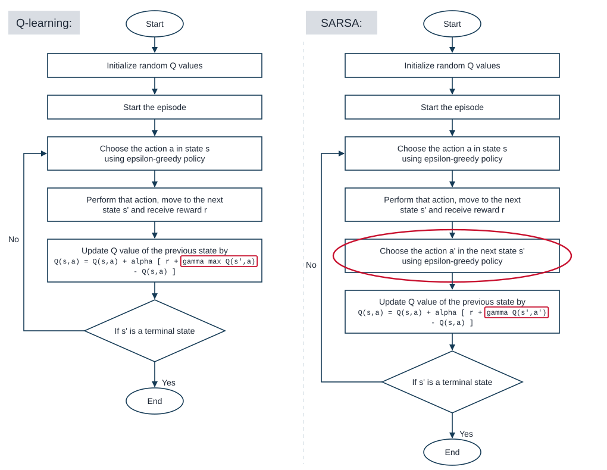

<!-- editorlm-hebrew-html-start -->

<!-- editorlm-hebrew-html-end -->

<nav class="book-nav" aria-label="ניווט בספר">
<a href="08-%D7%9E%D7%95%D7%A0%D7%98%D7%94%20%D7%A7%D7%A8%D7%9C%D7%95%20%D7%91%D7%90%D7%99%D7%A7%D7%A1%20%D7%A2%D7%99%D7%92%D7%95%D7%9C.md">→ הקודם</a>
<a class="toc-link" href="../index.md">תוכן העניינים</a>
<a href="10-TD%20%D7%91%D7%90%D7%99%D7%A7%D7%A1%20%D7%A2%D7%99%D7%92%D7%95%D7%9C.md">הבא ←</a>
</nav>

## ד.9 — Temporal Difference

שיטות במשפחת TD: SARSA ו־Q-learning

**המצגת:** [Temporal Difference](../../../sources/RL/5.%20Temporal%20Difference.pptx)

השאלה שהפרק הזה עונה עליה פשוטה: האם חייבים לחכות לסוף המשחק כדי ללמוד ממנו? בשני הפרקים הקודמים למדנו את שיטת מונטה קרלו: הסוכן משחק אפיזודה שלמה, מחכה לתוצאה הסופית, ורק אז חוזר אחורה ומעדכן את הערכים של כל המצבים והפעולות שעבר בדרך. השיטה עובדת יפה באיקס עיגול, כי המשחק מסתיים אחרי כמה מהלכים. אבל חשבו על נהג שלומד לנהוג: הוא אינו ממתין לסוף הנסיעה כדי להסיק שפנייה חדה מדי הייתה טעות. הוא מרגיש את התוצאה מיד ומתקן את הצעד הבא.

במשחק קצר אפשר להמתין לסיום כדי ללמוד מהתוצאה. אבל לגרסת מונטה קרלו שלמדנו, שמעדכנת רק בסוף האפיזודה, יש שלוש מגבלות:

- **אפיזודות ארוכות מאוד.** בשחמט עוברים עשרות מהלכים עד שמתקבל המצב הסופי, וכל הלמידה מהמשחק נדחית עד הסיום. ככל שהמסלול ארוך יותר, הלמידה איטית יותר, ובשחמט היא כמעט בלתי אפשרית.
- **תהליך ללא מצב סופי.** סוכן שמשקיע בבורסה פועל יום אחרי יום, ואין רגע שבו "המשחק נגמר" ואפשר לחשב תשואה. בלי מצב סופי אין אפיזודה שלמה, ומונטה קרלו אינו יכול לעדכן כלל.
- **לולאות.** גם במשחק שיש בו מצב סופי, הסוכן עלול להסתובב שוב ושוב בין אותם מצבים בלי להתקדם לסיום, ואז העדכון מתעכב בלי גבול.

**Temporal Difference — TD** מאפשרת לעדכן ערכים כבר אחרי צעד אחד: משתמשים בתגמול שהתקבל ובאומדן של מה שצפוי בהמשך.

הרעיון הכללי מחבר שני דברים שכבר ראינו. ממונטה קרלו לוקחים את הלמידה מדגימות: אין לנו מודל של הסביבה, ולכן לומדים מניסיון בפועל. מ־Value Iteration לוקחים את ה־Bootstrapping: במקום לחכות לתגמולים העתידיים, משתמשים בהערכה הקיימת של המצב הבא. השילוב נותן אלגוריתם שלומד מכל צעד בודד, בלי מודל ובלי המתנה.

בפרק נציג תחילה את עדכון TD הבסיסי לערכי מצבים, ואחר כך נעבור לערכי Q ולשני האלגוריתמים המרכזיים במשפחה: SARSA ו־Q-learning. ההבדל ביניהם דק אך חשוב, ונקדיש לו סעיף השוואה. בפרק הבא ניישם את הרעיון על איקס עיגול.

### עדכון בלי להמתין לסוף האפיזודה

נתחיל מהמקרה הפשוט ביותר: טבלה של ערכי מצבים V, כמו זו שהכרנו ב־Value Iteration. נזכיר שערך המצב V(S) הוא אומדן לסכום התגמולים המהוון שהסוכן צפוי לצבור מהמצב S והלאה. במונטה קרלו האומדן הזה התעדכן לכיוון התשואה Gt שנמדדה עד סוף האפיזודה. ב־TD דוגמים את הסביבה בדיוק באותו אופן, משחקים ומקבלים תגמולים, אבל במקום להמתין לסוף האפיזודה מעדכנים את הערך מיד אחרי כל צעד. הדרך לעשות זאת היא בעזרת משוואת בלמן: ערך של מצב הוא התגמול המיידי ועוד הערך המהוון של המצב הבא. נראה עכשיו שהרעיון הזה יוצא ישירות מנוסחת מונטה קרלו, בכמה צעדים אלגבריים.

#### מנוסחת מונטה קרלו לנוסחת TD

**צעד 1 — נקודת המוצא.** זהו [כלל העדכון של מונטה קרלו](07-מונטה%20קרלו.md#return) לערך המצב St. התשואה Gt היא סכום התגמולים המהוון מהצעד t ועד סוף האפיזודה:

$$
\begin{gathered} V(S_t) \leftarrow V(S_t) + \alpha \left[ G_t - V(S_t) \right] \\ G_t = R_t + \gamma R_{t+1} + \gamma^2 R_{t+2} + \gamma^3 R_{t+3} + \cdots \end{gathered}
$$

**צעד 2 — מוציאים γ מחוץ לסוגריים.** כל האיברים מהשני והלאה מכילים לפחות γ אחד. נשאיר את התגמול הראשון Rt בחוץ, ומשאר האיברים נוציא γ אחד החוצה:

$$
G_t = R_t + \gamma \left( R_{t+1} + \gamma R_{t+2} + \gamma^2 R_{t+3} + \cdots \right)
$$

**צעד 3 — מזהים את הסוגריים.** הביטוי בסוגריים הוא בדיוק התשואה של הצעד הבא, Gt+1: התגמול Rt+1 בלי היוון, אחריו Rt+2 כפול γ, וכן הלאה. קיבלנו קשר פשוט בין התשואה של צעד לתשואה של הצעד שאחריו:

$$
G_t = R_t + \gamma G_{t+1}
$$

זו אותה נוסחה שבעזרתה חישבנו בפרק מונטה קרלו את התשואות מהסוף להתחלה, G = r + γ·G, רק שהפעם היא כתובה במפורש לצעד t.

**צעד 4 — הצעד של TD.** כאן הבעיה של מונטה קרלו נראית בבירור. ברגע שביצענו את הצעד מ־St ל־St+1, אנחנו כבר יודעים את Rt. אבל Gt+1 עדיין אינו ידוע: הוא תלוי בכל מה שיקרה בהמשך המשחק, וזו בדיוק הסיבה שמונטה קרלו מחכה לסיום. אלא שיש לנו משהו במקומו. הטבלה כבר מכילה את V(St+1), האומדן שלנו לתשואה הצפויה מהמצב הבא, כלומר בדיוק אומדן ל־Gt+1. TD מחליף את התשואה העתידית, שעוד לא נמדדה, באומדן הזה:

$$
G_t \approx R_t + \gamma V(S_{t+1})
$$

**צעד 5 — מציבים בנוסחת העדכון.** במקום Gt כותבים את הביטוי החדש בתוך כלל העדכון של מונטה קרלו, ומקבלים את כלל העדכון של TD:

$$
V(S_t) \leftarrow V(S_t) + \alpha \left[ R_t + \gamma V(S_{t+1}) - V(S_t) \right]
$$

זו המשמעות של V(St) לפי TD: התגמול שהתקבל בצעד הזה, ועוד γ כפול הערך של המצב שאליו הגענו. זו בדיוק צורת [משוואת בלמן](05-Value%20Iteration.md#bootstrapping) שהכרנו ב־Value Iteration, בשני הבדלים: במקום לחשב תוחלת על כל המצבים הבאים לפי המודל, משתמשים במצב הבא היחיד שנדגם בפועל; ובמקום להחליף את הערך הישן בערך המחושב, מזיזים אותו רק חלק מהדרך, בעזרת α, כי דגימה אחת היא רק דגימה אחת.

**בדיקה במספרים.** ניקח את המשחק מפרק מונטה קרלו: X מנצח בשלושה צעדים, התגמולים הם 0, 0 ו־1, ו־γ=0.9. מהסוף להתחלה: G2 = 1, ‏G1 = 0 + 0.9·1 = 0.9, ‏G0 = 0 + 0.9·0.9 = 0.81. נבדוק את צעד 3 מול הסכום המלא: G0 = 0 + 0.9·0 + 0.81·1 = 0.81, אותו מספר. עכשיו נחשוב על TD: מיד אחרי הצעד הראשון עדיין איננו יודעים ש־G1 יצא 0.9, כי המשחק נמשך. אם בטבלה כתוב כרגע V(S1) = 0.6, היעד של TD הוא 0 + 0.9·0.6 = 0.54, ולא 0.81. ההפרש נובע מכך שהאומדן בטבלה עדיין אינו מדויק. ככל שהאימון מתקדם, V(S1) מתקרב לתשואה הממוצעת מהמצב הזה, ויעד TD מתקרב ליעד של מונטה קרלו. זהו המחיר של הלמידה המיידית: TD נשען על איכות הטבלה, והטבלה משתפרת תוך כדי.

<!-- editorlm-source-ref: [sources/RL/5. Temporal Difference.pptx#L9-L23] -->

#### היעד והעדכון בכתיב הכללי

מכאן נכתוב את הנוסחה בקיצור, בלי אינדקס הזמן: המצב הנוכחי S, המצב הבא S′ והתגמול שהתקבל במעבר R. אחרי מעבר מ־S ל־S′ התגמולים הרחוקים עדיין אינם ידועים, אבל כבר יש לנו הערכה V(S′). לכן היעד משלב מידע שנמדד עכשיו עם הערכה לעתיד:

$$
\begin{gathered} \text{target} = R + \gamma V(S') \\ V(S) \leftarrow V(S) + \alpha \left[ \text{target} - V(S) \right] \end{gathered}
$$

השורה הראשונה מגדירה את **היעד — target**: מה שאנחנו חושבים כעת שערך המצב S צריך להיות. השורה השנייה מזיזה את הערך הישן חלק מהדרך לכיוון היעד. הפרמטר α הוא קצב הלמידה שהכרנו במונטה קרלו: α קטן מזיז את הערך מעט בכל עדכון, ו־α גדול נותן משקל רב לדגימה האחרונה. הפרמטר γ הוא מקדם ההיוון, שמקטין את משקלם של תגמולים רחוקים.

בניגוד ל־[תשואה מאפיזודה מלאה](07-מונטה%20קרלו.md#return), היעד הזה אינו סכום של כל התגמולים שכבר נצפו עד הסיום. החלק הראשון שלו הגיע מהסביבה, והחלק השני מגיע מטבלת הערכים הנוכחית.

<figure>

<figcaption>אותו עץ משחק מפרק מונטה קרלו. משמאל (MC): כדי לעדכן את St מחכים למסלול שלם עד מצב סופי T. מימין (TD): מעדכנים כבר אחרי צעד אחד, לפי התגמול של הצעד (בתמונה מסומן rt+1; בסימון של הספר זהו Rt) והאומדן הקיים של המצב הבא St+1.</figcaption>
</figure>

לדוגמה, אם R=0, ‏γ=0.9 ו־V(S′)=0.8, היעד הוא 0.72. אם הערך הישן של S הוא 0.5 ו־α=0.1, נקבל ערך חדש 0.522. אפשר לבצע את העדכון מיד, גם אם המשחק נמשך עוד צעדים רבים. נשים לב שהערך זז רק מ־0.5 ל־0.522, אף שהיעד היה 0.72: זהו עדכון הדרגתי, ורק אחרי דגימות רבות הערך מתקרב ליעד.

<!-- editorlm-source-ref: [sources/RL/5. Temporal Difference.pptx#L15-L23] -->

### TD Error ו־Bootstrapping

נחזור לנוסחת האימון של TD, הפעם בכתיב הכללי:

$$
V(S) \leftarrow V(S) + \alpha \left[ R + \gamma V(S') - V(S) \right]
$$

הביטוי בסוגריים המרובעים הוא הפער בין היעד לבין הערך הנוכחי: מה שחשבנו שהמצב שווה, לעומת מה שמתברר עכשיו, אחרי צעד אחד. כדאי לתת לפער הזה שם. בספרות הוא נקרא **שגיאת TD — TD Error**, ומסמנים אותו באות היוונית δ (דלתא):

$$
\delta = R + \gamma V(S') - V(S)
$$

עם הסימון הזה נוסחת האימון נכתבת בקיצור:

$$
V(S) \leftarrow V(S) + \alpha \, \delta
$$

כלומר, בכל עדכון מוסיפים לערך הישן את השגיאה כפול קצב הלמידה. שגיאה חיובית אומרת שהמצב היה טוב יותר ממה שחשבנו, והערך עולה; שגיאה שלילית אומרת שהוא היה גרוע יותר, והערך יורד. כשהאומדן מדויק, השגיאה בממוצע קרובה לאפס והערכים מתייצבים. במצב סופי אין המשך, ולכן החלק העתידי מתאפס והיעד הוא R בלבד. את המונח שגיאת TD נפגוש שוב בפרק על DQN, שם הוא יהפוך לפונקציית ההפסד של רשת נוירונים.

נשים לב למה שקורה בתוך השגיאה: כדי לשפר את ההערכה של המצב הנוכחי V(S) משתמשים בהערכה של המצב הבא V(S′), שאותה קבענו בעצמנו, בטבלה שאנחנו בונים תוך כדי. זהו [Bootstrapping](05-Value%20Iteration.md#bootstrapping), אותו רעיון שפגשנו ב־Value Iteration. השם בא מהביטוי האנגלי "להרים את עצמך בלולאות המגף": האומדנים משפרים אומדנים, בלי לחכות למידע חיצוני מסוף האפיזודה.

<figure>

<figcaption>Bootstrapping: TD "מושך את עצמו" בעזרת הערכים שכבר יש לו בטבלה. ההערכה של המצב הבא, שהאלגוריתם עצמו קבע, משתתפת בשיפור ההערכה של המצב הנוכחי.</figcaption>
</figure>

<!-- editorlm-source-ref: [sources/RL/5. Temporal Difference.pptx#L25-L27] -->

### מטבלת V לטבלת Q

עד כאן דיברנו על ערכי מצבים. אבל כדי שהסוכן יבחר פעולה לפי V(S′) הוא צריך לדעת לאיזה מצב תוביל כל פעולה, כלומר מודל של הסביבה, ואת המודל הזה אין לנו. לכן, בדומה למונטה קרלו, כדי לבחור פעולות ללא מודל נשתמש ב־Q, מהסיבה שהוסברה ב־[מונטה קרלו](07-מונטה%20קרלו.md#mc-update): Q(S,A) אומר ישירות כמה שווה לבצע את הפעולה A במצב S, והסוכן בוחר את הפעולה בעלת הערך הגבוה, גם בלי לדעת לאן היא מובילה.

שני דברים מקבלים מהטבלה בלי מודל. הראשון הוא המדיניות: במצב s בוחרים את הפעולה שערכה הגבוה ביותר. השני הוא ערך המצב עצמו: אם במצב s נבחר את הפעולה הטובה ביותר, ערך המצב הוא ערך הפעולה הזאת:

$$
\begin{gathered} \pi(s) = \arg\max_a Q(s,a) \\ V(s) = \max_a Q(s,a) \end{gathered}
$$

שימו לב להבדל בין השתיים, שכבר פגשנו ב־Value Iteration: argmax מחזירה את **הפעולה** שנותנת את המקסימום, ואילו max מחזירה את **הערך** המרבי עצמו. בשתיהן עוברים רק על הפעולות החוקיות במצב. הקשר השני חשוב לנו מיד: הוא אומר שאת V(S′) שביעד של TD אפשר להחליף בערך Q של המצב הבא.

**אותן נוסחאות שכתבנו ל־V חלות גם על Q.** היעד הוא התגמול ועוד γ כפול ערך ההמשך, והעדכון מזיז את הערך הישן חלק מהדרך אל היעד. ההבדל היחיד הוא שעכשיו הערכים נלקחים מטבלת Q: הערך שמעדכנים הוא Q(S,A) של המצב והפעולה שביצענו, וערך ההמשך הוא Q(S′,A′) של המצב הבא עם פעולה A′ שלו:

$$
\begin{gathered} \text{target} = R + \gamma Q(S',A') \\ Q(S,A) \leftarrow Q(S,A) + \alpha \left[ \text{target} - Q(S,A) \right] \end{gathered}
$$

גם שגיאת TD נכתבת באותו אופן, δ = R + γQ(S′,A′) − Q(S,A), והעדכון הוא Q(S,A) ← Q(S,A) + αδ. נותרה שאלה אחת: למצב הבא יש כמה פעולות אפשריות, ולכל אחת ערך Q משלה. איזו A′ נכניס ליעד? השאלה הזאת מובילה לשני האלגוריתמים שבהמשך הפרק.

<!-- editorlm-source-ref: [sources/RL/5. Temporal Difference.pptx#L25-L31] -->

### מונטה קרלו לעומת TD

לפני שנפרט את שני האלגוריתמים, נעמיד את שתי השיטות זו מול זו. במונטה קרלו העדכון נעשה לפי התשואה Gt שנמדדה עד סוף האפיזודה, גם לטבלת V וגם לטבלת Q:

$$
\begin{gathered} G_t = R_t + \gamma R_{t+1} + \gamma^2 R_{t+2} + \cdots \\ V(s) \leftarrow V(s) + \alpha \left[ G_t - V(s) \right] \\ Q(s,a) \leftarrow Q(s,a) + \alpha \left[ G_t - Q(s,a) \right] \end{gathered}
$$

ב־TD מחליפים את Gt ביעד של צעד אחד, בעזרת Bootstrapping. בטבלת Q ערך ההמשך הוא ערך Q של המצב הבא s′ עם פעולה a′ שלו:

$$
\begin{gathered} V(s) \leftarrow V(s) + \alpha \left[ R + \gamma V(s') - V(s) \right] \\ Q(s,a) \leftarrow Q(s,a) + \alpha \left[ R + \gamma Q(s',a') - Q(s,a) \right] \end{gathered}
$$

המבנה של ארבע הנוסחאות זהה: ערך ישן, ועוד α כפול ההפרש בין היעד לערך הישן. ההבדל כולו ביעד, ומהיעד נובעים כל ההבדלים המעשיים בין השיטות:

| | מונטה קרלו | TD |
| --- | --- | --- |
| מה צריך כדי לעדכן | אפיזודה שלמה, עד המצב הסופי | מעבר אחד: S, A, R, S′ |
| מתי מעדכנים | בסוף האפיזודה, את כל המצבים שבמסלול | מיד אחרי כל צעד, מצב אחד |
| היעד | Gt, התשואה שנמדדה בפועל | R ועוד γ כפול ערך משוער של המצב הבא |
| על מה היעד נשען | רק על תגמולים אמיתיים | על תגמול אמיתי אחד ועל אומדן מהטבלה |
| מה מגביל | אפיזודות ארוכות, תהליכים ללא סיום, לולאות | דיוק הטבלה בתחילת האימון |

בשתי השיטות דוגמים מסלול אחד ולא עוברים על כל הענפים, ולכן שתיהן Sample Backup. ההבדל הוא באורך המסלול שנדגם לפני העדכון: מסלול שלם לעומת צעד אחד. האם ההחלפה של תשואה אמיתית באומדן פוגעת בתוצאה הסופית? Sutton הראה ב־1988 שגם TD מתכנס לערכים הנכונים, בתנאים דומים לאלה של מונטה קרלו: מבקרים בכל המצבים שוב ושוב, וקצב הלמידה מתאים. בתנאים דומים גם עדכוני Q של TD מתכנסים ל־Q*, ערכי הפעולה של המדיניות המיטבית. כלומר, אפשר ללמוד את המדיניות הטובה ביותר צעד אחר צעד, בלי להמתין לסיום.

<!-- editorlm-source-ref: [sources/RL/5. Temporal Difference.pptx#L33-L35] -->

### דגימת הסביבה

כמו במונטה קרלו, גם ב־TD אין לנו מודל של הסביבה. איננו יודעים מראש לאיזה מצב תוביל פעולה ומה יהיה התגמול, ולכן את המידע הזה משיגים בדגימה: הסוכן מבצע פעולה בפועל, והסביבה מחזירה לו את המצב הבא S′ ואת התגמול R. במונטה קרלו אספנו כך משחק שלם לפני העדכון; ב־TD דוגמים צעד אחד, מעדכנים, ודוגמים את הצעד הבא.

הדגימה מעלה שוב את השאלה שפגשנו במונטה קרלו: איזו פעולה לבצע? אם נבחר תמיד את הפעולה בעלת ה־Q הגבוה ביותר, נתקבע על מה שכבר נראה טוב, ולעולם לא נגלה פעולות טובות יותר שטרם ניסינו. זהו האיזון בין חקירה לניצול, Exploration מול Exploitation. הפתרון זהה לזה של מונטה קרלו: בוחרים פעולות לפי ε-greedy. בהסתברות ε מגרילים פעולה חוקית אקראית, וביתר המקרים בוחרים את הפעולה בעלת Q מרבי. בתחילת האימון ε גדול, כדי לחקור הרבה, והוא יורד בהדרגה ככל שהטבלה משתפרת, כפי שראינו ב־[דעיכת ε](07-מונטה%20קרלו.md#epsilon-decay). 

בספרות יש שני אלגוריתמים כמעט זהים שמשלבים את הדגימה הזאת עם עדכון TD: 
* SARSA
* Q-learning.

<!-- editorlm-source-ref: [sources/RL/5. Temporal Difference.pptx#L37-L39] -->

### SARSA

באלגוריתם SARSA אנחנו מאמנים את הסוכן לפי השלבים הבאים. הסוכן נמצא באמצע משחק, ובכל צעד הוא מבצע ארבעה שלבים:

1. **מקבלים מצב S.** זהו המצב שבו הסוכן נמצא עכשיו.
2. **בוחרים פעולה A לפי ε-greedy.** מסתכלים בטבלת Q בשורה של S ובוחרים: לרוב את הפעולה בעלת הערך הגבוה, ולפעמים פעולה אקראית.
3. **משחקים ומקבלים מהסביבה את S′ ו־R.** מבצעים את A, והסביבה מחזירה את המצב הבא ואת התגמול.
4. **בוחרים לפי ε-greedy את הפעולה הבאה A′.** מסתכלים בטבלת Q בשורה של S′ ובוחרים, באותה שיטה, את הפעולה שתבוצע שם.

בסוף ארבעת השלבים יש בידינו חמישה דברים: <strong>S, A, R, S′, A′</strong>. ראשי התיבות שלהם הם שם האלגוריתם: SARSA. עכשיו נסתכל שוב בנוסחת העדכון של Q, ונצבע באדום את מה שכבר בידינו:

$$
Q(\textcolor{#c00000}{S},\textcolor{#c00000}{A}) \leftarrow Q(\textcolor{#c00000}{S},\textcolor{#c00000}{A}) + \alpha \left[ \textcolor{#c00000}{R} + \gamma Q(\textcolor{#c00000}{S'},\textcolor{#c00000}{A'}) - Q(\textcolor{#c00000}{S},\textcolor{#c00000}{A}) \right]
$$

כל מה שמופיע בנוסחה כבר ידוע: S ו־A משלבים 1 ו־2, R ו־S′ משלב 3, A′ משלב 4, והערכים Q(S,A) ו־Q(S′,A′) נמצאים בטבלה. אפשר לעדכן מיד, בלי לחכות לסוף המשחק.

את ארבעת השלבים והעדכון עושים **בלולאה**, עד סוף האפיזודה. יש כאן פרט חשוב: הפעולה הבאה A′ כבר נבחרה בשלב 4, ולכן בסיבוב הבא לא בוחרים פעולה מחדש. המצב הבא הופך למצב הנוכחי (S ← S′), הפעולה שנבחרה הופכת לפעולה הנוכחית (A ← A′), וממשיכים ישר לשלב 3: משחקים אותה. במצב סופי אין המשך ואין A′; היעד הוא R בלבד, והאפיזודה מסתיימת.

הפסאודו־קוד מסכם את הלולאה:

<pre><code>Initialize Q
For each episode:
    Initialize S
    Choose A using epsilon-greedy
    Repeat:
        Perform A and observe R, S'
        If S' is terminal:
            target = R
        Else:
            Choose A' using epsilon-greedy
            target = R + gamma * Q(S', A')
        Q(S, A) += alpha * (target - Q(S, A))
        If S' is terminal: stop this episode
        S = S'
        A = A'
</code></pre>

שימו לב לשלושה דברים בקוד. הפעולה הראשונה של כל אפיזודה נבחרת לפני הלולאה, ובתוך הלולאה בוחרים רק את A′. הענף של המצב הסופי מעדכן לפי R בלבד. ובסוף כל סיבוב שתי ההשמות S = S′ ו־A = A′ מעבירות את הזוג הבא לסיבוב הבא, כך שהפעולה שנכנסה ליעד היא גם הפעולה שתבוצע בפועל. בגלל התכונה הזאת SARSA נקרא **on-policy**: הוא לומד את הערכים של המדיניות שמשחקת בפועל, כולל בחירות החקירה שלה.

<!-- editorlm-source-ref: [sources/RL/5. Temporal Difference.pptx#L41-L47] -->

### Q-learning

באלגוריתם Q-learning מאמנים את הסוכן לפי אותם ארבעה שלבים, וההבדל היחיד מסומן באדום:

1. **מקבלים מצב S.**
2. **בוחרים פעולה A לפי ε-greedy.**
3. **משחקים ומקבלים מהסביבה את S′ ו־R.**
4. **בוחרים את הפעולה הבאה A′ לפי הערך המרבי בטבלת Q, בלי ε.** מסתכלים בטבלת Q בשורה של S′ ולוקחים את הפעולה בעלת הערך הגבוה ביותר.

ב־SARSA בחרנו את A′ לפי ε-greedy, כלומר לפעמים באקראי. ב־Q-learning לא מגרילים: לצורך העדכון לוקחים תמיד את הטוב ביותר, ולכן ליעד נכנס הערך המרבי בשורה של S′. גם בנוסחה ההבדל היחיד מסומן באדום:

$$
Q(S,A) \leftarrow Q(S,A) + \alpha \left[ R + \gamma \, \textcolor{#c00000}{\max_{a'} Q(S',a')} - Q(S,A) \right]
$$

המקסימום הוא על הפעולות החוקיות במצב S′. ואם ליעד נכנס תמיד הערך המרבי, אין צורך לשמור את A′ לסיבוב הבא: בתחילת כל סיבוב בוחרים מחדש, לפי ε-greedy, את הפעולה שמבצעים בפועל. הסוכן ממשיך לחקור במשחק, אבל היעד מניח שבהמשך ייבחר הטוב ביותר. בפסאודו־קוד השורות שהשתנו לעומת SARSA מסומנות באדום:

<pre><code>Initialize Q
For each episode:
    Initialize S
    Repeat:
        Choose A using epsilon-greedy
        Perform A and observe R, S'
        If S' is terminal:
            target = R
        Else:
            target = R + gamma * max Q(S', legal action)
        Q(S, A) += alpha * (target - Q(S, A))
        S = S'
    Until S is terminal
</code></pre>

בחירת הפעולה עברה לתוך הלולאה, ליעד נכנס המקסימום, ושורת A = A′ נעלמה. תרשימי הזרימה של שני האלגוריתמים מראים שזה כל ההבדל:

<figure>

<figcaption>תרשימי הזרימה של שני האלגוריתמים (שרטוט מחדש של התרשים מתוך <a href="https://www.oreilly.com/library/view/hands-on-reinforcement-learning/9781788836524/20659243-cadb-46f0-b5c3-3acadd590d67.xhtml">Hands-On Reinforcement Learning</a>, O'Reilly). משמאל Q-learning: בוחרים a ב־ε-greedy, מבצעים, ומעדכנים לפי γ·max Q(s′,a), המסומן במסגרת אדומה. מימין SARSA: בין הביצוע לעדכון יש שלב נוסף, מוקף באדום, בחירת a′ במצב s′ ב־ε-greedy, והעדכון משתמש ב־γ·Q(s′,a′). התרשים אינו מציג את ההעברה S←S′ ו־A←A′; לסדר המדויק היצמדו לפסאודו־קוד.</figcaption>
</figure>

**דוגמה במספרים.** נניח שבמצב הבא יש שתי פעולות בעלות ערכים 0.8 ו־0.2, והחקירה בחרה בפעולה השנייה. עבור R=0 ו־γ=0.9, יעד SARSA יהיה 0.18 (כי 0.9·0.2) ואילו יעד Q-learning יהיה 0.72 (כי 0.9·0.8). המעבר שנדגם זהה, וההפרש נובע רק מהבחירה בשלב 4. SARSA "מעניש" את המצב הנוכחי על כך שהחקירה עלולה לבחור בו פעולה גרועה; Q-learning מתעלם מהחקירה.

לכן Q-learning נקרא **off-policy**: הסוכן משחק במדיניות אחת, עם חקירה, ולומד את הערכים של מדיניות אחרת, החמדנית, בלי חקירה. התכונה הזאת תאפשר בהמשך ללמוד גם מדגימות ישנות שנשמרו בזיכרון, ונחזור אליה בפרק על DQN. אין מכאן מסקנה שאחד האלגוריתמים תמיד טוב יותר; מה שחשוב הוא לא לערבב ביניהם. טעות נפוצה במימוש היא לבחור A′ ב־ε-greedy לצורך היעד, ואז להגריל פעולה חדשה לצעד הבא. זה אינו SARSA ואינו Q-learning.

<!-- editorlm-source-ref: [sources/RL/5. Temporal Difference.pptx#L49-L67] -->

### n-step TD — כמה צעדים לפני האומדן

עד עכשיו עמדו לפנינו שני קצוות: מונטה קרלו, שמחכה עד סוף האפיזודה ומשתמש רק בתגמולים אמיתיים, ו־TD של צעד אחד, שמשתמש בתגמול יחיד ומיד עובר לאומדן. בספרות TD של צעד אחד מכונה גם TD(0), וכך הוא מסומן בתמונה שלמטה. בין שני הקצוות יש רצף שלם של אפשרויות ביניים. אפשר להמתין לשניים או לשלושה צעדים לפני שמשתמשים באומדן ההמשך. כך משלבים יותר תגמולים שנמדדו בפועל עם ערך משוער בקצה המסלול. עבור n מעברים, באותו סימון של הפרק, שבו Rt הוא התגמול שאחרי הפעולה בזמן t, היעד הוא:

$$
G_t^{(n)} = R_t + \gamma R_{t+1} + \cdots + \gamma^{n-1} R_{t+n-1} + \gamma^n V(S_{t+n})
$$

למשל, ב־2-step נשתמש בשני תגמולים ואז בערך המצב שאליו הגענו: Rt + γRt+1 + γ²V(St+2). את V(St) נעדכן לכיוון היעד הזה בעזרת α, באותו מבנה של עדכון הדרגתי.

<figure>

<figcaption>הרצף בין השיטות. בכל עמודה עיגול הוא מצב ונקודה היא פעולה. TD של צעד אחד, TD(0), משתמש בתגמול אחד ואז באומדן של המצב האחרון בעמודה; 2-step ו־3-step משתמשים ביותר תגמולים שנמדדו בפועל לפני האומדן; בקצה הימני, מונטה קרלו ממתין עד המצב הסופי (הריבוע) ואינו משתמש באומדן כלל.</figcaption>
</figure>

אם האפיזודה מסתיימת לפני שנאספו n צעדים, עוצרים בסיום ואינם מוסיפים ערך עתידי. כשנאסף צעד יחיד מתקבל TD של צעד אחד; כשמחכים עד סוף האפיזודה ומשתמשים רק בתגמולים, חוזרים לרעיון של מונטה קרלו. n גדול יותר מכניס ליעד יותר מידע שנמדד בפועל ופחות תלות באומדן, אך מחייב להמתין יותר לפני העדכון. בספר זה נסתפק ב־TD של צעד אחד.

בפרק הבא ניישם SARSA על איקס עיגול כשהסוכן משחק X. שם נתמקד במשמעות של צעד אחד מול יריב, בטיפול המדויק בסיום המשחק, ובטבלת AfterState שמחליפה את טבלת Q. המשימות שיישארו לכם: לממש Q-learning באותו משחק, ולהפעיל את אחד האלגוריתמים על השחקן O.

<!-- editorlm-source-ref: [sources/RL/5. Temporal Difference.pptx#L69-L77] -->

<nav class="book-nav" aria-label="ניווט בספר">
<a href="08-%D7%9E%D7%95%D7%A0%D7%98%D7%94%20%D7%A7%D7%A8%D7%9C%D7%95%20%D7%91%D7%90%D7%99%D7%A7%D7%A1%20%D7%A2%D7%99%D7%92%D7%95%D7%9C.md">→ הקודם</a>
<a class="toc-link" href="../index.md">תוכן העניינים</a>
<a href="10-TD%20%D7%91%D7%90%D7%99%D7%A7%D7%A1%20%D7%A2%D7%99%D7%92%D7%95%D7%9C.md">הבא ←</a>
</nav>

<!-- editorlm-source-versions: {"schemaVersion": 1, "sources": {"sources/RL/5. Temporal Difference.pptx": {"sourceSha256": "e60d96da1e7a790024fd038cd0a4b569cbfd4d2e39fc26920472cc6ced05d99f", "canonicalTextSha256": "d847ef1583229bd8731218070d9870debc7edfd809f55780d7af70628fd35148"}}} -->
