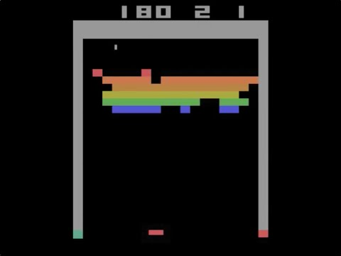
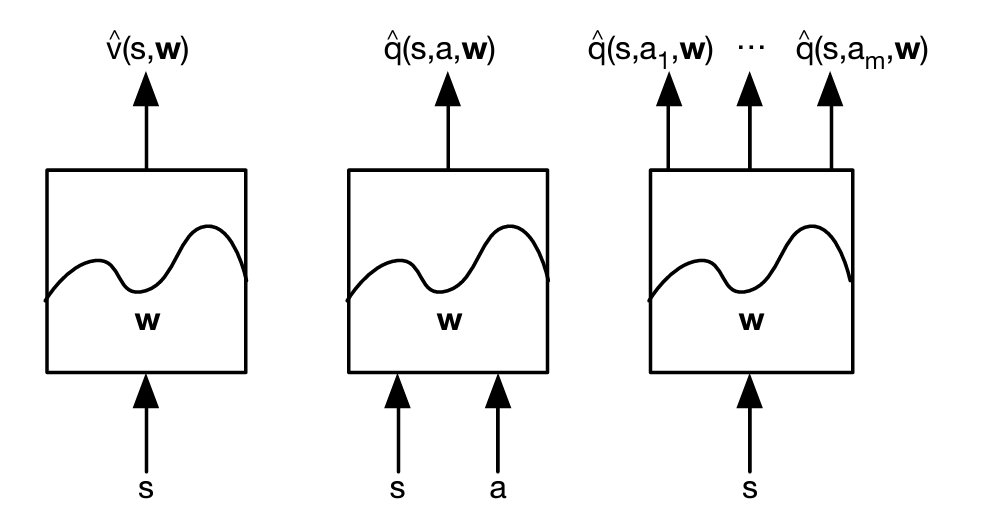

<!-- editorlm-hebrew-html-start -->
<style>
html, body, .vscode-body, .markdown-body, .markdown-preview, #write {
  direction: rtl !important; text-align: right !important;
}
ul, ol { padding-right: 2em !important; padding-left: 0 !important; }
blockquote { border-right: 3px solid #999; border-left: 0; padding-right: 1rem; padding-left: 0; }
@media print {
  html, body, .vscode-body, .markdown-body, .markdown-preview, #write {
    direction: rtl !important; text-align: right !important;
  }
}
</style>
<!-- editorlm-hebrew-html-end -->
<style>
.book { max-width: 900px; margin: auto; line-height: 1.8; font-family: Arial, sans-serif; }
.book .cover { min-height: 680px; box-sizing: border-box; padding: 64px 48px; margin: 24px 0 60px; background: #112b41; color: #f5f8fc; border-top: 9px solid #39c4b5; position: relative; }
.book .cover .eyebrow { color: #81e0d5; font-size: 15px; letter-spacing: 2px; }
.book .cover h1 { color: #fff; font-size: 48px; line-height: 1.3; border: 0; margin: 50px 0 18px; }
.book .cover .subtitle { font-size: 28px; color: #d8e6f0; }
.book .cover .author { font-size: 30px; color: #fff; margin-top: 52px; }
.book .cover .audience { color: #c1d3df; margin-top: 12px; }
.book .cover .motif { direction: ltr; text-align: left; font-family: Consolas, monospace; color: #81e0d5; font-size: 19px; margin-top: 54px; }
.book h1, .book h2, .book h3 { line-height: 1.4; font-weight: 700; }
.book > h1 { font-size: 32px !important; text-align: center !important; margin: 28px 0; }
.book h2 { font-size: 34px !important; text-align: center !important; color: #153b56 !important; background: #eef5fc; border: 0; border-bottom: 4px solid #299c91; border-radius: 10px 10px 0 0; padding: 28px 20px; margin: 24px 0 36px; }
.book h3 { font-size: 24px !important; text-align: right !important; color: #174e49 !important; background: #edf7f5; border: 0; border-right: 5px solid #299c91; border-radius: 6px; padding: 10px 16px; margin: 36px 0 18px; }
.book .chapter { height: 0; margin: 76px 0 0; border-top: 1px solid #ccd7df; break-before: page; page-break-before: always; break-after: avoid; page-break-after: avoid; }
.book .toc { padding: 24px; border-right: 5px solid #39a99d; background: rgba(70,150,155,.09); margin: 24px 0 48px; }
.book pre, .book pre code { direction: ltr !important; text-align: left !important; unicode-bidi: isolate; }
.book pre { box-sizing: border-box !important; width: 100% !important; max-width: 100% !important; margin: 0 !important; padding: 16px 20px; border: 1px solid #ccd7df; border-radius: 8px; line-height: 1.6; overflow-x: auto; }
.book code { direction: ltr; unicode-bidi: isolate; font-family: Consolas, "Courier New", monospace; }
.book pre { background: #f3f6fa !important; color: #1f2937 !important; }
.book pre code, .book pre code.hljs { background: transparent !important; color: #1f2937 !important; }
.book pre .hljs-keyword, .book pre .hljs-literal { color: #6f299c !important; }
.book pre .hljs-string { color: #216338 !important; }
.book pre .hljs-number { color: #075e68 !important; }
.book pre .hljs-comment { color: #526174 !important; }
.book pre .hljs-built_in, .book pre .hljs-title { color: #135b96 !important; }
.book table { width: 75%; max-width: 75%; margin: 18px auto; }
.book th, .book td { text-align: right; }
.book .small { font-size: .9em; opacity: .8; }
.book .python-intro { display: flex; align-items: center; gap: 28px; padding: 22px 28px; margin: 24px 0; background: #eef5fc; color: #183e63; border-right: 6px solid #3776ab; border-radius: 10px; }
.book .python-intro strong { font-size: 30px; }
.book .python-fact { background: #fff7d6; color: #423611; border-right: 6px solid #ffd343; border-radius: 8px; padding: 18px 24px; margin: 22px 0; }
.book .python-fact strong { font-size: 24px; }
.book img { max-width: 100%; height: auto; }
.book figure { margin: 24px auto; text-align: center; }
.book figure img { display: block; margin: auto; }
.book figcaption { direction: rtl; text-align: center; font-size: .9em; color: #445566; }
@media print { .book > h2 { break-before: page; page-break-before: always; } }
.book .screen-strip { width: 760px; max-width: 100%; height: 220px; overflow: hidden; border: 1px solid #bccad5; border-radius: 8px; margin: 20px auto 8px; direction: ltr; }
.book .screen-strip.output { height: 265px; }
.book .screen-strip img { display: block; width: 1745px; max-width: none; }
.book .screen-menu { width: 400px; max-width: 100%; height: 295px; overflow: hidden; direction: ltr; margin: 20px auto 8px; border: 1px solid #bccad5; border-radius: 8px; }
.book .screen-menu img { display: block; width: 1745px; max-width: none; }
.book .code-panel { box-sizing: border-box !important; display: block !important; width: 75% !important; max-width: 75% !important; margin: 18px auto !important; }
@media print {
  .book .cover { min-height: 85vh; break-after: page; print-color-adjust: exact; -webkit-print-color-adjust: exact; }
  .book pre { white-space: pre-wrap; break-inside: avoid; }
  .book .chapter { margin: 0; border: 0; }
  .book h1, .book h2, .book h3 { break-after: avoid; page-break-after: avoid; break-inside: avoid; }
  .book h2 { margin-top: 0; }
  .book h2, .book h3 { print-color-adjust: exact; -webkit-print-color-adjust: exact; }
}
</style>

<style>
.book .book-nav { display: flex; flex-wrap: wrap; gap: 10px; justify-content: center; align-items: center; padding: 16px 0; margin: 20px 0 32px; border-top: 1px solid #ccd7df; border-bottom: 1px solid #ccd7df; }
.book .book-nav a { display: inline-block; padding: 10px 18px; border-radius: 8px; background: #eef5fc; color: #153b56 !important; border: 1px solid #b5ccd9; text-decoration: none !important; font-size: 16px; font-weight: bold; }
.book .book-nav a.toc-link { background: #174e49; color: #fff !important; border-color: #174e49; }
.book .book-nav a:hover, .book .book-nav a:focus { background: #d4eee8; color: #153b56 !important; outline: 2px solid #299c91; outline-offset: 2px; }
.book .section-list { line-height: 2; }
@media print { .book .book-nav { display: none; } }

/* Explicit Hebrew direction, including prose beginning with English. */
.book p, .book ul, .book ol, .book li,
.book blockquote, .book h1, .book h2, .book h3,
.book h4, .book th, .book td {
  direction: rtl !important;
  text-align: right !important;
  unicode-bidi: isolate;
}
/* Chapter titles keep their agreed centered layout. */
.book h2 { text-align: center !important; }
.book pre, .book pre code, .book .code-panel {
  direction: ltr !important;
  text-align: left !important;
  unicode-bidi: isolate;
}
</style>

<style>
.book .formula { direction:ltr!important; text-align:center!important; overflow-x:auto;
  padding:16px; background:#eef5fc; color:#173b52; margin:20px auto; font-size:1.15em; }
.book .grid { direction:ltr!important; width:auto!important; margin:20px auto; border-collapse:collapse; }
.book .grid td { direction:ltr!important; text-align:center!important; width:64px; height:48px; border:1px solid #8199aa; }
.book .grid .goal { background:#d3efdc; } .book .grid .bad { background:#f4d7d7; }
</style>

<div class="book" dir="rtl" lang="he">

<nav class="book-nav" aria-label="ניווט בספר">
<a href="09-TD%20%D7%91%D7%90%D7%99%D7%A7%D7%A1%20%D7%A2%D7%99%D7%92%D7%95%D7%9C.md">→ הקודם</a>
<a class="toc-link" href="../index.md">תוכן העניינים</a>
<a href="11-DQN%20%D7%91%D7%90%D7%99%D7%A7%D7%A1%20%D7%A2%D7%99%D7%92%D7%95%D7%9C.md">הבא ←</a>
</nav>

## ד.10 — למידת חיזוק עמוקה

**המצגת:** [DQN](../../../sources/RL/6.DQN.pptx)

עד עכשיו כל הסוכנים שבנינו שמרו את מה שלמדו בטבלה: לכל מצב ופעולה תא משלו, ובתא מספר. באיקס עיגול זה עבד, כי מספר הלוחות האפשריים קטן, ואפילו טבלת AfterState מהפרק הקודם הסתפקה באלפי רשומות. אבל נסו לדמיין את אותה טבלה למשחק שחמט, שבו מספר המצבים גדול ממספר האטומים ביקום, או למכונית אוטונומית שמצבה מתואר במהירויות ובמרחקים רציפים. שם הטבלה לא רק גדולה מדי; רוב המצבים לעולם לא ייפגשו פעמיים, ולכן אין ממי ללמוד עליהם.

טבלת Q התאימה לאיקס עיגול, שבו מספר המצבים קטן. במשחק גדול יותר מספר זוגות המצב–פעולה עלול להיות עצום, ובסביבה עם מדידות רציפות אי אפשר לשמור רשומה נפרדת לכל מצב אפשרי. **Deep Q-Network — DQN** משתמש ברשת נוירונים כדי לאמוד ערכי Q. במקום לשמור כל ערך בתא נפרד, נלמד פונקציה שמחשבת אותו.

האלגוריתם פותח בחברת DeepMind ופורסם בשני מאמרים, בשנים 2013 ו־2015. החוקרים הראו שסוכן אחד, עם אותה רשת ואותו אלגוריתם, לומד לשחק עשרות משחקי Atari ישנים ברמה של שחקן אנושי, כשכל מה שהוא מקבל הוא תמונת המסך והניקוד. במאמר השני, שפורסם בכתב העת Nature, [Human-level control through deep reinforcement learning](https://www.nature.com/articles/nature14236), מתוארים גם שני הרכיבים שנכיר בהמשך הפרק: מאגר המעברים ורשת המטרה.

<figure>

<figcaption>משחק Breakout מקונסולת Atari 2600, אחד המשחקים שסוכן DQN למד לשחק מתוך תמונת המסך בלבד.</figcaption>
</figure>

כאן נפגשים שני חלקי הספר. בחלק ג למדנו שרשת נוירונים היא פונקציה עם משקלים, שאפשר לאמן אותה להתאים קלט לפלט ושהיא יודעת להכליל: לתת תשובה סבירה גם על קלט שלא ראתה. בחלק ד למדנו איך לבנות יעד למידה מתגמול ומהערכת ההמשך. DQN מחבר את השניים: הרשת מקבלת מצב ופעולה ומחזירה אומדן ל־Q, ואת היעד לאימון שלה מספק Q-learning. השאלה של הפרק היא מה משתנה כשמחליפים טבלה ברשת, ואילו שני רכיבים נוספים נדרשים כדי שהאימון יתייצב.

### מטבלת ערכים לפונקציה נלמדת

נתחיל מהשאלה מה בדיוק הרשת מחליפה. במילון קיבלנו מצב ופעולה והחזרנו מספר. גם רשת יכולה לקבל קלט ולהחזיר מספר, אלא שהמספר מחושב באמצעות משקלים. נסמן את תחזית הרשת ב־Q(S,A;w), כאשר w מייצג את הפרמטרים הנלמדים. הסימון ;w מזכיר לנו שהערך אינו נשלף מטבלה אלא מחושב, ושהוא תלוי במשקלים הנוכחיים.

עדכון של רשומה בטבלה משנה רק את הערך שלה. עדכון משקלי הרשת עשוי לשנות תחזיות עבור קלטים רבים. כך הרשת יכולה להכליל למצבים דומים שלא נלמדו כרשומות נפרדות, אך גם תחזית עבור מצב שכבר הכרנו יכולה להשתנות. זו בדיוק תכונת ההכללה שראינו ברגרסיה ובסיווג בחלק ג, וכאן היא גם היתרון וגם מקור הקושי: הרשת לומדת "מצבים שדומים ללוח הזה שווים בערך כך וכך", אבל כל צעד אימון עלול לקלקל מעט את מה שכבר נלמד על לוחות אחרים.

<!-- editorlm-source-ref: [sources/RL/6.DQN.pptx#L5-L11] -->

### הקשר ללמידה מפוקחת

איך מאמנים רשת כזאת? נזכיר את התבנית מחלק ג: בלמידה מפוקחת יש לנו דוגמאות עם תוויות, הרשת מנבאת, פונקציית ההפסד מודדת את המרחק בין הניבוי לתווית, וה־backpropagation מחשב לאילו כיוונים להזיז את המשקלים. אותה תבנית תשמש אותנו גם כאן.

מבחינת אימון הרשת נצטרך קלט, תחזית ויעד מספרי. נחשב loss ונעדכן את המשקלים באמצעות backpropagation ואופטימייזר, כפי שלמדנו בחלק למידת המכונה. ההבדל הוא **מקור היעד**: אין לנו מראש תווית שמציינת את Q הנכון לכל פעולה. נבנה את היעד מהתגמול שהתקבל ומהערכת ההמשך. במילים אחרות, הסוכן מייצר לעצמו את ה"תוויות" תוך כדי משחק.

לפני שנגדיר את היעד, צריך להחליט מה בדיוק הרשת מקבלת ומה היא מחזירה. אפשר לבחור כמה צורות לקלט ולפלט:

| קלט | פלט | שימוש |
| --- | --- | --- |
| מצב, או AfterState מתאים | ערך יחיד | קירוב פונקציית הערך שהוגדרה לאותו ייצוג |
| מצב ופעולה | ערך Q יחיד | מחשבים ציון לכל פעולה מועמדת |
| מצב בלבד | וקטור ערכי Q | רכיב אחד לכל פעולה אפשרית |

<figure>

<figcaption>שלוש הצורות מהטבלה, משמאל לימין: רשת שמקבלת מצב ומחזירה ערך אחד v̂(s,w); רשת שמקבלת מצב ופעולה ומחזירה ערך Q יחיד q̂(s,a,w); ורשת שמקבלת מצב בלבד ומחזירה ערך לכל אחת מהפעולות. w הם המשקלים הנלמדים, והקו הגלי בתוך כל תיבה מזכיר שהרשת היא פונקציה.</figcaption>
</figure>

האפשרות השלישית היא הנפוצה בספרות: הרשת מחזירה ערך לכל פעולה במעבר יחיד. בפרק היישום נבחר דווקא באפשרות השנייה: מצב ופעולה בקלט, ומספר אחד בפלט. בכל מצב נריץ את כל הפעולות החוקיות ונבחר את זו שקיבלה את הערך הגבוה ביותר. הבחירה הזאת נוחה באיקס עיגול, שבו קבוצת הפעולות החוקיות משתנה ממצב למצב, כי אנו מעריכים רק פעולות חוקיות.

<!-- editorlm-source-ref: [sources/RL/6.DQN.pptx#L13-L21] -->

### יעד האימון ופונקציית הטעות

עכשיו נגדיר את היעד. מבין שני האלגוריתמים של הפרק ד.8 נבחר ב־Q-learning ולא ב־SARSA, ובהמשך הפרק נראה למה: Q-learning הוא off-policy, ולכן יכול ללמוד גם ממעברים ישנים שנאספו במדיניות אחרת. נשתמש ביעד של [Q-learning](08-Temporal%20Difference.md#q-learning), כשהערכים מחושבים כעת באמצעות הרשת. בגרסה ראשונית עם רשת אחת, עבור מעבר שאינו סופי:

<div class="formula" dir="ltr">y = R + γ max<sub>a′∈A(S′)</sub> Q(S′,a′;w)<br>loss = [y − Q(S,A;w)]²</div>

השורה הראשונה היא בדיוק היעד של Q-learning; השורה השנייה היא שגיאת TD בריבוע, והיא ממלאת כאן את תפקיד פונקציית ההפסד. בטבלה הזזנו את הערך ב־α כפול השגיאה; ברשת, מזעור ההפסד הזה בעזרת ירידה בגרדיאנט מזיז את המשקלים כך שהתחזית תתקרב ליעד.

התחזית Q(S,A;w) מתייחסת לפעולה שנדגמה. היעד y משלב את התגמול ואת ההמשך החמדני במצב הבא. בזמן צעד האימון נתייחס ליעד כקבוע ולא נעביר דרכו גרדיאנט. הגרדיאנט יחושב דרך התחזית שאנחנו מנסים לקרב אליו. אם לא נעשה זאת, ה־backpropagation "ימשוך" גם את היעד לכיוון התחזית, במקום להזיז רק את התחזית לכיוון היעד.

לא מעדכנים את פלט הרשת באמצעות השמה, כפי שעשינו בתא של מילון. מחשבים את הטעות, מפעילים `backward` ומעדכנים את המשקלים. עבור אצווה של דוגמאות משתמשים בממוצע ריבועי השגיאות, MSE, אותה פונקציית הפסד שהכרנו ברגרסיה.

<!-- editorlm-source-ref: [sources/RL/6.DQN.pptx#L29-L39] -->

### האלגוריתם הראשוני ומצב סופי

יש לנו רשת, יעד ופונקציית הפסד. הניסיון הראשון יהיה הפשוט ביותר: להחליף את שורת העדכון של הטבלה בצעד אימון של הרשת, ולהשאיר את שאר הלולאה כפי שהייתה. תחילה אפשר לחשוב על אימון ישירות מכל מעבר: בוחרים פעולה באמצעות ε-greedy, מקבלים מצב הבא ותגמול, מחשבים את היעד ואת ה־loss ומבצעים עדכון משקלים. ממשיכים כך עד סוף המשחק ומתחילים משחק חדש.

במצב סופי היעד הוא **R בלבד**. אין להניח שפלט הרשת עבור מצב סופי יהיה 0 מעצמו. הרשת היא פונקציה עם פרמטרים, והיא יכולה להחזיר מספר אחר. לכן נסיר במפורש את חלק העתיד כאשר `done` הוא אמת.

למשל, אחרי מהלך מנצח היעד הוא 1, גם אם הרשת מחזירה תחזיות שונות עבור הלוח הסופי. אין פעולה הבאה שצריך להעריך או לבצע בלוח הזה.

הגרסה הפשוטה הזאת עובדת על הנייר, אבל בפועל האימון בה נוטה להיות לא יציב. בשני הסעיפים הבאים נזהה שתי סיבות לכך, ולכל אחת נוסיף רכיב שפותר אותה. שני הרכיבים יחד הם מה שהופך "Q-learning עם רשת" ל־DQN.

<!-- editorlm-source-ref: [sources/RL/6.DQN.pptx#L41-L47] -->

<a id="replay"></a>
### Replay Buffer — לומדים ממאגר מעברים

הבעיה הראשונה נוגעת לסדר הדוגמאות. בחלק ג, כשאימנו רשת על מערך נתונים, ערבבנו את הדוגמאות וחילקנו אותן לאצוות, כדי שכל אצווה תייצג את המגוון כולו. כאן הדוגמאות מגיעות אחת אחרי השנייה מתוך אותו משחק. מעברים עוקבים באותו משחק קשורים זה לזה: מצב אחד נוצר מהקודם, והפעולות נבחרו לפי אותה מדיניות. אם נעדכן רק על פי המעבר האחרון, האימון יתבסס בכל רגע על מקטע צר של ההתנסות, והרשת עלולה "לשכוח" מה שלמדה ממשחקים קודמים.

הפתרון הוא לא לזרוק את המעברים אחרי שימוש יחיד. נשמור מעברים במאגר בשם **Replay Buffer**. כל רשומה מכילה `(state, action, reward, next_state, done)`. לאחר איסוף מעברים נדגום מהם אצווה אקראית ונאמן עליה את הרשת. כאן נכנס לתמונה היתרון של Q-learning כאלגוריתם off-policy: המעברים במאגר נאספו כשהרשת הייתה במצב אחר, ואולי גם עם ε אחר, ובכל זאת מותר ללמוד מהם, כי היעד משתמש בפעולה הטובה ביותר במצב הבא ולא בפעולה שנבחרה אז בפועל.

הדגימה מערבבת חוויות ממשחקים ומרגעים שונים ומאפשרת ללמוד שוב ממעבר שכבר נאסף. היא מפחיתה את התלות בסדר ההגעה של הדוגמאות, אך אינה מבטיחה שכל הדגימות בלתי תלויות לחלוטין. המאגר מוגבל בגודלו: כשנכנסים מעברים חדשים מעבר לקיבולת, הישנים ביותר יוצאים.

יש להבחין בין המצב החי של המשחק לבין המצבים הישנים שנדגמו לצורך אימון. אחרי האימון ממשיכים את המשחק מן המצב שאליו הגענו עכשיו, ולא ממצב שנשלף במקרה מהמאגר.

<!-- editorlm-source-ref: [sources/RL/6.DQN.pptx#L49-L57] -->

### יעד שמשתנה ורשת מטרה

נשאר קושי נוסף, והוא נובע מהכללה של הרשת. באימון מסווג תמונות, למשל, התווית של אותה תמונה נשארת קבועה. כאן שינוי משקלי הרשת משנה גם את תחזית Q וגם את היעד שבנינו בעזרת אותה רשת. אנחנו מנסים להתקרב למספר שזז בזמן שאנחנו מתאמנים. בטבלה הבעיה הזאת הייתה קלה יותר: עדכון תא אחד לא שינה את התאים האחרים. ברשת, צעד אימון על מצב אחד משנה גם את התחזית למצב הבא, ואיתה את היעד עצמו. במקרים גרועים הרשת "רודפת אחרי הזנב של עצמה" והערכים מתבדרים.

הפתרון הוא להקפיא לזמן מה את הרשת שמחשבת את היעדים. לכן נחזיק שתי רשתות בעלות אותו מבנה:

- **הרשת הראשית**, בעלת משקלים w, מתעדכנת באמצעות האופטימייזר ומשמשת לבחירת פעולות במשחק.
- **רשת המטרה**, בעלת משקלים w⁻, מחשבת את ערכי ההמשך שביעדי האימון. משקליה נשארים קבועים בין סנכרונים.

באתחול מעתיקים את משקלי הראשית למטרה. בהמשך, אחת לפרק זמן קבוע, מעתיקים אותם שוב. כך היעדים אינם משתנים בעקבות כל צעד גרדיאנט, אלא נשארים קבועים לאורך תקופה שלמה של אימון, והרשת הראשית יכולה להתכנס אליהם. אחרי ההעתקה היעדים מתעדכנים בבת אחת לפי כל מה שנלמד בינתיים. עדיין נדרש ללמוד מתוך דגימות; רשת המטרה אינה מקור של תשובות אמת, אלא רק "תמונת מצב" ישנה יותר של אותה רשת.

<a id="dqn-target"></a>
<div class="formula" dir="ltr">y = R &nbsp; if done<br>y = R + γ max<sub>a′∈A(S′)</sub> Q(S′,a′;w⁻) &nbsp; otherwise</div>

ההבדל היחיד מהנוסחה הקודמת הוא ה־w⁻ במקום w: ערכי ההמשך מגיעים מרשת המטרה. ב־DQN רגיל רשת המטרה גם קובעת איזו פעולת המשך היא הטובה ביותר וגם נותנת את הערך שלה. בחירת פעולת ההתנסות במשחק ממשיכה להיעשות ברשת הראשית עם ε-greedy. לעובדה שרשת אחת גם בוחרת וגם מעריכה נחזור בפרק על DDQN.

<!-- editorlm-source-ref: [sources/RL/6.DQN.pptx#L59-L65] -->

### DQN — מחברים את הרכיבים

כעת נחבר את רכיבי DQN למחזור עבודה אחד: איסוף נתונים, עדכון הרשת הראשית והעתקה תקופתית לרשת המטרה:

<div class="code-panel" dir="ltr">

```text
Initialize main network Q
Copy its weights to target network
Create a replay buffer
For each episode:
    Initialize the game state
    Until termination:
        Choose a legal action using main Q and epsilon-greedy
        Observe next_state, reward, done
        Store the transition in the replay buffer
        If enough transitions exist:
            Sample a random batch
            Compute predictions using main Q
            Compute targets using target Q, without gradients
            Compute MSE and update main Q
        Advance the live game to next_state
    Every C completed episodes: copy main weights to target
```

</div>

שימו לב שבכל צעד של המשחק מתרחשים שני דברים נפרדים: איסוף מעבר חדש למאגר, ואימון על אצווה אקראית מהמאגר, שרוב חבריה מגיעים ממשחקים קודמים. התנאי "אם יש מספיק מעברים" מונע אימון על אצווה קטנה מדי בתחילת הריצה. כאן יחידת הסנכרון היא **אפיזודות שהסתיימו**; זה גם המימוש שבו נשתמש בפרק איקס עיגול. אם בוחרים במקום זאת C צעדי אימון, זו הגדרה אחרת של התדירות, וצריך לציין אותה במפורש.

כעת יש לנו את כל רכיבי DQN. בפרק הבא נחבר אותם לאימון סוכן באיקס עיגול, באמצעות ממשק המשחק הנתון.

<!-- editorlm-source-ref: [sources/RL/6.DQN.pptx#L63-L75] -->

<nav class="book-nav" aria-label="ניווט בספר">
<a href="09-TD%20%D7%91%D7%90%D7%99%D7%A7%D7%A1%20%D7%A2%D7%99%D7%92%D7%95%D7%9C.md">→ הקודם</a>
<a class="toc-link" href="../index.md">תוכן העניינים</a>
<a href="11-DQN%20%D7%91%D7%90%D7%99%D7%A7%D7%A1%20%D7%A2%D7%99%D7%92%D7%95%D7%9C.md">הבא ←</a>
</nav>

</div>

<!-- editorlm-source-versions: {"schemaVersion": 1, "sources": {"sources/RL/6.DQN.pptx": {"sourceSha256": "f38f194e9d775c359349d3aebcf6eaf8084daceb2dd6d449cc02c569631220f6", "canonicalTextSha256": "0e9158f31b0711094a167d1a805a5054fe4a4f62d288e407527d5f5f4dd507ac"}}} -->
