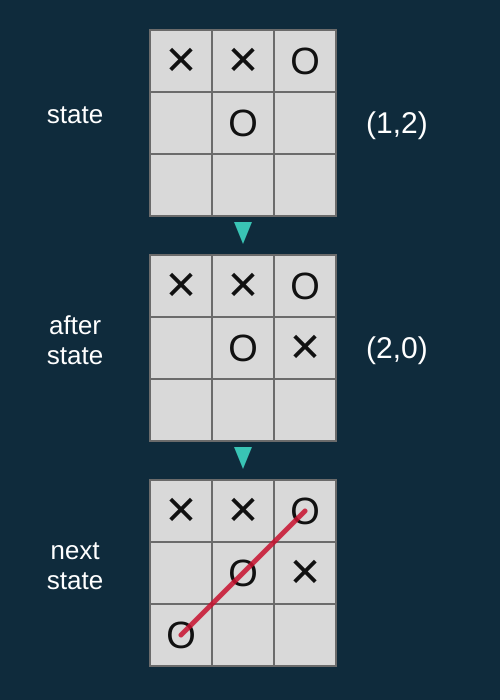

<!-- editorlm-hebrew-html-start -->
<style>
html, body, .vscode-body, .markdown-body, .markdown-preview, #write {
  direction: rtl !important; text-align: right !important;
}
ul, ol { padding-right: 2em !important; padding-left: 0 !important; }
blockquote { border-right: 3px solid #999; border-left: 0; padding-right: 1rem; padding-left: 0; }
@media print {
  html, body, .vscode-body, .markdown-body, .markdown-preview, #write {
    direction: rtl !important; text-align: right !important;
  }
}
</style>
<!-- editorlm-hebrew-html-end -->
<style>
.book { max-width: 900px; margin: auto; line-height: 1.8; font-family: Arial, sans-serif; }
.book .cover { min-height: 680px; box-sizing: border-box; padding: 64px 48px; margin: 24px 0 60px; background: #112b41; color: #f5f8fc; border-top: 9px solid #39c4b5; position: relative; }
.book .cover .eyebrow { color: #81e0d5; font-size: 15px; letter-spacing: 2px; }
.book .cover h1 { color: #fff; font-size: 48px; line-height: 1.3; border: 0; margin: 50px 0 18px; }
.book .cover .subtitle { font-size: 28px; color: #d8e6f0; }
.book .cover .author { font-size: 30px; color: #fff; margin-top: 52px; }
.book .cover .audience { color: #c1d3df; margin-top: 12px; }
.book .cover .motif { direction: ltr; text-align: left; font-family: Consolas, monospace; color: #81e0d5; font-size: 19px; margin-top: 54px; }
.book h1, .book h2, .book h3 { line-height: 1.4; font-weight: 700; }
.book > h1 { font-size: 32px !important; text-align: center !important; margin: 28px 0; }
.book h2 { font-size: 34px !important; text-align: center !important; color: #153b56 !important; background: #eef5fc; border: 0; border-bottom: 4px solid #299c91; border-radius: 10px 10px 0 0; padding: 28px 20px; margin: 24px 0 36px; }
.book h3 { font-size: 24px !important; text-align: right !important; color: #174e49 !important; background: #edf7f5; border: 0; border-right: 5px solid #299c91; border-radius: 6px; padding: 10px 16px; margin: 36px 0 18px; }
.book .chapter { height: 0; margin: 76px 0 0; border-top: 1px solid #ccd7df; break-before: page; page-break-before: always; break-after: avoid; page-break-after: avoid; }
.book .toc { padding: 24px; border-right: 5px solid #39a99d; background: rgba(70,150,155,.09); margin: 24px 0 48px; }
.book pre, .book pre code { direction: ltr !important; text-align: left !important; unicode-bidi: isolate; }
.book pre { box-sizing: border-box !important; width: 100% !important; max-width: 100% !important; margin: 0 !important; padding: 16px 20px; border: 1px solid #ccd7df; border-radius: 8px; line-height: 1.6; overflow-x: auto; }
.book code { direction: ltr; unicode-bidi: isolate; font-family: Consolas, "Courier New", monospace; }
.book pre { background: #f3f6fa !important; color: #1f2937 !important; }
.book pre code, .book pre code.hljs { background: transparent !important; color: #1f2937 !important; }
.book pre .hljs-keyword, .book pre .hljs-literal { color: #6f299c !important; }
.book pre .hljs-string { color: #216338 !important; }
.book pre .hljs-number { color: #075e68 !important; }
.book pre .hljs-comment { color: #526174 !important; }
.book pre .hljs-built_in, .book pre .hljs-title { color: #135b96 !important; }
.book table { width: 75%; max-width: 75%; margin: 18px auto; background: #f3f6fa; }
.book th, .book td { border: 1px solid #ccd7df; padding: 8px 12px; }
.book th, .book td { text-align: right; }
.book .small { font-size: .9em; opacity: .8; }
.book .python-intro { display: flex; align-items: center; gap: 28px; padding: 22px 28px; margin: 24px 0; background: #eef5fc; color: #183e63; border-right: 6px solid #3776ab; border-radius: 10px; }
.book .python-intro strong { font-size: 30px; }
.book .python-fact { background: #fff7d6; color: #423611; border-right: 6px solid #ffd343; border-radius: 8px; padding: 18px 24px; margin: 22px 0; }
.book .python-fact strong { font-size: 24px; }
.book img { max-width: 100%; height: auto; }
.book figure { box-sizing: border-box; width: 75%; max-width: 75%; margin: 24px auto; padding: 16px 20px; background: #f3f6fa; border: 1px solid #ccd7df; border-radius: 8px; text-align: center; }
.book figure img { display: block; margin: auto; }
.book figcaption { direction: rtl; text-align: center; font-size: .9em; color: #445566; }
@media print { .book > h2 { break-before: page; page-break-before: always; } }
.book .screen-strip { width: 760px; max-width: 100%; height: 220px; overflow: hidden; border: 1px solid #bccad5; border-radius: 8px; margin: 20px auto 8px; direction: ltr; }
.book .screen-strip.output { height: 265px; }
.book .screen-strip img { display: block; width: 1745px; max-width: none; }
.book .screen-menu { width: 400px; max-width: 100%; height: 295px; overflow: hidden; direction: ltr; margin: 20px auto 8px; border: 1px solid #bccad5; border-radius: 8px; }
.book .screen-menu img { display: block; width: 1745px; max-width: none; }
.book .code-panel { box-sizing: border-box !important; display: block !important; width: 75% !important; max-width: 75% !important; margin: 18px auto !important; }
@media print {
  .book .cover { min-height: 85vh; break-after: page; print-color-adjust: exact; -webkit-print-color-adjust: exact; }
  .book pre { white-space: pre-wrap; break-inside: avoid; }
  .book .chapter { margin: 0; border: 0; }
  .book h1, .book h2, .book h3 { break-after: avoid; page-break-after: avoid; break-inside: avoid; }
  .book h2 { margin-top: 0; }
  .book h2, .book h3 { print-color-adjust: exact; -webkit-print-color-adjust: exact; }
}
</style>

<style>
.book .book-nav { display: flex; flex-wrap: wrap; gap: 10px; justify-content: center; align-items: center; padding: 16px 0; margin: 20px 0 32px; border-top: 1px solid #ccd7df; border-bottom: 1px solid #ccd7df; }
.book .book-nav a { display: inline-block; padding: 10px 18px; border-radius: 8px; background: #eef5fc; color: #153b56 !important; border: 1px solid #b5ccd9; text-decoration: none !important; font-size: 16px; font-weight: bold; }
.book .book-nav a.toc-link { background: #174e49; color: #fff !important; border-color: #174e49; }
.book .book-nav a:hover, .book .book-nav a:focus { background: #d4eee8; color: #153b56 !important; outline: 2px solid #299c91; outline-offset: 2px; }
.book .section-list { line-height: 2; }
@media print { .book .book-nav { display: none; } }

/* Explicit Hebrew direction, including prose beginning with English. */
.book p, .book ul, .book ol, .book li,
.book blockquote, .book h1, .book h2, .book h3,
.book h4, .book th, .book td {
  direction: rtl !important;
  text-align: right !important;
  unicode-bidi: isolate;
}
/* Chapter titles keep their agreed centered layout. */
.book h2 { text-align: center !important; }
.book pre, .book pre code, .book .code-panel {
  direction: ltr !important;
  text-align: left !important;
  unicode-bidi: isolate;
}
</style>

<style>
/* Display math renders left-to-right and centered, independent of the RTL page. */
.book .math-panel, .book .math-panel .katex-display, .book .math-panel .katex {
  direction: ltr !important;
  text-align: center !important;
  unicode-bidi: isolate;
}
.book .math-panel { box-sizing: border-box; width: 75%; max-width: 75%; margin: 20px auto; padding: 16px 20px; background: #f3f6fa; color: #1f2937; border: 1px solid #ccd7df; border-radius: 8px; overflow-x: auto; font-size: 1.1em; }
.book .math-panel .katex-display { margin: 0; }
.book .code-panel.wide { width: 100% !important; max-width: 100% !important; }
.book .code-panel.wide pre, .book .code-panel.wide pre code { font-size: 11px; }
.book .math-panel p { margin: 0; }
.book .grid-panel { box-sizing:border-box; width:75%; max-width:75%; margin:20px auto; padding:16px 20px; background:#f3f6fa; border:1px solid #ccd7df; border-radius:8px; }
.book .grid { direction:ltr!important; width:auto!important; max-width:100%!important; margin:0 auto; border-collapse:collapse; background:#fff; }
.book .grid td { direction:ltr!important; text-align:center!important; width:64px; height:48px; border:1px solid #8199aa; }
.book .grid .goal { background:#d3efdc; } .book .grid .bad { background:#f4d7d7; }
</style>

<div class="book" dir="rtl" lang="he">

<nav class="book-nav" aria-label="ניווט בספר">
<a href="09-Temporal%20Difference.md">→ הקודם</a>
<a class="toc-link" href="../index.md">תוכן העניינים</a>
<a href="11-DQN.md">הבא ←</a>
</nav>

## ד.10 — TD באיקס עיגול ו־AfterState

**המצגת:** [TD באיקס עיגול](../../../sources/RL/5.1%20Temporal%20Difference-TicTacToe.pptx) · **קוד:** [SARSA_Trainer.py](https://github.com/MarkmanGilad/Tic_Tac_Toe_2/blob/TicTacToe_SARSA/SARSA_Trainer.py) · [AI_Agent.py](https://github.com/MarkmanGilad/Tic_Tac_Toe_2/blob/TicTacToe_SARSA/AI_Agent.py) · [ענף TicTacToe_SARSA במאגר Tic_Tac_Toe_2](https://github.com/MarkmanGilad/Tic_Tac_Toe_2/tree/TicTacToe_SARSA)

בפרק הקודם למדנו את SARSA על נייר: מצב, פעולה, תגמול, מצב הבא, פעולה הבאה. בפרק הזה נחזור לאיקס עיגול ונשאל שאלה מעשית: איך נראה "צעד אחד" במשחק שבו יש יריב? בפרק ד.8 בנינו סוכן מונטה קרלו שמשחק אפיזודה שלמה ולומד רק בסופה. עכשיו נשנה דבר אחד בלבד: מועד העדכון. הסוכן ילמד תוך כדי המשחק, מכל מהלך.

הקושי המרכזי הוא שבמשחק מול יריב "הצעד הבא" אינו מיידי. באיקס עיגול, אחרי ש־X הניח סימן, הוא עדיין אינו יכול לבחור את המהלך הבא שלו: קודם צריך לראות מה יעשה O. נשתמש באותו [ממשק משחק](08-מונטה%20קרלו%20באיקס%20עיגול.md#game-interface) ובאותו סוכן `AI_Agent` מפרק ד.8, ונכתוב מאמן חדש, שמעדכן את טבלת Q במהלך המשחק. הקוד בפרק לקוח מענף `TicTacToe_SARSA` של מאגר המשחק.

בסוף הפרק נציג רעיון נוסף, **AfterState**, שמנצל את מה שאנחנו כן יודעים על המשחק: איננו יודעים מה היריב יעשה, אבל אנחנו יודעים בדיוק איך ייראה הלוח אחרי המהלך שלנו. נסביר את העיקרון בלבד; המימוש נשאר כתרגיל.

### דגימת הסביבה — מעבר אחד במשחק מול יריב

במהלך האימון אנחנו דוגמים את הסביבה כדי לקבל את החמישייה <span dir="ltr">S, A, R, S′, A′</span> ולהציב אותה בנוסחת העדכון של [SARSA](09-Temporal%20Difference.md#sarsa):

<div class="math-panel" dir="ltr">

$$
Q(S,A) \leftarrow Q(S,A) + \alpha \left[ R + \gamma Q(S',A') - Q(S,A) \right]
$$

</div>

במשחק מול יריב, בין הפעולה שלנו לבין המצב שבו נבחר שוב מסתתר מהלך של O. לכן נחלק את הדגימה לחמישה שלבים:

- **א.** הסוכן מקבל מצב `state` ובוחר פעולה `A` לפי ε-greedy.
- **ב.** הסביבה מבצעת את הפעולה ומחזירה את הלוח שנוצר, `afterState`, ותגמול `R′`.
- **ג.** היריב מקבל את `afterState` ובוחר את הפעולה שלו, `afterAction`.
- **ד.** הסביבה מבצעת את פעולת היריב ומחזירה `nextState` ותגמול `R″`.
- **ה.** הסוכן מקבל את `nextState` ובוחר את הפעולה הבאה `A′` לפי ε-greedy.

`afterState` הוא הלוח **לפני תגובת היריב**, ואילו `nextState` הוא הלוח שבו X עומד לבחור שוב. מנקודת המבט של הסוכן הלומד, היריב הוא חלק מהסביבה: "צעד אחד" של הסוכן כולל את המהלך שלו ואת התגובה של O.

אילו נתונים נכנסים לנוסחה? התשובה תלויה בשאלה אם הגענו למצב סופי, ובאיזה שלב. יש שלושה מקרים, ונעבור עליהם אחד אחד עם הלוחות מהמצגת.

<!-- editorlm-source-ref: [sources/RL/5.1 Temporal Difference-TicTacToe.pptx#L35-L48] -->

### המקרה הרגיל — המשחק לא מסתיים

נתחיל מלוח ריק. הסוכן X בוחר את המרכז, `(1,1)`. הסביבה מבצעת ומחזירה `afterState` עם X אחד במרכז, והתגמול `R′` הוא 0, כי המשחק לא הסתיים. היריב O בוחר את הפינה השמאלית התחתונה, `(2,0)`. הסביבה מבצעת ומחזירה `nextState` עם שני סימנים, ושוב `R″ = 0`. עכשיו X מקבל את `nextState` ובוחר את הפעולה הבאה, למשל `(2,2)`. היא נבחרה, אך עדיין לא בוצעה.

<figure>

<figcaption>המקרה הרגיל: state הוא הלוח הריק שבו X בוחר את (1,1); after state הוא הלוח מיד אחרי הפעולה, שבו O בוחר את (2,0); next state הוא הלוח שבו X חוזר ובוחר, כאן את (2,2).</figcaption>
</figure>

כל חמשת השלבים התבצעו, ויש בידינו את כל מה שהנוסחה צריכה:

<div class="math-panel" dir="ltr">

$$
s = \text{state};\quad a = A;\quad r = R'' = 0;\quad s' = \text{nextState};\quad a' = A'
$$

</div>

שימו לב לשני דברים. ה־S′ של הנוסחה הוא `nextState`, הלוח **אחרי תגובת היריב**, ולא `afterState`: רק ב־`nextState` הסוכן חוזר ומחליט, ולכן רק לו יש ערך Q עם פעולה משלו. והתגמול הוא 0, כי באיקס עיגול יש תגמול רק בסיום המשחק; במקרה הרגיל היעד כולו מגיע מהערך המשוער של הצעד הבא, <span dir="ltr">γ·Q(nextState, A′)</span>. אחרי העדכון ממשיכים: `nextState` הופך ל־`state`, ו־`A′` הופכת ל־`A`, בדיוק כמו ההעברה <span dir="ltr">S ← S′, A ← A′</span> בפסאודו־קוד.

<!-- editorlm-source-ref: [sources/RL/5.1 Temporal Difference-TicTacToe.pptx#L50-L60] -->

### מצב סופי בשלב ב׳ — המשחק מסתיים אחרי הפעולה שלנו

המקרה השני הוא סיום מיידי. במצב שבתמונה יש X במרכז ובפינה הימנית התחתונה, ו־O בשני התאים העליונים בעמודה הימנית. X בוחר את הפינה השמאלית העליונה, `(0,0)`, ומשלים אלכסון. הסביבה מחזירה `afterState` שהוא כבר מצב סופי, ותגמול `R′ = 1`.

<figure>

<figcaption>סיום בשלב ב׳: הפעולה (0,0) משלימה אלכסון, ולכן after state הוא כבר מצב סופי. שלבים ג׳–ה׳ אינם מתבצעים: אין תגובת יריב, אין next state ואין פעולה נוספת לבחור.</figcaption>
</figure>

שלבים ג׳, ד׳ ו־ה׳ אינם מתבצעים. אין `nextState` ואין `A′`, ולכן חלק ההמשך בנוסחה הוא אפס:

<div class="math-panel" dir="ltr">

$$
s = \text{state};\quad a = A;\quad r = R' = 1;\quad \gamma Q(s',a') = 0
$$

</div>

היעד הוא התגמול בלבד, בדיוק כמו ענף המצב הסופי בפסאודו־קוד של הפרק הקודם: <span dir="ltr">Q(state, (0,0)) ← Q + α·[1 − Q]</span>. אותו טיפול מתאים גם לתיקו שמתקבל מיד אחרי המהלך של X, עם `R′ = 0`. אחרי העדכון האפיזודה מסתיימת.

<!-- editorlm-source-ref: [sources/RL/5.1 Temporal Difference-TicTacToe.pptx#L62-L73] -->

### מצב סופי בשלב ד׳ — המשחק מסתיים אחרי תגובת היריב

המקרה השלישי עדין יותר: הפעולה שלנו לא סיימה את המשחק, אבל היריב מנצח בתגובתו. במצב שבתמונה יש ל־X שני סימנים בשורה העליונה ול־O סימן בפינה הימנית העליונה ובמרכז. X בוחר את התא הימני באמצע, `(1,2)`. הסביבה מחזירה `afterState` ו־`R′ = 0`, כי המשחק נמשך. עכשיו O בוחר את הפינה השמאלית התחתונה, `(2,0)`, ומשלים אלכסון. הסביבה מבצעת ומחזירה `nextState`, שהוא מצב סופי, ותגמול `R″ = −1`.

<figure>

<figcaption>סיום בשלב ד׳: X בוחר את (1,2) והמשחק נמשך; O בוחר את (2,0) ומשלים אלכסון. next state הוא מצב סופי, והתגמול מנקודת המבט של X הוא ‎−1. שלב ה׳, בחירת A′, אינו מתבצע.</figcaption>
</figure>

שלב ה׳ אינו מתבצע: אין פעולה לבחור במצב סופי. גם כאן חלק ההמשך הוא אפס, אבל התגמול שנכנס לנוסחה הוא `R″`, התגמול שהגיע **מהמהלך של היריב**:

<div class="math-panel" dir="ltr">

$$
s = \text{state};\quad a = A;\quad r = R'' = -1;\quad \gamma Q(s',a') = 0
$$

</div>

הסימן נקבע מנקודת המבט של הסוכן הלומד, לא לפי מי שביצע את המהלך האחרון: ניצחון של O הוא ‎−1 עבור X. כך הפעולה `(1,2)` תקבל ערך נמוך יותר, אף שהיא עצמה לא הפסידה: היא השאירה ליריב אפשרות לנצח, וזה בדיוק מה שהסוכן צריך ללמוד להימנע ממנו. הפעולה הנכונה במצב הזה הייתה לחסום ב־`(2,0)`, ואחרי מספיק משחקים הערך של החסימה יהיה גבוה מהערך של `(1,2)`.

<!-- editorlm-source-ref: [sources/RL/5.1 Temporal Difference-TicTacToe.pptx#L75-L86] -->

### קוד האימון — SARSA_Trainer.py

עכשיו נחבר את שלושת המקרים ללולאת אימון אחת. הקובץ `SARSA_Trainer.py` בענף `TicTacToe_SARSA` משתמש באותם רכיבים מפרק ד.8: `TicTacToe`, ‏`State`, ‏`Random_Agent` כיריב ו־`AI_Agent` כסוכן הלומד, עם `get_action` ב־ε-greedy ו־`get_Q` שמחזירה 0 לזוג שעדיין אינו בטבלה. הנה החלק הראשון של הקובץ, כלשונו (התיבה רחבה מהרגיל כדי ששורות העדכון הארוכות ייראו בשלמותן):

<div class="code-panel wide" dir="ltr">

```python
from TicTacToe import TicTacToe
from State import State
from Human_Agent import Human_Agent
from Random_Agent import Random_Agent
from AI_Agent import AI_Agent

PATH = 'Data/Q_SARSA_4.pth'
env = TicTacToe(State())

player1 = AI_Agent(1, env, graphics=None, Q_table_PATH=None)
Q = player1.Q
get_Q = player1.get_Q
gamma = 0.9
alpha = 0.1

player2 = Random_Agent(-1, env,graphics=None)

def main ():
    player = player1
    epochs = 100000

    for epoch in range(epochs):
        state = State()
        action = player1.get_action(state, epoch)   #using e-greedy
        while not env.end_of_game(state):
            afterState, reward = env.next_state(state, action)
            if env.end_of_game(afterState):
                Q[(state, action)] =  get_Q(state, action) + alpha * (reward + gamma * 0 - get_Q(state, action))
                # Q[(state, action)] = reward
                break
            afterAction = player2.get_action(state=afterState)
            next_state, reward = env.next_state(afterState, afterAction)
            if env.end_of_game(next_state):
                Q[(state, action)] =  get_Q(state, action) + alpha * (reward + gamma * 0 - get_Q(state, action))
                # Q[(state, action)] = reward
                break
            next_action = player1.get_action(next_state, epoch)   #using e-greedy
            Q[(state, action)] =  get_Q(state, action) + alpha * (reward + gamma * get_Q(next_state, next_action) - get_Q(state, action))
            state = next_state
            action = next_action

        print(epoch, end="\r")

    player1.save_Q(PATH)
    print(test(100))
```

</div>

נעבור על הלולאה הפנימית ונזהה את חמשת השלבים ואת שלושת המקרים:

1. **שלב א׳** נמצא לפני הלולאה: `action = player1.get_action(state, epoch)` בוחר את הפעולה הראשונה של האפיזודה ב־ε-greedy, כמו בפסאודו־קוד של SARSA.
2. **שלב ב׳:** `afterState, reward = env.next_state(state, action)` מבצע את הפעולה של X. אם `afterState` הוא מצב סופי, זהו **המקרה השני**: מעדכנים לפי התגמול בלבד, עם `gamma * 0` שכתוב במפורש כדי להזכיר שאין המשך, ויוצאים מהלולאה ב־`break`.
3. **שלבים ג׳ ו־ד׳:** `afterAction = player2.get_action(state=afterState)` הוא המהלך של היריב האקראי, ו־`next_state, reward = env.next_state(afterState, afterAction)` מבצע אותו. אם `next_state` הוא מצב סופי, זהו **המקרה השלישי**: התגמול הוא זה שהגיע ממהלך היריב, ‎−1 בהפסד או 0 בתיקו, וגם כאן ההמשך אפס ו־`break`.
4. **שלב ה׳ והמקרה הרגיל:** `next_action = player1.get_action(next_state, epoch)` בוחר את A′ ב־ε-greedy, והעדכון משתמש ב־`get_Q(next_state, next_action)`. שתי השורות האחרונות, `state = next_state` ו־`action = next_action`, הן ההעברה <span dir="ltr">S ← S′, A ← A′</span>: הפעולה שנכנסה ליעד היא הפעולה שתבוצע בסיבוב הבא.

הפרמטרים הם `gamma = 0.9`, ‏`alpha = 0.1` ו־100,000 אפיזודות. בהשוואה למונטה קרלו בפרק ד.8, α גדול פי עשרה וחצי ממספר האפיזודות: כל צעד מעדכן את הטבלה, ולכן יש הרבה יותר עדכונים בכל משחק. בענף הזה `epsilon_greedy` של `AI_Agent` היא הדעיכה המעריכית, <span dir="ltr">final + (start − final)·e^(−epoch/10000)</span>, ולא הלינארית של ענף הפתרון. היריב הוא `Random_Agent` הבסיסי.

שאר הקובץ, הפונקציות `test` ו־`switch_players`, זהה לזה של `MC_Trainer.py` בפרק ד.8: `test(100)` משחק 100 משחקים מול היריב האקראי ללא חקירה ומחזיר ניצחונות, הפסדים ותיקו:

<div class="code-panel" dir="ltr">

```python
def test (num):
    x_win = 0
    o_win = 0
    tie = 0
    player = player1
    player.train=False
    player.load_Q(PATH)
    for n in range(num):
        player = player1
        state = State()
        while not env.end_of_game(state):
            action = player.get_action(state=state)
            state, _ = env.next_state(state,action)
            player = switch_players(player)
        if state.end_of_game == 1:
            x_win +=1
        elif state.end_of_game == -1:
            o_win += 1
        else:
            tie +=1
        state.reset()
        print(n, end = "\r")
    return x_win, o_win, tie

def switch_players(player):
    if player == player1:
        return player2
    else:
        return player1

if __name__ == '__main__':
    main()
    # print(test(100))
```

</div>

<!-- editorlm-source-ref: [sources/RL/5.1 Temporal Difference-TicTacToe.pptx#L88-L94] -->

### הרצה ובדיקה

הפעילו את `SARSA_Trainer.py`. בטרמינל רץ מונה האפיזודות. האימון של 100,000 המשחקים אורך יותר מאימון מונטה קרלו, כארבע עד חמש דקות, כי בכל צעד בודקים סיום פעמיים ומעדכנים את הטבלה. בסיום הטבלה נשמרת לקובץ ומודפסת תוצאת `test(100)`:

**פלט**

<div class="code-panel" dir="ltr">

```text
(99, 0, 1)
```

</div>

הסוכן ניצח 99 משחקים מתוך 100, סיים אחד בתיקו ולא הפסיד. `Tester.py` עושה את אותה בדיקה על 1,000 משחקים:

**פלט**

<div class="code-panel" dir="ltr">

```text
993 0 7
```

</div>

בטבלה נשמרו 6,848 זוגות של מצב ופעולה, לעומת כ־8,600 באימון מונטה קרלו מול אותו יריב: SARSA לומד מכל צעד, ולכן ε יורד מהר יותר והסוכן חוזר על אותם מסלולים טובים. הרצה חוזרת תיתן מספרים מעט שונים, כי המשחקים אקראיים. מה שחוזר בכל ההרצות הוא אפס הפסדים מול היריב האקראי.

**הערה לגרסאות PyTorch חדשות.** בענף הזה `load_Q` קוראת ל־`torch.load(PATH)` בלי פרמטרים. מגרסה 2.6 של PyTorch הטעינה נכשלת בשגיאת `UnpicklingError`, כי ברירת המחדל טוענת רק משקלים. התיקון הוא הקריאה `torch.load(PATH, weights_only=False)`, כמו בענף הפתרון של פרק ד.8. האימון והשמירה עובדים כרגיל; רק `test` ו־`Tester.py`, שטוענים את הקובץ, זקוקים לתיקון.

אחרי האימון הריצו את `Game.py`: הוא טוען את הטבלה השמורה, הסוכן משחק X ואתם O.

### AfterState — החלק של המודל שכבר ידוע לנו

עד כאן הסוכן שמר ערך לכל זוג של מצב ופעולה. נעצור לרגע ונשאל: למה בכלל היינו צריכים Q ולא V? התשובה, מהפרקים הקודמים, היא שאין לנו מודל של הסביבה: איננו יודעים לאיזה מצב תוביל כל פעולה. אבל באיקס עיגול זה נכון רק בחלקו. איננו יודעים מראש מה היריב יבחר, אבל כן יודעים מה תעשה **הפעולה שלנו** ללוח. במקרים שבהם חלק מהמודל ידוע לנו אפשר להתאים את האלגוריתם ולייעל אותו.

נחזור למעבר מהמקרה הרגיל: מהלוח הריק X בוחר את `(1,1)`, והסביבה מחזירה `afterState` עם X במרכז. את הלוח הזה הסוכן יכול לחשב בעצמו, עוד לפני שהסביבה מבצעת את המהלך: זה הלוח הנוכחי ועוד הסימן שלו. הוא אינו המצב הבא, כי היריב עדיין לא הגיב, ולכן נכנה אותו **afterState**. הרעיון: במקום לשמור ערך לזוג `(state, action)`, נשמור ערך ל־afterState שהזוג הזה יוצר, בטבלת V(afterState):

<div class="math-panel" dir="ltr">

$$
Q(S,A) = V(\text{afterState})
$$

</div>

afterState הוא למעשה הזוג (state, action) בצורה אחרת: הלוח מספר גם מה היה המצב וגם איזו פעולה נבחרה. נוסחת העדכון של SARSA נכתבת אז על afterState:

<div class="math-panel" dir="ltr">

$$
V(\text{after\_S}) \leftarrow V(\text{after\_S}) + \alpha \left[ R + \gamma V(\text{afterS}') - V(\text{after\_S}) \right]
$$

</div>

כאן <span dir="ltr">after_S</span> הוא הלוח שנוצר מהפעולה שלנו במצב הנוכחי, ו־<span dir="ltr">afterS′</span> הוא הלוח שייווצר מהפעולה הבאה A′ ב־`nextState`, אחרי תגובת היריב. זה הפרט העדין: afterS′ **אינו** `nextState` עצמו, אלא `nextState` ועוד הסימן של הפעולה הבאה.

<!-- editorlm-source-ref: [sources/RL/5.1 Temporal Difference-TicTacToe.pptx#L96-L107] -->

### למה טבלת AfterState יעילה יותר?

השימוש בטבלת afterState מונע כפילויות. ייתכן ששני זוגות שונים, (S,A) ו־(S′,A′), ייתנו את אותו afterState. בתמונה, במסלול הראשון X נמצא בפינה השמאלית העליונה ו־O במרכז, ו־X מוסיף סימן בימין השורה האמצעית. במסלול השני X כבר נמצא בימין השורה האמצעית ו־O במרכז, ו־X מוסיף סימן בפינה השמאלית העליונה. שני המסלולים מגיעים לאותו לוח:

<figure>

<figcaption>שני זוגות מצב–פעולה שונים (למעלה) מובילים לאותו afterState (למטה). בטבלת Q הם שתי רשומות נפרדות; בטבלת afterState הם רשומה אחת.</figcaption>
</figure>

מה שיקרה מכאן והלאה תלוי רק בלוח שנוצר ובתור של O, ולא בדרך שבה הגענו אליו. לכן טבלת Q רגילה, ששומרת שני מפתחות שונים, לומדת פעמיים את אותו דבר, ואילו טבלת afterState שומרת רשומה אחת, וכל דגימה שמגיעה ללוח הזה, מכל אחת מהדרכים, מעדכנת אותה. הטבלה קטנה יותר, והערכים בה מתייצבים מהר יותר.

**מה נדרש כדי לממש את זה?** זו כבר טבלה אחרת, שהמפתח שלה הוא לוח ולא זוג של מצב ופעולה, ולכן צריך לשנות את הממשק של הסוכן: `get_Q` צריכה לחשב את afterState של כל פעולה מועמדת בעזרת `env.next_state`, בלי לבצע אותה במשחק, ולקרוא את הערך שלו; `get_Q_action` תבחר את הפעולה שה־afterState שלה הוא בעל הערך הגבוה ביותר; והעדכון בלולאת האימון יכתוב ל־V של afterState. בספר לא נממש את זה; זהו התרגיל האחרון של הפרק.

<!-- editorlm-source-ref: [sources/RL/5.1 Temporal Difference-TicTacToe.pptx#L109-L123] -->

### תרגילים

1. ממשו את אלגוריתם Q-learning במשחק איקס עיגול. ההבדל היחיד מ־`SARSA_Trainer.py` הוא ביעד של המקרה הרגיל: במקום `get_Q(next_state, next_action)` עם A′ שנבחרה ב־ε-greedy, השתמשו בערך המרבי מבין הפעולות החוקיות ב־`next_state`. שימו לב שאז אין צורך להעביר את `next_action` לסיבוב הבא.
2. ממשו את אחד האלגוריתמים עבור השחקן O. חשבו מה משתנה בסדר השלבים כשהסוכן הלומד משחק שני, ומה הסימן של התגמול.
3. ממשו את SARSA באמצעות טבלת afterState במקום טבלת Q. שימו לב: מהו afterS′ וכיצד יוצרים אותו.

עם זאת, גם עם טבלת afterState הסוכן עדיין שומר רשומה נפרדת לכל לוח שפגש. באיקס עיגול זה אפשרי; במשחקים גדולים יותר מספר המצבים עצום, ורובם לעולם לא ייפגשו פעמיים. בפרק הבא נחליף את הטבלה ברשת נוירונים שמעריכה את הערכים, וכך נוכל להכליל ממצבים שנראו למצבים חדשים.

<nav class="book-nav" aria-label="ניווט בספר">
<a href="09-Temporal%20Difference.md">→ הקודם</a>
<a class="toc-link" href="../index.md">תוכן העניינים</a>
<a href="11-DQN.md">הבא ←</a>
</nav>

</div>

<!-- editorlm-source-versions: {"schemaVersion": 1, "sources": {"sources/RL/5.1 Temporal Difference-TicTacToe.pptx": {"sourceSha256": "0f19e3b5cd3a1a49d1d5efc82f512d98b75162ba08d5012e22fac113d34ca4f8", "canonicalTextSha256": "96bca337693ae7554fd98117ce0597fe042512be90caec11250beeeea60215f9"}}} -->
