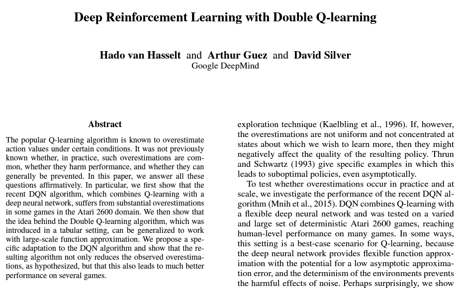

<!-- editorlm-hebrew-html-start -->
<style>
html, body, .vscode-body, .markdown-body, .markdown-preview, #write {
  direction: rtl !important; text-align: right !important;
}
ul, ol { padding-right: 2em !important; padding-left: 0 !important; }
blockquote { border-right: 3px solid #999; border-left: 0; padding-right: 1rem; padding-left: 0; }
@media print {
  html, body, .vscode-body, .markdown-body, .markdown-preview, #write {
    direction: rtl !important; text-align: right !important;
  }
}
</style>
<!-- editorlm-hebrew-html-end -->
<style>
.book { max-width: 900px; margin: auto; line-height: 1.8; font-family: Arial, sans-serif; }
.book .cover { min-height: 680px; box-sizing: border-box; padding: 64px 48px; margin: 24px 0 60px; background: #112b41; color: #f5f8fc; border-top: 9px solid #39c4b5; position: relative; }
.book .cover .eyebrow { color: #81e0d5; font-size: 15px; letter-spacing: 2px; }
.book .cover h1 { color: #fff; font-size: 48px; line-height: 1.3; border: 0; margin: 50px 0 18px; }
.book .cover .subtitle { font-size: 28px; color: #d8e6f0; }
.book .cover .author { font-size: 30px; color: #fff; margin-top: 52px; }
.book .cover .audience { color: #c1d3df; margin-top: 12px; }
.book .cover .motif { direction: ltr; text-align: left; font-family: Consolas, monospace; color: #81e0d5; font-size: 19px; margin-top: 54px; }
.book h1, .book h2, .book h3 { line-height: 1.4; font-weight: 700; }
.book > h1 { font-size: 32px !important; text-align: center !important; margin: 28px 0; }
.book h2 { font-size: 34px !important; text-align: center !important; color: #153b56 !important; background: #eef5fc; border: 0; border-bottom: 4px solid #299c91; border-radius: 10px 10px 0 0; padding: 28px 20px; margin: 24px 0 36px; }
.book h3 { font-size: 24px !important; text-align: right !important; color: #174e49 !important; background: #edf7f5; border: 0; border-right: 5px solid #299c91; border-radius: 6px; padding: 10px 16px; margin: 36px 0 18px; }
.book .chapter { height: 0; margin: 76px 0 0; border-top: 1px solid #ccd7df; break-before: page; page-break-before: always; break-after: avoid; page-break-after: avoid; }
.book .toc { padding: 24px; border-right: 5px solid #39a99d; background: rgba(70,150,155,.09); margin: 24px 0 48px; }
.book pre, .book pre code { direction: ltr !important; text-align: left !important; unicode-bidi: isolate; }
.book pre { box-sizing: border-box !important; width: 100% !important; max-width: 100% !important; margin: 0 !important; padding: 16px 20px; border: 1px solid #ccd7df; border-radius: 8px; line-height: 1.6; overflow-x: auto; }
.book code { direction: ltr; unicode-bidi: isolate; font-family: Consolas, "Courier New", monospace; }
.book pre { background: #f3f6fa !important; color: #1f2937 !important; }
.book pre code, .book pre code.hljs { background: transparent !important; color: #1f2937 !important; }
.book pre .hljs-keyword, .book pre .hljs-literal { color: #6f299c !important; }
.book pre .hljs-string { color: #216338 !important; }
.book pre .hljs-number { color: #075e68 !important; }
.book pre .hljs-comment { color: #526174 !important; }
.book pre .hljs-built_in, .book pre .hljs-title { color: #135b96 !important; }
.book table { width: 75%; max-width: 75%; margin: 18px auto; background: #f3f6fa; }
.book th, .book td { border: 1px solid #ccd7df; padding: 8px 12px; }
.book th, .book td { text-align: right; }
.book .small { font-size: .9em; opacity: .8; }
.book .python-intro { display: flex; align-items: center; gap: 28px; padding: 22px 28px; margin: 24px 0; background: #eef5fc; color: #183e63; border-right: 6px solid #3776ab; border-radius: 10px; }
.book .python-intro strong { font-size: 30px; }
.book .python-fact { background: #fff7d6; color: #423611; border-right: 6px solid #ffd343; border-radius: 8px; padding: 18px 24px; margin: 22px 0; }
.book .python-fact strong { font-size: 24px; }
.book img { max-width: 100%; height: auto; }
.book figure { box-sizing: border-box; width: 75%; max-width: 75%; margin: 24px auto; padding: 16px 20px; background: #f3f6fa; border: 1px solid #ccd7df; border-radius: 8px; text-align: center; }
.book figure img { display: block; margin: auto; }
.book figcaption { direction: rtl; text-align: center; font-size: .9em; color: #445566; }
@media print { .book > h2 { break-before: page; page-break-before: always; } }
.book .screen-strip { width: 760px; max-width: 100%; height: 220px; overflow: hidden; border: 1px solid #bccad5; border-radius: 8px; margin: 20px auto 8px; direction: ltr; }
.book .screen-strip.output { height: 265px; }
.book .screen-strip img { display: block; width: 1745px; max-width: none; }
.book .screen-menu { width: 400px; max-width: 100%; height: 295px; overflow: hidden; direction: ltr; margin: 20px auto 8px; border: 1px solid #bccad5; border-radius: 8px; }
.book .screen-menu img { display: block; width: 1745px; max-width: none; }
.book .code-panel { box-sizing: border-box !important; display: block !important; width: 75% !important; max-width: 75% !important; margin: 18px auto !important; }
@media print {
  .book .cover { min-height: 85vh; break-after: page; print-color-adjust: exact; -webkit-print-color-adjust: exact; }
  .book pre { white-space: pre-wrap; break-inside: avoid; }
  .book .chapter { margin: 0; border: 0; }
  .book h1, .book h2, .book h3 { break-after: avoid; page-break-after: avoid; break-inside: avoid; }
  .book h2 { margin-top: 0; }
  .book h2, .book h3 { print-color-adjust: exact; -webkit-print-color-adjust: exact; }
}
</style>

<style>
.book .book-nav { display: flex; flex-wrap: wrap; gap: 10px; justify-content: center; align-items: center; padding: 16px 0; margin: 20px 0 32px; border-top: 1px solid #ccd7df; border-bottom: 1px solid #ccd7df; }
.book .book-nav a { display: inline-block; padding: 10px 18px; border-radius: 8px; background: #eef5fc; color: #153b56 !important; border: 1px solid #b5ccd9; text-decoration: none !important; font-size: 16px; font-weight: bold; }
.book .book-nav a.toc-link { background: #174e49; color: #fff !important; border-color: #174e49; }
.book .book-nav a:hover, .book .book-nav a:focus { background: #d4eee8; color: #153b56 !important; outline: 2px solid #299c91; outline-offset: 2px; }
.book .section-list { line-height: 2; }
@media print { .book .book-nav { display: none; } }

/* Explicit Hebrew direction, including prose beginning with English. */
.book p, .book ul, .book ol, .book li,
.book blockquote, .book h1, .book h2, .book h3,
.book h4, .book th, .book td {
  direction: rtl !important;
  text-align: right !important;
  unicode-bidi: isolate;
}
/* Chapter titles keep their agreed centered layout. */
.book h2 { text-align: center !important; }
.book pre, .book pre code, .book .code-panel {
  direction: ltr !important;
  text-align: left !important;
  unicode-bidi: isolate;
}
</style>

<style>
.book .formula { box-sizing:border-box; width:75%; max-width:75%; direction:ltr!important; text-align:center!important; overflow-x:auto;
  padding:16px 20px; background:#f3f6fa; color:#1f2937; border:1px solid #ccd7df; border-radius:8px; margin:20px auto; font-size:1.15em; }
.book .grid-panel { box-sizing:border-box; width:75%; max-width:75%; margin:20px auto; padding:16px 20px; background:#f3f6fa; border:1px solid #ccd7df; border-radius:8px; }
.book .grid { direction:ltr!important; width:auto!important; max-width:100%!important; margin:0 auto; border-collapse:collapse; background:#fff; }
.book .grid td { direction:ltr!important; text-align:center!important; width:64px; height:48px; border:1px solid #8199aa; }
.book .grid .goal { background:#d3efdc; } .book .grid .bad { background:#f4d7d7; }
</style>

<div class="book" dir="rtl" lang="he">

<nav class="book-nav" aria-label="ניווט בספר">
<a href="11-DQN%20%D7%91%D7%90%D7%99%D7%A7%D7%A1%20%D7%A2%D7%99%D7%92%D7%95%D7%9C.md">→ הקודם</a>
<a class="toc-link" href="../index.md">תוכן העניינים</a>
<a href="../index.md">הבא ←</a>
</nav>

## ד.12 — DDQN — ההבדל מ־DQN

**המצגת:** [DDQN](../../../sources/RL/9.DDQN%20-%20Space_Invaders.pptx)

בשני הפרקים הקודמים בנינו סוכן DQN שלם. הפרק הזה אינו מוסיף רכיב חדש, אלא שואל שאלה על פרט קטן ביעד האימון: האם נכון לקחת את המקסימום של הערכות שאינן מדויקות? כדי להבין למה זו בעיה, חשבו על מורה שמעריך את הציון של כמה תלמידים "בערך", ואז מכריז שהתלמיד הטוב ביותר בכיתה הוא זה שקיבל את ההערכה הגבוהה ביותר. גם אם כל ההערכות שקולות בממוצע, זו שיצאה הגבוהה ביותר היא כנראה גם זו שהוגזמה יותר מהאחרות. בחירת המקסימום מטה את התוצאה כלפי מעלה.

כשבוחרים את המקסימום מבין כמה הערכות לא מדויקות, עלולים לבחור דווקא בהערכה שגבוהה מדי במקרה. אם אותה הערכה משמשת גם כיעד האימון, האופטימיות עלולה לעבור לעדכונים הבאים. **Double DQN — DDQN** מצמצם את הבעיה באמצעות הפרדה בין בחירת פעולת ההמשך לבין הערכת הערך שלה.

הרעיון הכללי: אם רשת אחת בוחרת איזו פעולה נראית הטובה ביותר, ורשת אחרת, שטעויותיה שונות, נותנת את הערך של אותה פעולה, ההטיה כלפי מעלה קטנה. יש לנו כבר שתי רשתות מ־DQN, ולכן השינוי במימוש קטן מאוד: שורה או שתיים בחישוב היעד. הרעיון הוצג ב־2015 במאמר של Hado van Hasselt, ‏Arthur Guez ו־David Silver מ־DeepMind, [Deep Reinforcement Learning with Double Q-learning](https://arxiv.org/abs/1509.06461), שהראה שהאופטימיות של DQN אכן מופיעה במשחקי Atari ושההפרדה בין בחירה להערכה משפרת את התוצאות.

<figure>

<figcaption>העמוד הראשון של המאמר שהציג את DDQN בשנת 2015.</figcaption>
</figure>

### מי בוחר ומי מעריך?

הפעולה max ביעד עושה בעצם שני דברים בבת אחת: היא בוחרת את הפעולה בעלת הערך הגבוה ביותר, וגם מחזירה את הערך הזה. אפשר לפצל את שני התפקידים בין שתי הרשתות. ב־[יעד DQN](10-DQN.md#dqn-target) רשת המטרה מבצעת את שני התפקידים. ב־DDQN הרשת **הראשית בוחרת** את הפעולה בעלת הערך המרבי במצב הבא, ורשת **המטרה מעריכה** את הפעולה שנבחרה. זו בחירה חמדנית לצורך היעד, ללא ε-greedy.

| אלגוריתם | יעד במעבר שאינו סופי |
| --- | --- |
| DQN | <span dir="ltr">y = R + γ max<sub>a′</sub> Q(S′,a′;w⁻)</span> |
| DDQN | <span dir="ltr">a* = argmax<sub>a′</sub> Q(S′,a′;w)<br>y = R + γQ(S′,a*;w⁻)</span> |

בשורת DDQN, ‏argmax מחזיר את **הפעולה** בעלת הערך הגבוה ביותר לפי הרשת הראשית (ולא את הערך עצמו), ואת הפעולה הזאת, a*, מעבירים לרשת המטרה כדי לקבל את הערך שייכנס ליעד. בכל בחירה בוחנים רק פעולות חוקיות. במעבר סופי היעד בשתי השיטות הוא R בלבד. שתי רשתות ומאגר דגימות כבר קיימים ב־DQN; הם אינם החידוש של DDQN. השם "Double" מתייחס להפרדת התפקידים, לא למספר הרשתות.

<!-- editorlm-source-ref: [sources/RL/9.DDQN - Space_Invaders.pptx#L15-L23] -->
<!-- editorlm-source-ref: [sources/RL/9.DDQN - Space_Invaders.pptx#L111-L117] -->

### דוגמה מספרית וקוד השינוי

ההבדל בין הנוסחאות נראה קטן, ולכן כדאי לראות אותו על מספרים. נראה כיצד אותן הערכות של שתי הרשתות מובילות ליעדים שונים ב־DQN וב־DDQN. נניח שבמצב הבא יש שתי פעולות חוקיות, וכל רשת נותנת להן הערכה משלה:

| פעולה | הרשת הראשית | רשת המטרה |
| --- | --- | --- |
| A | 0.8 | 0.4 |
| B | 0.6 | 0.9 |

עבור R=0 ו־γ=0.9, ‏DQN משתמש במקסימום של רשת המטרה: הערך הגבוה ביותר בעמודת המטרה הוא 0.9 (פעולה B), ולכן היעד הוא 0.9×0.9=0.81. ‏DDQN בוחר A בעזרת הראשית, כי בעמודת הראשית 0.8 גדול מ־0.6, אך מעריך אותה בעזרת המטרה: 0.9×0.4=0.36. שימו לב ששתי הרשתות חלוקות ביניהן איזו פעולה עדיפה, וזה בדיוק המצב שבו ההפרדה משנה את היעד. המספרים הומצאו להמחשת ההבדל; אין כאן ידיעה מהו הערך האמיתי או הוכחה שהיעד הנמוך תמיד נכון יותר.

נכתוב את שני החישובים כפונקציה קטנה בפייתון טהור, בלי רשתות, כדי לראות את ההבדל בקוד. בקטע הבא `main_values` ו־`target_values` מכילים את הערכים של **אותה רשימת פעולות חוקיות, באותו סדר**, עבור מצב הבא אחד:

<div class="code-panel" dir="ltr">

```python
def compute_targets(reward, done, main_values, target_values, gamma=0.9):
    if done:
        return reward, reward
    dqn_target = reward + gamma * max(target_values)
    best_index = max(range(len(main_values)), key=main_values.__getitem__)
    ddqn_target = reward + gamma * target_values[best_index]
    return dqn_target, ddqn_target

dqn, ddqn = compute_targets(0, False, [0.8, 0.6], [0.4, 0.9])
print(f'DQN: {dqn:.2f}, DDQN: {ddqn:.2f}')
```

</div>

**פלט**

<div class="code-panel" dir="ltr">

```text
DQN: 0.81, DDQN: 0.36
```

</div>

הפלט תואם לחישוב הידני: 0.81 ל־DQN ו־0.36 ל־DDQN. השורה עם `best_index` היא ה־argmax: היא מוצאת את מיקום הערך הגבוה ביותר ברשימת הראשית, ובשורה שאחריה משתמשים באותו מיקום כדי לשלוף ערך מרשימת המטרה. לכן חשוב ששתי הרשימות יהיו באותו סדר.

במימוש רשתות מחשבים את שני היעדים ללא גרדיאנט; רק הרשת הראשית מתעדכנת כדי להתקרב ליעד שנבחר. יתר לולאת DQN נשארת באותו מבנה: אותו מאגר, אותו סנכרון של רשת המטרה, אותו צעד אימון. במימוש איקס עיגול מהפרק הקודם, השינוי נמצא בפונקציה לחישוב [ערכי ההמשך של האצווה](11-DQN%20באיקס%20עיגול.md#next-q-values): במקום `target(states, actions).max()`, הראשית תבחר פעולה חוקית, והמטרה תעריך אותה.

בכך מסתיים חלק למידת החיזוק. עברנו מתכנון עם מודל מלא של הסביבה (Policy Iteration ו־Value Iteration), דרך למידה מדגימות בטבלאות (מונטה קרלו, SARSA ו־Q-learning), ועד להחלפת הטבלה ברשת נוירונים שיודעת להכליל (DQN ו־DDQN). אותם רעיונות, עם רשתות גדולות יותר ומשחקים מורכבים יותר, עומדים בבסיס הסוכנים שלומדים לשחק במשחקי מחשב ובמשחקי לוח ברמה גבוהה.

<nav class="book-nav" aria-label="ניווט בספר">
<a href="11-DQN%20%D7%91%D7%90%D7%99%D7%A7%D7%A1%20%D7%A2%D7%99%D7%92%D7%95%D7%9C.md">→ הקודם</a>
<a class="toc-link" href="../index.md">תוכן העניינים</a>
<a href="../index.md">הבא ←</a>
</nav>

</div>

<!-- editorlm-source-versions: {"schemaVersion": 1, "sources": {"sources/RL/9.DDQN - Space_Invaders.pptx": {"sourceSha256": "d6981fbcaece328c93f467f0106324e69f912c6b6b1614359703bdb294703b0d", "canonicalTextSha256": "9277e70122fd5412f1d8e6812fe67075e5cbacc59fdf975a808df997638dee83"}}} -->
